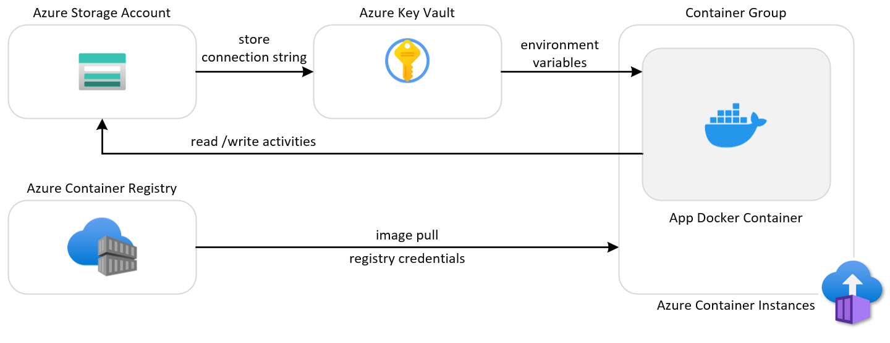

# Vacation Planner on Azure Container Instances

A sample application demonstrating how to deploy a containerized Flask web app using four Azure services:

- **Azure Blob Storage** — Stores vacation activities as JSON blobs
- **Azure Key Vault** — Stores the storage connection string as a secret
- **Azure Container Registry (ACR)** — Hosts the Docker container image
- **Azure Container Instances (ACI)** — Runs the containerized application

## Architecture

The following diagram illustrates the architecture of the solution:



- **Deployment flow:** The deploy script creates Storage and Key Vault first, stores the storage connection string as a secret, creates ACR and pushes the container image, then creates an ACI container group that pulls from ACR with the secrets injected as environment variables.
- **At runtime:** The Flask app reads the storage connection string from its environment, connects to Blob Storage, and provides a web UI for managing vacation activities (add, edit, delete).

## Prerequisites

- [LocalStack](https://docs.localstack.cloud/getting-started/installation/)
- [Docker](https://docs.docker.com/get-docker/)
- [Azure CLI](https://docs.microsoft.com/en-us/cli/azure/install-azure-cli)
- [azlocal](https://pypi.org/project/azlocal/) (`pip install azlocal`)
- [Terraform](https://developer.hashicorp.com/terraform/downloads) (optional, for Terraform deployment)

## Quick Start

```bash
# Start the LocalStack Azure emulator
IMAGE_NAME=localstack/localstack-azure-alpha localstack start -d
localstack wait -t 60

# Route all Azure CLI calls to the LocalStack Azure emulator
azlocal start-interception

# Deploy all services
cd python
bash scripts/deploy.sh

# Validate the deployment (includes stop/start/restart lifecycle tests)
bash scripts/validate.sh
```

## Alternative Deployments

### Bicep

```bash
cd python
bash bicep/deploy.sh
```

### Terraform

```bash
cd python
bash terraform/deploy.sh
```

## Cleanup

```bash
# Removes all resources created by deploy.sh
bash scripts/cleanup.sh
```

## Application

The Vacation Planner is a Flask web application with a Bootstrap UI that lets users manage vacation activities. Activities are stored as JSON blobs in Azure Blob Storage, organized by username.

### Endpoints

| Route | Method | Description |
|-------|--------|-------------|
| `/` | GET | View all activities |
| `/` | POST | Add or update an activity |
| `/delete/<id>` | POST | Delete an activity |
| `/update/<id>` | GET | Edit an activity |
| `/health` | GET | Health check |

### Environment Variables

| Variable | Description |
|----------|-------------|
| `AZURE_STORAGE_CONNECTION_STRING` | Blob Storage connection string (from Key Vault) |
| `BLOB_CONTAINER_NAME` | Name of the blob container for activities |
| `LOGIN_NAME` | Username for the activity list (default: "paolo") |

## Scripts

| Script | Description |
|--------|-------------|
| `scripts/deploy.sh` | Deploys Storage, Key Vault, ACR, and ACI with env vars and DNS label |
| `scripts/validate.sh` | Validates all resources and exercises ACI lifecycle (get, list, logs, exec, stop, start, restart) |
| `scripts/cleanup.sh` | Removes all resources created by deploy.sh |
| `bicep/deploy.sh` | Deploys all resources using a Bicep template |
| `terraform/deploy.sh` | Deploys all resources using Terraform |

## ACI Features Demonstrated

| Feature | Script |
|---------|--------|
| Container group create | deploy.sh |
| Public IP + ports | deploy.sh |
| Environment variables | deploy.sh |
| Registry credentials (ACR) | deploy.sh |
| CPU / memory resources | deploy.sh |
| DNS name label / FQDN | deploy.sh |
| Container get / list | validate.sh |
| Container logs | validate.sh |
| Container exec | validate.sh |
| Stop / Start / Restart | validate.sh |
