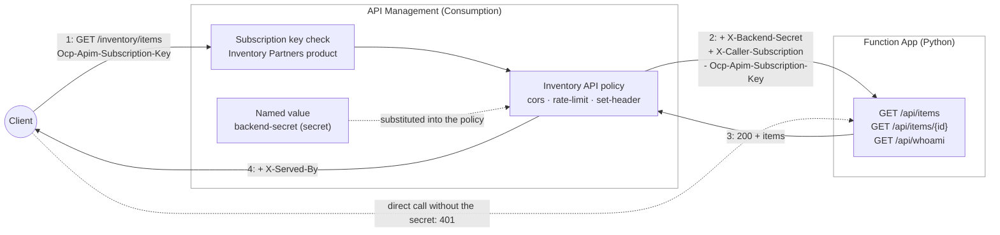

# API Management and Function App: an Azure Function published through an API gateway

This sample demonstrates [Azure API Management](https://learn.microsoft.com/en-us/azure/api-management/api-management-key-concepts) in front of an [Azure Function App](https://learn.microsoft.com/en-us/azure/azure-functions/functions-overview). The Function App serves a small *Inventory* API, but answers nothing unless the request carries a shared secret, and the only party holding that secret is the API Management gateway: it keeps it in a secret [named value](https://learn.microsoft.com/en-us/azure/api-management/api-management-howto-properties) and adds it to every backend call through a [policy](https://learn.microsoft.com/en-us/azure/api-management/api-management-howto-policies). Clients never see the backend. They call the gateway with a subscription key, and the gateway authorises the call, enforces a rate limit, answers browser preflights, and forwards what remains to the function.

The sample exercises both halves of API Management on the LocalStack Azure emulator: the control plane (service instance, OpenAPI import, product, subscription, named value, policy) and the gateway (subscription-key authorisation, policy execution, rate limiting, CORS).

## Architecture

The solution is composed of the following Azure resources:

1. [Azure Resource Group](https://learn.microsoft.com/en-us/azure/azure-resource-manager/management/manage-resource-groups-cli): A logical container scoping all resources in this sample.
2. [Azure Storage Account](https://learn.microsoft.com/en-us/azure/storage/common/storage-account-overview): The Function App's runtime storage (`AzureWebJobsStorage`).
3. [Azure App Service Plan](https://learn.microsoft.com/en-us/azure/app-service/overview-hosting-plans) (Linux, B1): Hosts the Function App.
4. [Azure Function App](https://learn.microsoft.com/en-us/azure/azure-functions/functions-overview) (Python v2 model): The *Inventory* backend, with three HTTP-triggered routes: `GET /api/items`, `GET /api/items/{id}` and `GET /api/whoami`. Every route refuses a request that does not carry a valid `X-Backend-Secret` header, so the Function App can only be reached through the gateway.
5. [Azure API Management](https://learn.microsoft.com/en-us/azure/api-management/api-management-key-concepts) (Consumption tier):
   - The **Inventory API**, imported from [`apim/openapi.json`](./apim/openapi.json) and published under `/inventory`, with the Function App as its backend (`serviceUrl`).
   - The **backend-secret** [named value](https://learn.microsoft.com/en-us/azure/api-management/api-management-howto-properties), marked secret, holding the shared secret.
   - The [API policy](./apim/inventory-api-policy.xml): a [`cors`](https://learn.microsoft.com/en-us/azure/api-management/cors-policy) policy that answers preflights at the gateway, a [`rate-limit`](https://learn.microsoft.com/en-us/azure/api-management/rate-limit-policy) of ten calls a minute per subscription, [`set-header`](https://learn.microsoft.com/en-us/azure/api-management/set-header-policy) policies that inject the secret from the named value and tell the backend which subscription is calling (`@(context.Subscription.Id)`), a pair that strips the subscription key in both forms a client may send it -- the header and the `subscription-key` query parameter -- and an outbound header marking responses that came through the gateway.
   - The **Inventory Partners** [product](https://learn.microsoft.com/en-us/azure/api-management/api-management-howto-add-products) containing the API, and the **partner-subscription** [subscription](https://learn.microsoft.com/en-us/azure/api-management/api-management-subscriptions) whose key clients present.



The life of a request: the client calls `GET /inventory/items` on the gateway with an `Ocp-Apim-Subscription-Key` header → the gateway checks the key against the product's subscriptions → the API policy runs → the request is forwarded to the Function App's `/api/items` with `X-Backend-Secret` and `X-Caller-Subscription` added and the subscription key removed → the Function App verifies the secret and answers → the gateway adds `X-Served-By` and returns the response. A call without a key, with a wrong key, or beyond ten calls a minute never reaches the function.

## Prerequisites

- [Docker](https://docs.docker.com/get-docker/)
- [Azure CLI](https://learn.microsoft.com/en-us/cli/azure/install-azure-cli)
- [lstk CLI](https://docs.localstack.cloud/aws/developer-tools/running-localstack/lstk/)
- [jq](https://jqlang.org/), `zip` and `openssl`
- [Terraform](https://developer.hashicorp.com/terraform/downloads) (for the Terraform deployment)
- [Bicep](https://learn.microsoft.com/en-us/azure/azure-resource-manager/bicep/install) (for the Bicep deployment)
- A LocalStack account with a valid `LOCALSTACK_AUTH_TOKEN` (see the [Auth Token guide](https://docs.localstack.cloud/getting-started/auth-token/))

## Setup

Start the LocalStack Azure emulator and route the Azure CLI to it:

```bash
export LOCALSTACK_AUTH_TOKEN=<your_auth_token>
IMAGE_NAME=localstack/localstack-azure localstack start -d
localstack wait -t 60
lstk az start-interception
az login --service-principal -u any-app -p any-pass --tenant any-tenant
```

## Deployment

### Azure CLI scripts

```bash
bash scripts/deploy.sh
```

The script provisions all resources idempotently: it creates the Function App and deploys it from a zip package, creates the API Management instance, stores the generated shared secret both as the Function App's `BACKEND_SECRET` setting and as the secret named value, imports the API from the OpenAPI document with the Function App as its backend, applies the policy, and creates the product and the subscription. It ends by printing the gateway URL and the command that reads the subscription key. A re-run reuses the stored secret, so the gateway and the Function App stay in agreement.

### Terraform

```bash
cd terraform
bash deploy.sh
```

The Terraform variant provisions the same resources declaratively and then deploys the function from a zip package with the Azure CLI. The API is imported from the same `apim/openapi.json`, and the policy is read from the same `apim/inventory-api-policy.xml`.

### Bicep

```bash
cd bicep
bash deploy.sh
```

The Bicep variant validates and deploys `main.bicep` into the resource group (generating the shared secret per run) and then deploys the function from a zip package with the Azure CLI. It shares the OpenAPI document and the policy with the other two variants through `loadTextContent`.

## Testing

```bash
bash scripts/validate.sh
bash scripts/call-api.sh
```

`validate.sh` walks the whole chain and exits non-zero on any failure:

1. The Function App refuses a direct call without the shared secret (401): the gateway is the only way in.
2. The OpenAPI import produced the three operations, matched case-insensitively. API Management normalises `operationId` into the operation's name — it replaces characters that are not allowed and truncates at 76 — and Microsoft's import-restrictions page also lists lower-casing, though a deployment to real Azure kept the casing (`getItems` stayed `getItems`, `Get Items` became `Get-Items`). The check does not depend on either behaviour.
3. A keyless call is refused with Azure's *missing subscription key* message, and a wrong key with its *invalid subscription key* message.
4. With the subscription key, `listItems` and `getItem` are authorised, matched (including the `{id}` template parameter) and answered by the function; a 404 from the backend passes through untouched; every response carries the outbound `X-Served-By` header.
5. `whoAmI` shows what the backend received: the injected secret, the calling subscription in `X-Caller-Subscription`, and no `Ocp-Apim-Subscription-Key`. The same holds for a key passed as the `subscription-key` query parameter: it authenticates the call and is stripped from the URL the function sees.
6. A CORS preflight is answered by the gateway itself, from the `cors` policy (asserted on Azure only; see the LocalStack notes).
7. A path that matches no operation gets the gateway's own 404.
8. The eleventh call within a minute is refused with a 429 and a `Retry-After` header.

`call-api.sh` is the user-level smoke test: it reads the key, lists the items and reads one of them. Run right after `validate.sh` it may be told to wait: the rate limit is still in force for the rest of the minute, and the script honours the `Retry-After` the gateway sends.

### Calling the API by hand

```bash
APIM_ID=$(az apim show --name local-inventory-apim-test --resource-group local-rg --query id --output tsv)
KEY=$(az rest --method post \
  --url "$APIM_ID/subscriptions/partner-subscription/listSecrets?api-version=2022-08-01" \
  --query primaryKey --output tsv)
GATEWAY=http://local-inventory-apim-test.apim.azure.localhost.localstack.cloud:4566

# Refused by the gateway
curl -s "$GATEWAY/inventory/items"
```

```json
{"statusCode": 401, "message": "Access denied due to missing subscription key. Make sure to include subscription key when making requests to an API."}
```

```bash
# Forwarded to the Function App
curl -s -H "Ocp-Apim-Subscription-Key: $KEY" "$GATEWAY/inventory/items/2"
```

```json
{"id": 2, "sku": "APIM-002", "name": "Gateway sticker pack", "quantity": 500}
```

```bash
# What the backend received: the caller's subscription, no subscription key
curl -s -H "Ocp-Apim-Subscription-Key: $KEY" "$GATEWAY/inventory/whoami" | jq .headers
```

```json
{
  "x-caller-subscription": "partner-subscription",
  "accept": "*/*",
  "user-agent": "curl/7.81.0",
  "host": "local-inventory-functionapp-test.azurewebsites.azure.localhost.localstack.cloud:4566"
}
```

The eleventh call within a minute is refused before it reaches the function:

```json
{"statusCode": 429, "message": "Rate limit is exceeded. Try again in 59 seconds."}
```

The key can also be passed as the `subscription-key` query parameter.

## Cleanup

```bash
az group delete --name local-rg --yes
```

Deleting an API Management instance soft-deletes it: the name stays reserved until the instance is purged or the retention period ends. To free the name straight away:

```bash
az apim deletedservice purge --service-name local-inventory-apim-test --location westeurope
```

## LocalStack notes

- **Gateway address.** API Management reports Azure's gateway address, `https://<name>.azure-api.net`, in `gatewayUrl`. The emulator claims that name too, but it only resolves once LocalStack's DNS is in front of the machine, so the scripts call the gateway through its local alias, `http://<name>.apim.azure.localhost.localstack.cloud:4566`, whenever the Azure CLI is pointed at the emulator (`az account show --query environmentName` is `LocalStack`). On Azure they use `gatewayUrl`.
- **Backend over plain HTTP.** The emulator serves the Function App under its own hostname (the `defaultHostName` it reports) over HTTP, so the API's `serviceUrl` is `http://<function app host>/api` there and `https://...` on Azure. The Azure CLI scripts pick the scheme from the environment. Terraform and Bicep take it as an input that defaults to the emulator's `http`, so a real deployment overrides one value rather than editing the template — `terraform apply -var backend_scheme=https` or `az deployment group create --parameters backendScheme=https`. The Bicep variant derives the Function App's `httpsOnly` from the same parameter, so the app stops accepting plain HTTP in the same step.
- **Shared secret rather than a function key.** On Azure the usual way to lock a Function App to its gateway is the function's host key, injected the same way (an `x-functions-key` header from a secret named value). This sample has the function check a secret of its own instead, so the same code, policy and deployment run unchanged on the emulator and on Azure without listing host keys.
- **CORS is answered by the emulator, not by the policy.** LocalStack enforces CORS for every hostname it serves, the API Management gateway included: a browser origin outside its allow-list gets a bodiless 403 before the gateway sees the request, and an allowed origin gets the emulator's own preflight answer and response headers rather than those of the API's `cors` policy. To call the emulated gateway from a browser app, allow its origin with `EXTRA_CORS_ALLOWED_ORIGINS=http://localhost:3000` (or `DISABLE_CORS_CHECKS=1`) when starting LocalStack. The `cors` policy in this sample is what answers preflights on Azure, and `validate.sh` asserts it there only.
- **Consumption tier.** It provisions in minutes on Azure and has no per-instance health probe; the emulator reproduces both. The rate limit is enforced per subscription and the counts are exact on the emulator, while Azure documents them as approximate, so `validate.sh` keeps calling until it sees the 429 rather than asserting the exact call at which it happens.
- **Updating API Management entities needs an `If-Match` header**, which is why `scripts/deploy.sh` only applies the policy with `If-Match: *` when it already exists and skips entities that are already there.

## References

- [Azure API Management Documentation](https://learn.microsoft.com/en-us/azure/api-management/)
- [API Management policy reference](https://learn.microsoft.com/en-us/azure/api-management/api-management-policies)
- [Azure Functions Documentation](https://learn.microsoft.com/en-us/azure/azure-functions/)
- [Import an Azure Function App as an API](https://learn.microsoft.com/en-us/azure/api-management/import-function-app-as-api)
- [LocalStack for Azure](https://docs.localstack.cloud/azure/)
- [LocalStack for Azure: API Management](https://docs.localstack.cloud/azure/services/api-management/)
- [lstk CLI](https://docs.localstack.cloud/aws/developer-tools/running-localstack/lstk/)
