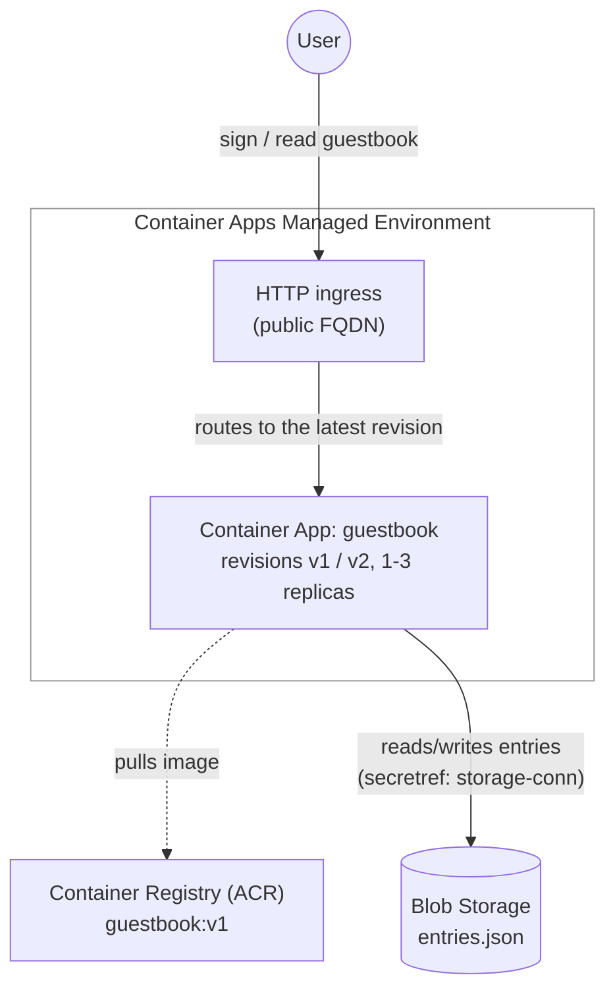

# Guestbook on Azure Container Apps

A sample application demonstrating how to deploy a containerized Flask web app using three Azure services:

- **Azure Blob Storage** — Stores guestbook entries as a JSON blob
- **Azure Container Registry (ACR)** — Hosts the Docker container image
- **Azure Container Apps** — Runs the containerized application behind the managed environment's HTTP ingress

## Architecture



- **Deployment flow:** The deploy script creates Storage first, then ACR, builds and pushes the container image, creates a Container Apps managed environment, and finally creates a container app that pulls from ACR. The storage connection string is stored as a Container Apps secret and injected into the container through a `secretref` environment variable.
- **At runtime:** The Flask app reads the storage connection string from its environment, connects to Blob Storage, and provides a web UI for signing and reading the guestbook. The revision that served each response is shown in the UI, so rolling out a new revision with `az containerapp update` is observable over HTTP.

## Prerequisites

- [LocalStack](https://docs.localstack.cloud/getting-started/installation/)
- [Docker](https://docs.docker.com/get-docker/)
- [Azure CLI](https://docs.microsoft.com/en-us/cli/azure/install-azure-cli)
- [lstk](https://github.com/localstack/lstk) (`brew install localstack/tap/lstk` or `npm install -g @localstack/lstk`)
- [Terraform](https://developer.hashicorp.com/terraform/downloads) (optional, for Terraform deployment)

## Quick Start

```bash
# Start the LocalStack Azure emulator
IMAGE_NAME=localstack/localstack-azure localstack start -d
localstack wait -t 60

# Route all Azure CLI calls to the LocalStack Azure emulator
lstk az start-interception

# Deploy all services
cd samples/container-apps-blob-storage/python
bash scripts/deploy.sh

# Validate the deployment (includes a live HTTP round trip and a revision rollout)
bash scripts/validate.sh
```

## Alternative Deployments

### Bicep

```bash
cd samples/container-apps-blob-storage/python
bash bicep/deploy.sh
```

### Terraform

```bash
cd samples/container-apps-blob-storage/python
bash terraform/deploy.sh
```

## Cleanup

```bash
# Removes all resources created by deploy.sh
bash scripts/cleanup.sh
```

## Application

The Guestbook is a Flask web application that lets visitors sign a guestbook. Entries are stored as a single JSON blob in Azure Blob Storage, so they survive replica restarts and revision switches.

### Endpoints

| Route | Method | Description |
|-------|--------|-------------|
| `/` | GET | View all guestbook entries |
| `/` | POST | Sign the guestbook |
| `/delete/<id>` | POST | Delete an entry |
| `/health` | GET | Health check (reports the serving revision) |

### Environment Variables

| Variable | Description |
|----------|-------------|
| `AZURE_STORAGE_CONNECTION_STRING` | Blob Storage connection string (injected via `secretref:storage-conn`) |
| `BLOB_CONTAINER_NAME` | Name of the blob container for entries |
| `APP_REVISION` | Revision label shown in the UI and `/health` (default: "v1") |

## Scripts

| Script | Description |
|--------|-------------|
| `scripts/deploy.sh` | Deploys Storage, ACR, the Container Apps environment, and the container app |
| `scripts/validate.sh` | Validates all resources, exercises secrets, revisions and replicas, and drives the live app over its ingress FQDN |
| `scripts/cleanup.sh` | Removes all resources created by deploy.sh |
| `bicep/deploy.sh` | Deploys all resources using a Bicep template |
| `terraform/deploy.sh` | Deploys all resources using Terraform |

## Container Apps Features Demonstrated

| Feature | Script |
|---------|--------|
| Managed environment create | deploy.sh |
| App create from a private registry (ACR) | deploy.sh |
| Secrets (`--secrets` + `secretref:` env var) | deploy.sh |
| External HTTP ingress + FQDN | deploy.sh |
| Multiple revisions mode + revision suffix | deploy.sh |
| Min / max replicas + HTTP scale rule | deploy.sh |
| Secret list / show | validate.sh |
| Revision list + rollout (`az containerapp update`) | validate.sh |
| Replica list | validate.sh |
| Live requests through the ingress FQDN | validate.sh |

## References

- [LocalStack for Azure Documentation](https://docs.localstack.cloud/azure/)
- [lstk CLI](https://docs.localstack.cloud/aws/developer-tools/running-localstack/lstk/)
- [lstk GitHub repository](https://github.com/localstack/lstk)
