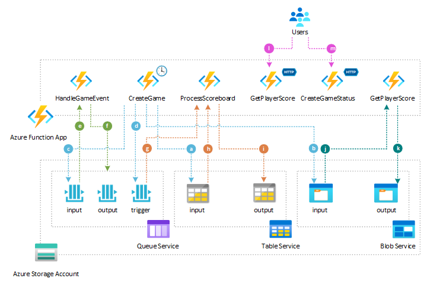

# Azure Functions Gaming Scoreboard Sample with LocalStack for Azure

This sample demonstrates a comprehensive gaming scoreboard system built with [Azure Functions](https://learn.microsoft.com/en-us/azure/azure-functions/functions-overview) running against [LocalStack for Azure](https://azure.localstack.cloud/). The application showcases how Azure Functions can seamlessly interact with Azure Storage services (Queues, Blobs, and Tables) when both the Azure Function App and storage services are running in emulated fashion locally on your machine using LocalStack for Azure.

## 🎯 Overview

The sample implements a complete gaming workflow that:

- **Manages game sessions** with player scoring and winner determination
- **Processes game events** through multiple Azure Storage services
- **Demonstrates hybrid storage architecture** using both Azure Storage services and in-memory data structures
- **Runs entirely locally** using LocalStack for Azure emulation
- **Showcases real-world Azure Functions patterns** with triggers, bindings, and best practices

## 🏗️ Architecture

The following diagram illustrates the architecture of the sample application, showing how Azure Functions interact with various Azure Storage services through LocalStack for Azure emulation:



The system uses a **hybrid storage approach** combining:

- **Azure Blob Storage** - for game file processing and data exchange
- **Azure Queue Storage** - for asynchronous event processing and workflow coordination  
- **Azure Table Storage** - for persistent winner records
- **In-memory Dictionary** - for fast access to active game data with thread-safe operations

## ⚡ Azure Functions Triggers and Bindings

### Triggers Used

| Trigger Type | Function | Description |
|-------------|----------|-------------|
| **HttpTrigger** | `GetPlayerScore` | GET endpoint to retrieve player scores: `/api/player/{gameId}/{name}/status` |
| **HttpTrigger** | `CreateGameStatus` | POST/PUT endpoint for game status requests: `/api/game/session` |
| **BlobTrigger** | `ProcessGameFile` | Processes uploaded game files from input container |
| **QueueTrigger** | `HandleGameEvent` | Processes game events from input queue |
| **QueueTrigger** | `ProcessScoreboard` | Processes scoreboard data from trigger queue |
| **TimerTrigger** | `CreateGame` | Runs every minute to generate new game rounds |

### Bindings Used

| Binding Type | Usage | Description |
|-------------|-------|-------------|
| **BlobOutput** | `ProcessGameFile` | Outputs processed game status to output container |
| **QueueOutput** | `HandleGameEvent` | Sends processed events to output queue |
| **TableInput** | `ProcessScoreboard` | Reads scoreboard entities by game ID |
| **TableOutput** | `ProcessScoreboard` | Writes winner records to winners table |

## 📋 Function Details

### 1. GetPlayerScore
- **Route**: `GET /api/player/{gameId}/{name}/status`
- **Purpose**: Retrieves individual player scores for a specific game
- **Response**: `PlayerScoreResponse` with player name, score, and timestamp
- **Storage**: Reads from in-memory dictionary for fast access

### 2. CreateGameStatus  
- **Route**: `POST|PUT /api/game/session`
- **Purpose**: Processes game status requests and returns comprehensive game information
- **Input**: `GameStatusRequest` with game ID
- **Response**: `GameStatusResponse` with winner, all players, and game details
- **Storage**: Queries in-memory dictionary and determines winner

### 3. ProcessGameFile
- **Trigger**: New blobs in input container
- **Purpose**: Processes uploaded game status files
- **Workflow**: Deserializes `GameStatusRequest` → Retrieves game data → Determines winner → Outputs `GameStatusResponse`
- **Storage**: Input container → Processing → Output container

### 4. HandleGameEvent
- **Trigger**: Messages in input queue  
- **Purpose**: Processes game events asynchronously
- **Workflow**: Reads queue messages → Processes `GameStatusRequest` → Outputs `GameStatusResponse` to output queue
- **Storage**: Input queue → Processing → Output queue

### 5. ProcessScoreboard
- **Trigger**: Messages in trigger queue
- **Purpose**: Determines game winners and records them permanently
- **Workflow**: Reads scoreboard entities → Finds highest score → Creates winner record
- **Storage**: Scoreboards table → Processing → Winners table

### 6. CreateGame (Timer Function)
- **Schedule**: Every minute (`0 */1 * * * *`) + runs on startup
- **Purpose**: Generates new game rounds with random player data
- **Workflow**: 
  1. Creates `GameStatusRequest` with new game ID
  2. Uploads game file to input container (triggers ProcessGameFile)
  3. Sends message to input queue (triggers HandleGameEvent)  
  4. Sends trigger message (triggers ProcessScoreboard)
  5. Creates in-memory game data with random player scores
  6. Increments game ID for next round

## 🎮 Game Data Model

### Core Classes

- **`PlayerScore`** - Represents a player's name and score
- **`PlayerScoreRequest`** - HTTP request for player operations  
- **`PlayerScoreResponse`** - HTTP response with player information
- **`GameStatusRequest`** - Request for game status operations
- **`GameStatusResponse`** - Response with complete game status, winner, and all players
- **`ScoreboardEntity`** - Azure Table entity for persistent scoreboard storage

### Configuration

The sample uses the following configurable settings in `local.settings.json`:

```json
{
  "STORAGE_ACCOUNT_CONNECTION_STRING": "Storage account connection string",
  "INPUT_STORAGE_CONTAINER_NAME": "input", 
  "OUTPUT_STORAGE_CONTAINER_NAME": "output",
  "INPUT_QUEUE_NAME": "input",
  "OUTPUT_QUEUE_NAME": "output", 
  "TRIGGER_QUEUE_NAME": "trigger",
  "INPUT_TABLE_NAME": "scoreboards",
  "OUTPUT_TABLE_NAME": "winners",
  "PLAYER_NAMES": "Anastasia,Paolo,Leo,Mia,Bob"
}
```

## 🚀 Running the Sample

### Prerequisites

- [LocalStack for Azure](https://azure.localstack.cloud/)
- [Visual Studio Code](https://code.visualstudio.com/) installed on one of the [supported platforms](https://code.visualstudio.com/docs/supporting/requirements#_platforms)
- [Bicep extension](https://marketplace.visualstudio.com/items?itemName=ms-azuretools.vscode-bicep), if you plan to install the sample via Bicep.
- [Terraform](https://developer.hashicorp.com/terraform/downloads), if you plan to install the sample via Terraform.
- [.NET SDK](https://dotnet.microsoft.com/en-us/download)
- [Docker](https://docs.docker.com/get-docker/) - Container runtime for LocalStack
- [Azure CLI](https://learn.microsoft.com/en-us/cli/azure/install-azure-cli) - Azure command-line interface
- [azlocal CLI](https://azure.localstack.cloud/user-guides/sdks/az/) - LocalStack Azure CLI wrapper
- [jq](https://jqlang.org/)** - JSON processor for scripting

1. **.NET 9.0 SDK** - The sample targets .NET 9.0 with isolated worker model
2. **Azure Functions Core Tools** - For local function execution
3. **LocalStack for Azure** - For Azure services emulation
4. **Azure Storage Explorer** (optional) - For viewing storage contents

### Local Development

1. **Start LocalStack for Azure** with required services:
   ```bash
   localstack start
   ```

2. **Build the project**:
   ```bash
   dotnet build
   ```

3. **Run the Functions App**:
   ```bash
   func start --verbose
   ```

4. **Monitor the workflow**: The timer function will automatically start creating games every minute

### Testing the API

```bash
# Get player score
curl "http://localhost:7071/api/player/1/Alice/status"

# Create game status  
curl -X POST "http://localhost:7071/api/game/session" \
  -H "Content-Type: application/json" \
  -d '{"gameId": 1}'
```

## 📸 Storage Contents

*Screenshots will be added here showing:*

- **Input Container**: Game status JSON files uploaded by timer function
- **Output Container**: Processed game status responses  
- **Input Queue**: Game status request messages
- **Output Queue**: Processed game status response messages
- **Trigger Queue**: Game ID triggers for scoreboard processing
- **Scoreboards Table**: Individual player score entries  
- **Winners Table**: Winning player records per game

## 🚀 Deployment Options

This sample can be deployed locally using multiple Infrastructure as Code approaches:

- **Azure CLI** - Direct Azure resource creation and deployment
- **Bicep** - Azure Resource Manager templates with simplified syntax  
- **Terraform** - Cross-cloud infrastructure provisioning

*Links to deployment scripts will be added here.*

## 🔧 LocalStack for Azure Integration

The sample demonstrates seamless integration with LocalStack for Azure by:

- Using standard Azure SDK clients (`BlobServiceClient`, `QueueClient`, `TableClient`)
- Configuring LocalStack endpoints in connection strings
- Maintaining full compatibility with Azure services
- Enabling local development without Azure subscription costs

## 📚 References

### Azure Documentation

- [Azure Functions Documentation](https://docs.microsoft.com/en-us/azure/azure-functions/)
- [Azure Functions .NET Isolated Worker](https://docs.microsoft.com/en-us/azure/azure-functions/dotnet-isolated-process-guide)
- [Azure Functions Triggers and Bindings](https://docs.microsoft.com/en-us/azure/azure-functions/functions-triggers-bindings)
- [Azure Blob Storage](https://docs.microsoft.com/en-us/azure/storage/blobs/)
- [Azure Queue Storage](https://docs.microsoft.com/en-us/azure/storage/queues/)
- [Azure Table Storage](https://docs.microsoft.com/en-us/azure/storage/tables/)

### LocalStack for Azure

- [LocalStack for Azure - Introduction](https://azure.localstack.cloud/introduction/)
- [LocalStack for Azure - Getting Started](https://azure.localstack.cloud/getting-started/)
- [LocalStack for Azure - Azure Functions](https://azure.localstack.cloud/user-guide/azure-functions/)
- [LocalStack for Azure - Storage Services](https://azure.localstack.cloud/user-guide/storage/)

## 🏷️ Tags

`azure-functions` `azure-storage` `localstack` `dotnet` `serverless` `gaming` `scoreboard` `blob-storage` `queue-storage` `table-storage` `triggers` `bindings`