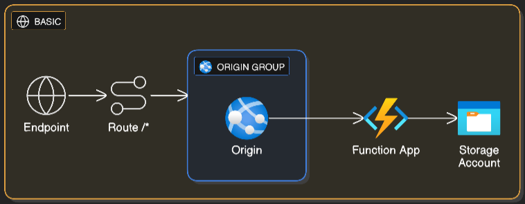
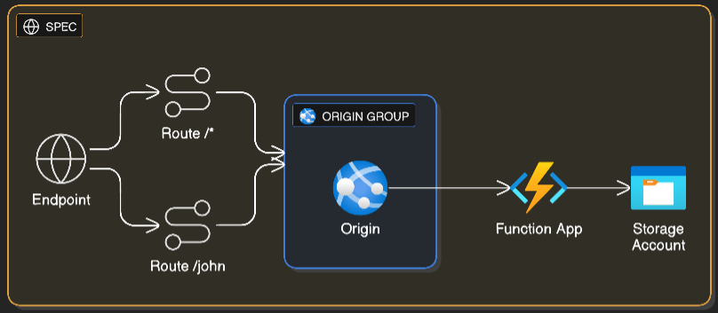
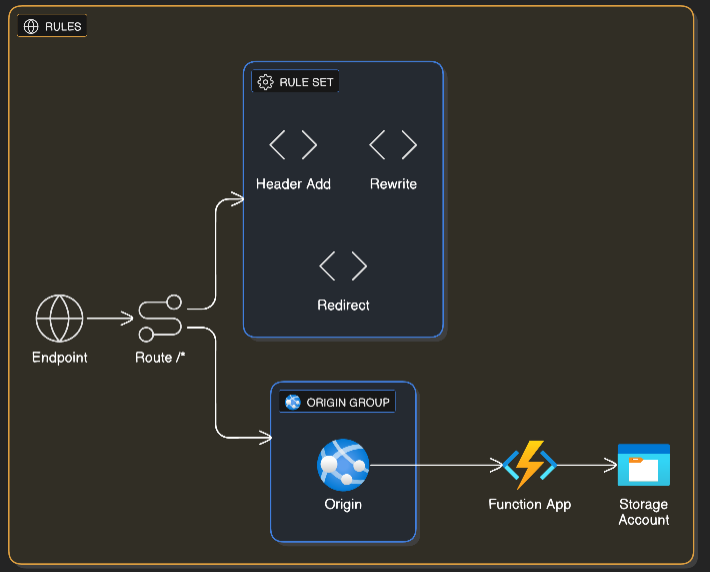
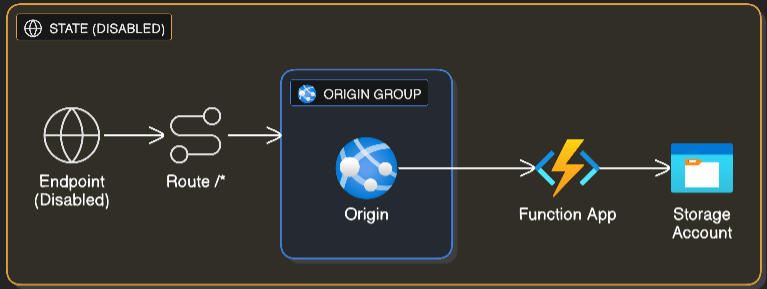

Function App + Azure Front Door (az CLI)

This sample creates a minimal Python Azure Function App that responds to /{name} and configures Azure Front Door (Standard SKU) to route traffic to it. It can target real Azure or LocalStack’s Azure emulation via azlocal interception.

- scripts/deploy_all.sh: One script that provisions all scenarios below in a single resource group:
  1) Basic single-origin routing
  2) Multiple origins with priority/weight selection
  3) Route specificity/precedence
  4) Rules Engine demo (three rules: response header, rewrite, redirect)
  5) Endpoint enabled/disabled state toggle
- scripts/cleanup_all.sh: Deletes the resource group created by deploy_all.sh.

Architecture at a glance (diagrams)
-----------------------------------
The following diagrams visualize each scenario provisioned by `deploy_all.sh`. They help you see the wiring between AFD endpoints, routes, origin groups/origins, and the Function App(s).

- Basic single‑origin
  
  
  
  What to notice: one Endpoint → one Route (`/*`) → one Origin Group → one Origin → Function App.

- Multi‑origin (priority/weight)
  
  
  
  What to notice: two Origins in a single Origin Group with explicit `priority` and `weight`. A group‑level health probe (HEAD /, 120s) gates origin eligibility; selection prefers the lowest priority and distributes by weight among equally prioritized healthy origins.

- Route specificity
  
  
  
  What to notice: two Routes on the same Endpoint and Origin Group: a catch‑all (`/*`) and a specific (`/john`). The most specific matching route should be chosen by the data plane.

- Rules engine
  
  
  
  What to notice: a Route with an attached Rule Set (three rules):
  - Rule 1: ModifyResponseHeader on GET → `X‑CDN: MSFT`
  - Rule 2: UrlRewrite when path begins with `/api` → `/`
  - Rule 3: UrlRedirect when path begins with `/old` → `/new` (302 Found)

- Endpoint enabled/disabled state
  
  
  
  What to notice: the Endpoint’s `enabled-state` can be toggled; when Disabled, requests should return a 4xx (e.g., 403). Re‑enabling restores normal behavior.

Notes for LocalStack runs:
- The printed test URLs use `*.afd.localhost.localstack.cloud:4566` for AFD and `*website.localhost.localstack.cloud:4566` for the Function App, so requests flow through the emulator’s edge.

Prerequisites
- Bash (e.g., Git Bash, WSL, or Linux/macOS shell)
- Azure CLI installed and logged in (az login) for real Azure
- Optional: azlocal (LocalStack’s Azure interception helper) in PATH to target the emulator
- zip utility in PATH (used for zip deploy to Azure)
- For LocalStack: funclocal and Azure Functions Core Tools ('func') for publishing

Quick start
1) Deploy against real Azure (eastus by default):
   bash ./scripts/deploy_all.sh --name-prefix mydemo

2) Deploy against LocalStack emulator:
   bash ./scripts/deploy_all.sh --name-prefix mydemo --use-localstack

The script prints:
- Resource group name
- AFD endpoint hostnames for each scenario and sample URLs (e.g., https://<endpoint>.z01.azurefd.net/john)

Cleanup
- Delete the resource group created by the deploy script:
  bash ./scripts/cleanup_all.sh --env-file ./scripts/.last_deploy_all.env
  or
  bash ./scripts/cleanup_all.sh --resource-group <rg-name>

Scenarios deployed by deploy_all.sh
1) Basic single-origin
   - One Function App, one AFD endpoint with a catch‑all route.
   - Test URL: printed as [Basic] in the output.

2) Multiple origins (priority/weight)
   - Two Function Apps (A primary, B secondary by default), one origin group with priorities/weights.
   - Call repeatedly to observe distribution; the function response includes "from <WEBSITE_HOSTNAME>" to visualize selected origin.

3) Route specificity
   - One endpoint with two routes pointing to the same origin group: catch‑all ('/*') and a specific ['/john'] route.
   - Compare responses for /john vs other paths.

4) Rules Engine demo
   - Creates a Rule Set with three rules and attaches it to the route:
     • ModifyResponseHeader on GET: sets header `X-CDN: MSFT`
     • UrlRewrite: when UrlPath begins with `/api`, rewrites to `/`
     • UrlRedirect: when UrlPath begins with `/old`, redirects (302 Found) to `/new`
   - If the `az afd rule-set`/`az afd rule` commands are unavailable, the script skips rule creation gracefully.

5) Endpoint enabled/disabled state
   - Provisions a dedicated endpoint you can toggle with:
     az afd endpoint update -g <RG> --profile-name <PROFILE> --endpoint-name <ENDPOINT> --enabled-state Disabled
     az afd endpoint update -g <RG> --profile-name <PROFILE> --endpoint-name <ENDPOINT> --enabled-state Enabled

Unified scripts details
=======================

deploy_all.sh (what it provisions/tests)
- Creates one AFD Profile and up to five Endpoints (one per scenario):
  - Basic: single origin, catch‑all route
  - Multi: two origins in one origin group with priority/weight and a HEAD health probe
  - Spec: two routes on one endpoint to demonstrate route specificity (`/*` vs `/john`)
  - Rules: a rules engine Rule Set attached to the endpoint’s route (three rules listed above)
  - State: an endpoint to toggle Enabled/Disabled
- Creates the necessary Function App(s): one main app for Basic/Spec/Rules/State, and two apps (A/B) for Multi.
- Publishes the function code (zip deploy for Azure; `funclocal` + `func` for LocalStack).
- Prints convenient test URLs for each scenario.
- Writes an environment file for cleanup at: `scripts/.last_deploy_all.env`.

deploy_all.sh (how to run)
- Azure (cloud):
  - `bash ./scripts/deploy_all.sh --name-prefix mydemo`
- LocalStack (emulator):
  - `bash ./scripts/deploy_all.sh --name-prefix mydemo --use-localstack`
- Useful flags:
  - `-p, --name-prefix`: base name used for resources (auto-sanitized to lowercase/digits)
  - `-l, --location`: Azure region (default: eastus)
  - `-g, --resource-group`: use a specific RG instead of an auto-generated one
  - `--python-version`: Python runtime for Function Apps (default: 3.11)
  - `--use-localstack`: target LocalStack via azlocal interception and publish via funclocal/func
  - Scenario toggles (all enabled by default): `--no-basic`, `--no-multi`, `--no-spec`, `--no-rules`, `--no-state`

deploy_all.sh (outputs to expect)
- Resource group name, e.g., `rg-<prefix>-<suffix>`
- Scenario endpoints (Azure or LocalStack hosts) and example URLs, e.g.:
  - `[Rules] AFD Local Endpoint:   https://ep-<prefix>-rules-<suffix>.afd.localhost.localstack.cloud:4566/john`
- For LocalStack runs, the function host and AFD local endpoint names will use `*.localhost.localstack.cloud:4566`.
- The script also writes `scripts/.last_deploy_all.env` with variables like:
  - `RESOURCE_GROUP`, `PROFILE_NAME`, `EP_BASIC`, `EP_MULTI`, `EP_SPEC`, `EP_RULES`, `EP_STATE`, `FUNC_MAIN`, `FUNC_A`, `FUNC_B`.
  - The Rules Engine rule set name follows the pattern `rs<prefix><suffix>` (alphanumeric), which can be derived from `PROFILE_NAME`:
    - Example in bash: `BASE="${PROFILE_NAME#afd-}"; RULE_SET="rs${BASE//-/}"`

cleanup_all.sh (what it does)
- Deletes the entire resource group created by `deploy_all.sh` using `az group delete --no-wait`.
- Supports two ways to specify the resource group:
  1) `--env-file ./scripts/.last_deploy_all.env` (recommended after a fresh deploy)
  2) `-g/--resource-group <rg-name>`
- Supports `--use-localstack` to intercept the az CLI for emulator cleanup.

cleanup_all.sh (how to run)
- Using the env file created by the deploy:
  - `bash ./scripts/cleanup_all.sh --env-file ./scripts/.last_deploy_all.env`
- Passing RG explicitly:
  - `bash ./scripts/cleanup_all.sh --resource-group rg-<prefix>-<suffix>`
- LocalStack cleanup:
  - add `--use-localstack` to either command above.

Verifying the Rules Engine scenario quickly (LocalStack)
- Assume you ran with `--name-prefix mydemo` and got `ep-mydemo-rules-12345`:
```
HOST="https://ep-mydemo-rules-12345.afd.localhost.localstack.cloud:4566"

# 1) ModifyResponseHeader on GET → expect X-CDN: MSFT
curl -i "$HOST/" | grep -i "^X-CDN:\s*MSFT" || echo "Header X-CDN not present"

# 2) UrlRewrite for /api → /
curl -i "$HOST/api" | head -n 1

# 3) UrlRedirect for /old → /new
curl -i -L "$HOST/old" | head -n 5
```

Deploy to Azure (cloud) and test
1) Sign in/select subscription:
   - az login
   - az account set --subscription "<SUBSCRIPTION_ID_OR_NAME>"

2) Run deployment (avoid --use-localstack):
   - cd samples/function-app-front-door/python
   - bash ./scripts/deploy_all.sh --name-prefix mydemo --location eastus

3) Note the printed outputs (resource group and endpoints) and test as instructed. Allow 2–10 minutes for AFD readiness.

If you closed the terminal and need hostnames later
- Function host:
  az functionapp show -g <RESOURCE_GROUP> -n <FUNCTION_APP_NAME> --query defaultHostName -o tsv
- AFD endpoint hostname:
  az afd endpoint show -g <RESOURCE_GROUP> --profile-name <AFD_PROFILE_NAME> --endpoint-name <ENDPOINT_NAME> --query hostName -o tsv
- List resources by RG:
  - Function Apps: az functionapp list -g <RESOURCE_GROUP> --query "[].{name:name,host:defaultHostName}"
  - AFD profiles:  az afd profile list -g <RESOURCE_GROUP> --query "[].name"
  - AFD endpoints: az afd endpoint list -g <RESOURCE_GROUP> --profile-name <AFD_PROFILE_NAME> --query "[].{name:name,host:hostName}"

Common notes and troubleshooting
- Windows users: use Git Bash or WSL to run bash scripts.
- Authentication: the function trigger is Anonymous; no keys required.
- The function returns plain text and echoes WEBSITE_HOSTNAME to help testing multi-origins.
- Application Insights: disabled by default via --disable-app-insights.
- Azure deploy uses zip deploy; LocalStack uses funclocal + func publish.
- AFD readiness: 2–10 minutes typical; check provisioning state:
  az afd endpoint show -g <RESOURCE_GROUP> --profile-name <AFD_PROFILE_NAME> --endpoint-name <ENDPOINT_NAME> --query provisioningState -o tsv
- Region/runtime: change with --location/--python-version in deploy_all.sh.

Cleanup
- Delete all resources by removing the resource group (non-blocking delete):
  - Using env file: `bash ./scripts/cleanup_all.sh --env-file ./scripts/.last_deploy_all.env`
  - Or directly:    `bash ./scripts/cleanup_all.sh --resource-group <rg-name>`

Notes
- Azure Front Door is a global resource; the script uses Standard_AzureFrontDoor SKU and links the route to the default domain of the endpoint.
- The function removes the /api prefix so you can call /john directly.
- The deployment uses zip deploy; because the function has no heavy dependencies, it should work without additional build steps. If you add dependencies that require native builds, consider using the Azure Functions Core Tools for publishing.
