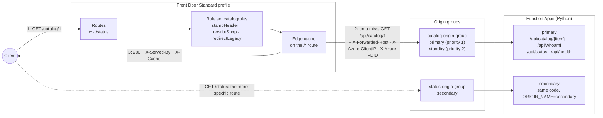

# Front Door and Function Apps: a catalog API published through an edge

This sample demonstrates [Azure Front Door Standard](https://learn.microsoft.com/en-us/azure/frontdoor/front-door-overview) in front of two [Azure Function Apps](https://learn.microsoft.com/en-us/azure/azure-functions/functions-overview). The Function Apps serve a small *Catalog* API and are otherwise identical: each one reports its own name in every response, so which origin answered, which route matched and what path the origin was asked for can all be read straight off the body.

Clients only ever call the Front Door endpoint. Between the client and the function, the edge picks an origin by priority, decides which of two routes applies, caches what the origin allows it to cache, and runs a [rule set](https://learn.microsoft.com/en-us/azure/frontdoor/front-door-rules-engine) that stamps a response header, rewrites one path prefix into another and answers a retired path with a redirect without calling an origin at all.

The sample exercises both halves of Front Door on the LocalStack Azure emulator: the control plane (profile, endpoint, origin groups, origins, routes, rule set, rules, purge) and the data plane (routing, origin selection, health probes, caching, the rules engine and the headers the edge adds).

## Architecture

The solution is composed of the following Azure resources:

1. [Azure Resource Group](https://learn.microsoft.com/en-us/azure/azure-resource-manager/management/manage-resource-groups-cli): A logical container scoping all resources in this sample.
2. [Azure Storage Accounts](https://learn.microsoft.com/en-us/azure/storage/common/storage-account-overview) (two): The Function Apps' runtime storage (`AzureWebJobsStorage`), one each.
3. [Azure App Service Plan](https://learn.microsoft.com/en-us/azure/app-service/overview-hosting-plans) (Linux, B1): Shared by both Function Apps.
4. [Azure Function Apps](https://learn.microsoft.com/en-us/azure/azure-functions/functions-overview) (Python v2 model), **primary** and **secondary**: the *Catalog* origin, with four HTTP routes — `GET /api/catalog/{item}` (cacheable, `Cache-Control: public, max-age=300`), `GET /api/whoami` (what the origin received, `no-store`), `GET /api/status` and `GET|HEAD /api/health` (the health probe target). An `ORIGIN_NAME` app setting is the only difference between the two apps.
5. [Azure Front Door Standard](https://learn.microsoft.com/en-us/azure/frontdoor/front-door-overview) profile:
   - One **endpoint**, the address clients call.
   - The **catalog origin group**, holding the primary origin at priority 1 and the secondary as a priority-2 standby, with a [health probe](https://learn.microsoft.com/en-us/azure/frontdoor/health-probes) that sends `HEAD /api/health` every 30 seconds.
   - The **status origin group**, holding the secondary origin alone.
   - The **catalog route** (`/*`), which sends traffic to the catalog origin group with [caching](https://learn.microsoft.com/en-us/azure/frontdoor/front-door-caching) switched on and the rule set attached.
   - The **status route** (`/status`), a more specific pattern pointing at the other origin group, with no caching and no rules.
   - The **catalogrules** [rule set](https://learn.microsoft.com/en-us/azure/frontdoor/front-door-rules-engine): `stampHeader` (adds `X-Served-By` to every GET response, which is what its `RequestMethod Equal GET` condition matches), `rewriteShop` (`/shop/*` → `/catalog/*` on the way to the origin) and `redirectLegacy` (`/legacy` → `302` to `/status`, answered at the edge).


```mermaid
%%{init: {"flowchart": {"nodeSpacing": 50, "rankSpacing": 70}}}%%
flowchart LR
    client((Client))

    subgraph afd["Front Door Standard profile"]
        direction TB
        routes["Routes<br/>/* · /status"]
        rules["Rule set catalogrules<br/>stampHeader · rewriteShop · redirectLegacy"]
        cache["Edge cache<br/>on the /* route"]
        routes --> rules --> cache
    end

    subgraph origins["Origin groups"]
        direction TB
        primary["catalog-origin-group<br/>primary (priority 1)<br/>standby (priority 2)"]
        secondary["status-origin-group<br/>secondary"]
    end

    subgraph apps["Function Apps (Python)"]
        direction TB
        app1["primary<br/>/api/catalog/{item} · /api/whoami<br/>/api/status · /api/health"]
        app2["secondary<br/>same code, ORIGIN_NAME=secondary"]
    end

    client -->|"1: GET /catalog/1"| routes
    cache -->|"2: on a miss, GET /api/catalog/1<br/>+ X-Forwarded-Host · X-Azure-ClientIP · X-Azure-FDID"| primary
    primary --> app1
    secondary --> app2
    cache -->|"3: 200 + X-Served-By + X-Cache"| client
    client -. "GET /status: the more specific route" .-> secondary

    style afd fill:#ffffff,stroke:#999999,color:#333333
    style origins fill:#ffffff,stroke:#999999,color:#333333
    style apps fill:#ffffff,stroke:#999999,color:#333333
```

The life of a request: the client calls `GET /catalog/1` on the endpoint → the `/*` route matches, since no more specific pattern does → the rule set runs → the edge looks in its cache, and on a miss picks the healthy origin with the lowest priority number → the route's origin path puts `/api` back on the front of the path and the request goes to the primary Function App as `GET /api/catalog/1` → the response comes back, is stored because its `Cache-Control` allows it, gets `X-Served-By` from the rule set and `X-Cache`/`X-Azure-Ref` from Front Door, and reaches the client. The second identical request never leaves the edge.

## Prerequisites

- [Docker](https://docs.docker.com/get-docker/)
- [Azure CLI](https://learn.microsoft.com/en-us/cli/azure/install-azure-cli)
- [lstk CLI](https://docs.localstack.cloud/aws/developer-tools/running-localstack/lstk/)
- [jq](https://jqlang.org/) and `zip`
- A LocalStack account with a valid `LOCALSTACK_AUTH_TOKEN` (see the [Auth Token guide](https://docs.localstack.cloud/getting-started/auth-token/))

## Setup

Start LocalStack for Azure and point the Azure CLI at it:

```bash
export LOCALSTACK_AUTH_TOKEN=<your-auth-token>
IMAGE_NAME=localstack/localstack-azure localstack start -d
lstk az start-interception
az login --service-principal -u any-app -p any-pass --tenant any-tenant
az account set --subscription 00000000-0000-0000-0000-000000000000
```

Every command below is the same against real Azure; sign in with `az login` instead.

## Deployment

```bash
bash scripts/deploy.sh
```

The script provisions the resource group, the App Service plan, the two storage accounts and the two Function Apps, deploys the same zip package to both, then creates the Front Door profile, endpoint, origin groups, origins, rule set, rules and routes. It finishes by printing the endpoint URL and a handful of `curl` commands to try.

It is safe to re-run: the Azure resources it creates are either checked for first or created with an idempotent `PUT`.

## Testing

```bash
bash scripts/validate.sh
bash scripts/call-front-door.sh
```

`validate.sh` walks the whole chain and exits non-zero on any failure:

| # | Check | What it proves |
|---|-------|----------------|
| 1 | Both Function Apps answer `/api/health`, including on `HEAD` | The origins are up and answer the method the health probe uses |
| 2 | `GET /catalog/1` through the endpoint | The catch-all route, the priority-1 origin, and the route's origin path |
| 3 | `X-Served-By` and `X-Azure-Ref` on the response | The rule set ran; the edge stamped its reference id |
| 4 | `GET /status` | A more specific route wins, and sends the request to a different origin group |
| 5 | `GET /shop/2` | The `UrlRewrite` rule: the origin is asked for `/api/catalog/2` |
| 6 | `GET /legacy` | The `UrlRedirect` rule answers `302` at the edge, without calling an origin |
| 7 | `/catalog/3` twice, then a purge, then a `no-store` path | Caching, `X-Cache`, `Age`, purge, and the origin's power to refuse caching |
| 8 | `GET /whoami` | `X-Forwarded-Host`, `X-Azure-ClientIP` and `X-Azure-FDID` reach the origin |
| 9 | Ten requests to an uncached path | Priority is a strict tier: all ten are answered by the priority-1 origin |
| 10 | `GET /catalog/99` | The origin's own `404` passes through the edge untouched |
| 11 | The endpoint disabled, then enabled again | `enabledState` takes the endpoint out of service and back |

`call-front-door.sh` is the short version: read a catalog item, read it again from the cache, follow the rewrite and the redirect, and print what the origin received.

### Calling the endpoint by hand

```bash
ENDPOINT_URL=http://local-catalog-test.afd.azure.localhost.localstack.cloud:4566

# A cacheable response: the first request is a miss, the second a hit
curl -si $ENDPOINT_URL/catalog/1 | grep -iE "^(HTTP|x-cache|age|x-served-by)"
```

```text
HTTP/1.1 200 OK
x-served-by: front-door
x-cache: MISS
```

```bash
# The rules engine rewrites the path before the origin sees it
curl -s $ENDPOINT_URL/shop/2 | jq '{origin, path, sku: .item.sku}'
```

```json
{
  "origin": "primary",
  "path": "/api/catalog/2",
  "sku": "AFD-002"
}
```

```bash
# What Front Door tells the origin about the caller and about itself
curl -s $ENDPOINT_URL/whoami | jq .front_door_headers
```

```json
{
  "host": "local-catalog-primary-test.azurewebsites.azure.localhost.localstack.cloud:4566",
  "via": "1.1 Azure",
  "x-azure-clientip": "127.0.0.1",
  "x-azure-fdid": "8c7dc56e48154939834f0469a7e5c1bf",
  "x-azure-requestchain": "hops=1",
  "x-azure-socketip": "127.0.0.1",
  "x-forwarded-for": "127.0.0.1",
  "x-forwarded-host": "local-catalog-test.afd.azure.localhost.localstack.cloud",
  "x-forwarded-proto": "http"
}
```

```bash
# Empty the cache for a set of paths
az afd endpoint purge \
  --endpoint-name local-catalog-test \
  --profile-name local-catalog-afd-test \
  --resource-group local-rg \
  --content-paths '/catalog/*'
```

## Cleanup

```bash
bash scripts/cleanup.sh
```

## LocalStack notes

- **The endpoint's local address.** Front Door assigns the endpoint a `*.azurefd.net` host name, and the emulator reports one too, but that name only resolves once [LocalStack's DNS server](https://docs.localstack.cloud/aws/capabilities/networking/dns-server/) is in front of the machine. The scripts use the emulator's own alias instead, `http://<endpoint-name>.afd.azure.localhost.localstack.cloud:4566`, which resolves to `127.0.0.1` without any DNS setup.
- **Plain HTTP to the origins.** The emulator serves Function Apps over HTTP on port 4566, so the routes forward with `HttpOnly` and do not redirect HTTP to HTTPS. Against real Azure the same script uses `HttpsOnly` and `--https-redirect Enabled`, because `*.azurewebsites.net` is HTTPS-only. This is the only difference in what the script deploys.
- **The origin's host name and port.** An origin's `--host-name` is a bare host name, so the script splits the `host:4566` the emulator reports and passes the port as `--http-port`. The `--origin-host-header` keeps the port, because that is the name the emulator routes the Function App by.
- **Cache status values.** The emulator reports `X-Cache: HIT`, `MISS` and `UNCACHEABLE`; Azure reports `TCP_HIT`, `TCP_MISS` and friends. `validate.sh` looks for the word, not the whole value.

## Two Azure details worth knowing

- **`UrlPath` conditions see the path without its leading slash.** A rule that should fire on `/shop/2` matches on `shop`; `UrlRewrite`'s `--source-pattern`, on the other hand, keeps it (`/shop`). Real Azure [ignores a leading slash in the match value](https://learn.microsoft.com/en-us/azure/frontdoor/rules-match-conditions), so `/shop` matches there too, while the emulator compares the configured value as written. Writing the match value without the slash works on both.
- **`az afd rule create` has two spellings.** Up to Azure CLI 2.83 the `afd` commands are part of the CLI and take one flattened condition and action per rule (`--match-variable`, `--action-name`, …). From 2.85 they live in the [`cdn` extension](https://github.com/Azure/azure-cli-extensions/tree/main/src/cdn), which takes `--conditions` and `--actions` in its own shorthand syntax, and spells the route's rule sets and caching differently too. `deploy.sh` detects which one is installed and uses it.

## What this sample does not cover

[Custom domains](https://learn.microsoft.com/en-us/azure/frontdoor/standard-premium/how-to-add-custom-domain) and their certificates, [WAF policies and security policies](https://learn.microsoft.com/en-us/azure/web-application-firewall/afds/afds-overview), [private link origins](https://learn.microsoft.com/en-us/azure/frontdoor/private-link), and the older [classic Front Door](https://learn.microsoft.com/en-us/azure/frontdoor/front-door-overview) and [classic CDN](https://learn.microsoft.com/en-us/azure/cdn/cdn-overview) profiles. The emulator implements all of them; see the [Front Door coverage page](https://docs.localstack.cloud/azure/services/front-door/) for what each one supports.

## References

- [Azure Front Door documentation](https://learn.microsoft.com/en-us/azure/frontdoor/)
- [Routing architecture](https://learn.microsoft.com/en-us/azure/frontdoor/front-door-routing-architecture) and [route matching](https://learn.microsoft.com/en-us/azure/frontdoor/front-door-routing-methods)
- [Rules engine actions](https://learn.microsoft.com/en-us/azure/frontdoor/front-door-rules-engine-actions) and [match conditions](https://learn.microsoft.com/en-us/azure/frontdoor/rules-match-conditions)
- [Caching with Azure Front Door](https://learn.microsoft.com/en-us/azure/frontdoor/front-door-caching)
- [How Front Door forwards requests to origins](https://learn.microsoft.com/en-us/azure/frontdoor/front-door-http-headers-protocol)
- [LocalStack for Azure: Front Door](https://docs.localstack.cloud/azure/services/front-door/)
