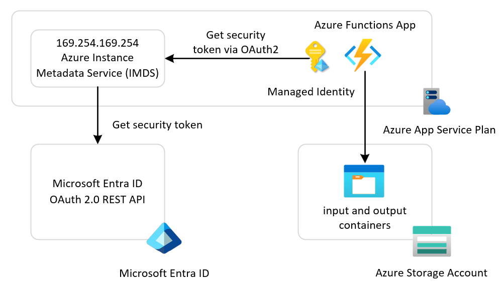

# Azure Functions App with Managed Identity

This sample demonstrates a serverless application hosted on [Azure Functions](https://learn.microsoft.com/en-us/azure/azure-functions/functions-overview) that reads text blobs from an `input` container, converts the text to uppercase, and stores the result as a blob in the `output` container of an [Azure Storage Account](https://learn.microsoft.com/en-us/azure/storage/blobs/storage-blobs-introduction). The application runs on an Azure App Service Plan and uses either a user-assigned or system-assigned managed identity to access storage.

A managed identity from Microsoft Entra ID enables your application to seamlessly access other Microsoft Entra-protected resources, such as Azure Key Vault. The Azure platform manages the identity, eliminating the need to provision or rotate secrets. For more information about managed identities in Microsoft Entra ID, see [Managed identities for Azure resources](https://learn.microsoft.com/en-us/azure/active-directory/managed-identities-azure-resources/overview).

You can configure the Azure Functions App to use two types of managed identities:

- A **system-assigned identity** is tied to the application and is deleted when the application is deleted. An application can have only one system-assigned identity.
- A **user-assigned identity** is a standalone Azure resource that can be assigned to your application. An application can have multiple user-assigned identities. A single user-assigned identity can be assigned to multiple Azure resources, such as multiple App Service applications.

For more information on how to create a managed identity for Azure App Service and Azure Functions applications, and how to use it to access other resources, see [Use managed identities for App Service and Azure Functions](https://learn.microsoft.com/en-us/azure/app-service/overview-managed-identity).

## Architecture

The following diagram illustrates the architecture of the solution:



- **Azure Functions App**: Hosts the serverless application that processes text blobs
- **Azure App Service Plan**: Provides compute resources for the Functions app
- **Azure Blob Storage**: Contains `input` and `output` containers for storing text blobs
- **Managed Identity**: Enables secure access to Azure Storage without storing credentials
- **Azure Entra ID**: Issues security tokens for the managed identity to authenticate with Azure Storage

## Security

## Security

This sample demonstrates how to configure an [Azure App Service](https://learn.microsoft.com/en-us/azure/app-service/configure-authentication-provider-aad?tabs=workforce-configuration), specifically an Azure Functions App, to use either a user-assigned identity or a system-assigned identity to acquire a security token from [Microsoft Entra ID](https://learn.microsoft.com/en-us/entra/fundamentals/what-is-entra) for accessing downstream services such as Azure Blob Storage. You must configure the target resource to allow access from your app. For most Azure services, configure the target resource by [creating a role assignment](https://learn.microsoft.com/en-us/azure/role-based-access-control/role-assignments-steps) for the user-assigned or system-assigned managed identity used by the application via Azure role-based access control (Azure RBAC). For more information, see [What is Azure RBAC?](https://learn.microsoft.com/en-us/azure/role-based-access-control/overview)

Some services use mechanisms other than Azure role-based access control. To understand how to configure access using an identity, refer to the Azure documentation for each target resource. To learn more about which resources support Microsoft Entra tokens, see [Azure services that support Microsoft Entra authentication](https://learn.microsoft.com/en-us/azure/active-directory/managed-identities-azure-resources/services-support-managed-identities#azure-services-that-support-azure-ad-authentication).

For example, if you [request a token](https://learn.microsoft.com/en-us/azure/app-service/overview-managed-identity?tabs=portal%2Chttp#connect-to-azure-services-in-app-code) to access a secret in Azure Key Vault, you must also create a role assignment that allows the managed identity to work with secrets in the target vault. Otherwise, Key Vault will reject your calls even if you use a valid token. The same is true for Azure SQL Database and other Azure services.

In this sample, the provisioning process assigns the [Storage Blob Data Contributor](https://learn.microsoft.com/en-us/azure/role-based-access-control/built-in-roles/storage#storage-blob-data-contributor) built-in role to the managed identity used by the Azure Functions App, with the demo storage account as the scope. This ensures the managed identity has the proper permissions to allow the application code to read and write blobs in the target `input` and `output` containers.

The LocalStack emulator emulates the following services, which are necessary at provisioning time and runtime:

- **Microsoft Entra Tenant**: This REST API is responsible for issuing a security token to the application to access the target service. For more information, see [Microsoft identity platform and OAuth 2.0 authorization code flow](https://learn.microsoft.com/en-us/entra/identity-platform/v2-oauth2-auth-code-flow).
- **Microsoft Graph REST API**: Microsoft Graph is the gateway to Microsoft cloud services like Microsoft Entra and Microsoft 365. In particular, it provides access to [service principals](https://learn.microsoft.com/en-us/graph/api/resources/serviceprincipal?view=graph-rest-1.0) used by applications via [workload identities](https://learn.microsoft.com/en-us/entra/workload-id/workload-identities-overview). In Microsoft Entra, workload identities are applications, service principals, and managed identities.
- **Azure Role-Based Access Control (RBAC)**: Azure role-based access control (Azure RBAC) helps you manage who has access to Azure resources, what they can do with those resources, and what areas they have access to. LocalStack for Azure fully supports and mocks built-in [role definitions](https://learn.microsoft.com/en-us/azure/role-based-access-control/role-definitions), custom role definitions, and [role assignments](https://learn.microsoft.com/en-us/azure/role-based-access-control/role-assignments), but does not enforce or check permissions.

## Prerequisites

- [Azure Subscription](https://azure.microsoft.com/free/)
- [Azure CLI](https://learn.microsoft.com/en-us/cli/azure/install-azure-cli)
- [Azure Functions Core Tools](https://learn.microsoft.com/en-us/azure/azure-functions/functions-run-local)
- [Python](https://www.python.org/downloads/)
- [Flask](https://flask.palletsprojects.com/)
- [Bicep extension](https://marketplace.visualstudio.com/items?itemName=ms-azuretools.vscode-bicep), if you plan to install the sample via Bicep.
- [Terraform](https://developer.hashicorp.com/terraform/downloads), if you plan to install the sample via Terraform.

## Deployment

Set up the Azure emulator using the LocalStack for Azure Docker image. Before starting, ensure you have a valid `LOCALSTACK_AUTH_TOKEN` to access the Azure emulator. Refer to the [Auth Token guide](https://docs.localstack.cloud/getting-started/auth-token/?__hstc=108988063.8aad2b1a7229945859f4d9b9bb71e05d.1743148429561.1758793541854.1758810151462.32&__hssc=108988063.3.1758810151462&__hsfp=3945774529) to obtain your Auth Token and set it in the `LOCALSTACK_AUTH_TOKEN` environment variable. The Azure Docker image is available on the [LocalStack Docker Hub](https://hub.docker.com/r/localstack/localstack-azure-alpha). To pull the image, execute:

```bash
docker pull localstack/localstack-azure-alpha
```

Start the LocalStack Azure emulator by running:

```bash
# Set the authentication token
export LOCALSTACK_AUTH_TOKEN=<your_auth_token>

# Start the LocalStack Azure emulator
IMAGE_NAME=localstack/localstack-azure-alpha localstack start -d
localstack wait -t 60

# Route all Azure CLI calls to the LocalStack Azure emulator
azlocal start-interception
```

Deploy the application to LocalStack for Azure using one of these methods:

- [Azure CLI Deployment](./scripts/README.md)
- [Bicep Deployment](./bicep/README.md)
- [Terraform Deployment](./terraform/README.md)

All deployment methods have been fully tested with both user-assigned and system-assigned managed identities against Azure and the LocalStack for Azure local emulator.

> **Note**  
> When you deploy the application to LocalStack for Azure for the first time, the initialization process involves downloading and building Docker images. This is a one-time operation—subsequent deployments will be significantly faster. Depending on your internet connection and system resources, this initial setup may take several minutes.

## Test

Once the resources and serverless application have been deployed, you can use the `test.sh` script below to copy a sample file to the `input` container and monitor whether the Azure Functions App processes the input blob file and generates a result file in the `output` container. 

```bash
#!/bin/bash

# Variables
PREFIX='local'
SUFFIX='test'
FILE_PATH="input.txt"
INPUT_CONTAINER_NAME="input"
OUTPUT_CONTAINER_NAME="output"
STORAGE_ACCOUNT_NAME="${PREFIX}storage${SUFFIX}"
CURRENT_DIR="$(cd "$(dirname "$0")" && pwd)"

# Change the current directory to the script's directory
cd "$CURRENT_DIR" || exit
# Generate a timestamp in the format YYYY-MM-DD-HH-MM-SS
TIMESTAMP=$(date +"%Y-%m-%d-%H-%M-%S")

# Extract the file name and extension
FILE_NAME=$(basename -- "$FILE_PATH")
FILE_BASE_NAME="${FILE_NAME%.*}"  # File name without extension
FILE_EXTENSION="${FILE_NAME##*.}" # File extension

# Construct the blob name with the timestamp
BLOB_NAME="${FILE_BASE_NAME}-${TIMESTAMP}.${FILE_EXTENSION}"

# Check whether the input container already exists
CONTAINER_EXISTS=$(az storage container exists \
	--name "$INPUT_CONTAINER_NAME" \
	--account-name "$STORAGE_ACCOUNT_NAME" \
	--auth-mode login | jq .exists)

if [ "$CONTAINER_EXISTS" == "true" ]; then
	echo "Container [$INPUT_CONTAINER_NAME] already exists."
else
	echo "Container [$INPUT_CONTAINER_NAME] does not exist."

	# Create the input container if it doesn't exist
	az storage container create \
		--name $INPUT_CONTAINER_NAME \
		--account-name $STORAGE_ACCOUNT_NAME \
		--auth-mode login
fi

# Check whether the output container already exists
CONTAINER_EXISTS=$(az storage container exists \
	--name "$OUTPUT_CONTAINER_NAME" \
	--account-name "$STORAGE_ACCOUNT_NAME" \
	--auth-mode login | jq .exists)

if [ "$CONTAINER_EXISTS" == "true" ]; then
	echo "Container [$OUTPUT_CONTAINER_NAME] already exists."
else
	echo "Container [$OUTPUT_CONTAINER_NAME] does not exist."

	# Create the output container if it doesn't exist
	az storage container create \
		--name $OUTPUT_CONTAINER_NAME \
		--account-name $STORAGE_ACCOUNT_NAME \
		--auth-mode login
fi

# Upload the file to the container
az storage blob upload \
	--container-name $INPUT_CONTAINER_NAME \
	--file "$FILE_PATH" \
	--name "$BLOB_NAME" \
	--account-name $STORAGE_ACCOUNT_NAME \
	--auth-mode login 1>/dev/null

echo "[$BLOB_NAME] file uploaded successfully to the [$INPUT_CONTAINER_NAME] container."

# Verify the upload by checking if the blob exists in the input container
BLOB_EXISTS=$(az storage blob exists \
	--container-name "$INPUT_CONTAINER_NAME" \
	--name "$BLOB_NAME" \
	--account-name "$STORAGE_ACCOUNT_NAME" \
	--auth-mode login \
	--query "exists" \
	--output tsv)

if [ "$BLOB_EXISTS" == "true" ]; then
	echo "Blob [$BLOB_NAME] exists in container [$INPUT_CONTAINER_NAME]. Upload verified."
else
	echo "Blob [$BLOB_NAME] does not exist in container [$INPUT_CONTAINER_NAME]. Upload failed."
	exit 1
fi

# Loop n times to check whether the function app processed the input file and generated the result file in the output container
n=10
seconds=5

for ((i=1; i<=n; i++)); do
	echo "Checking for [$BLOB_NAME] file in the [$OUTPUT_CONTAINER_NAME] container (Attempt $i of $n)..."
	
	BLOB_EXISTS=$(az storage blob exists \
		--container-name "$OUTPUT_CONTAINER_NAME" \
		--name "$BLOB_NAME" \
		--account-name "$STORAGE_ACCOUNT_NAME" \
		--auth-mode login \
		--query "exists" \
		--output tsv)

	if [ "$BLOB_EXISTS" == "true" ]; then
		echo "Processed file [$BLOB_NAME] found in the [$OUTPUT_CONTAINER_NAME] container."
		exit 0
	fi

	echo "Processed file not found yet. Waiting for $seconds seconds before retrying..."
	sleep $seconds
done

echo "Processed file was not found in the [$OUTPUT_CONTAINER_NAME] container after $n attempts. Exiting with failure."
exit 1
```

If everything works as expected, you should see output similar to the following:

```bash
./test.sh 
Using azlocal for LocalStack emulator environment.
Container [input] already exists.
Container [output] already exists.
Finished[#############################################################]  100.0000%
[input-2025-12-03-10-58-54.txt] file uploaded successfully to the [input] container.
Blob [input-2025-12-03-10-58-54.txt] exists in container [input]. Upload verified.
Checking for [input-2025-12-03-10-58-54.txt] file in the [output] container (Attempt 1 of 10)...
Processed file not found yet. Waiting for 5 seconds before retrying...
Checking for [input-2025-12-03-10-58-54.txt] file in the [output] container (Attempt 2 of 10)...
Processed file [input-2025-12-03-10-58-54.txt] found in the [output] container.
```

## Storage Contents

You can use [Azure Storage Explorer](https://learn.microsoft.com/en-us/azure/storage/storage-explorer/vs-azure-tools-storage-manage-with-storage-explorer) to confirm that your Azure Functions App creates the blobs in the `output` container in the emulated storage account. To do this:

- Expand **Emulator & Attached**.
- Right-click **Storage Accounts**.
- Select **Connect to Azure Storage...**.
- In the dialog that appears, enter the name of the emulated storage account and specify the published ports, as shown in the following picture:


> **Note**  
> When sending commands to an emulated storage account, make sure to use the primary key generated by the emulator itself. For convenience, if you're connecting to the storage account directly with Azure Storage Explorer, you can use the default Azurite password. For more details, see [Connect to Azurite with SDKs and tools](https://learn.microsoft.com/en-us/azure/storage/common/storage-connect-azurite).

## References

- [Azure Functions Documentation](https://docs.microsoft.com/en-us/azure/azure-functions/)
- [What is Azure Blob storage?](https://learn.microsoft.com/en-us/azure/storage/blobs/storage-blobs-overview)
- [What is managed identities for Azure resources?](https://learn.microsoft.com/en-us/entra/identity/managed-identities-azure-resources/overview)
- [How managed identities for Azure resources work with Azure virtual machines](https://learn.microsoft.com/en-us/entra/identity/managed-identities-azure-resources/how-managed-identities-work-vm)
- [LocalStack for Azure](https://azure.localstack.cloud/)