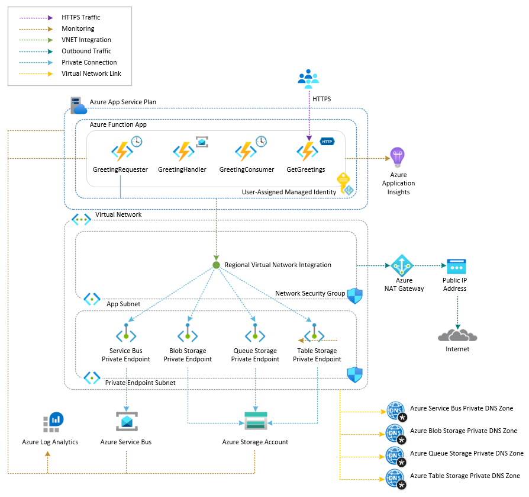

# Azure Functions App with Service Bus Messaging

This sample demonstrates how to deploy an [Azure Functions App](https://learn.microsoft.com/en-us/azure/azure-functions/functions-overview) on an [Azure App Service Plan](https://learn.microsoft.com/en-us/azure/app-service/overview-hosting-plans) that exchanges messages through queues in a [Service Bus](https://learn.microsoft.com/en-us/azure/service-bus/service-bus-overview) namespace. The function app authenticates to Azure resources using a [user-assigned managed identity](https://learn.microsoft.com/en-us/entra/identity/managed-identities-azure-resources/overview) and connects to the Service Bus namespace via an [Azure Private Endpoint](https://learn.microsoft.com/azure/private-link/private-endpoint-overview) for secure, private network communication.

## Architecture

The following diagram illustrates the architecture of the solution:



The function app is composed of the following functions:

- **GreetingRequester**: Timer-triggered function that periodically sends a request message containing a randomly generated name to the `input` queue.
- **GreetingHandler**: Uses the [Azure Service Bus trigger](https://learn.microsoft.com/en-us/azure/azure-functions/functions-bindings-service-bus-trigger) to listen for incoming messages on the `input` queue. When a message arrives, it extracts the name, composes a greeting, and sends the result to the `output` queue using the [Azure Service Bus output binding](https://learn.microsoft.com/en-us/azure/azure-functions/functions-bindings-service-bus-output).
- **GreetingConsumer**: Timer-triggered function that periodically polls the `output` queue, retrieves greeting response messages, and logs them for monitoring.
- **GetGreetings**: HTTP-triggered function that returns the most recent greetings stored in an in-memory circular buffer. Greetings are returned in reverse chronological order (newest first), providing a quick way to verify the message pipeline is working.

The solution is composed of the following Azure resources:

1. [Azure Resource Group](https://learn.microsoft.com/en-us/azure/azure-resource-manager/management/manage-resource-groups-cli): A logical container scoping all resources in this sample.
2. [Azure Virtual Network](https://learn.microsoft.com/azure/virtual-network/virtual-networks-overview): Hosts two subnets:
	- *app-subnet*: Dedicated to [regional VNet integration](https://learn.microsoft.com/azure/azure-functions/functions-networking-options?tabs=azure-portal#outbound-networking-features) with the Function App.
	- *pe-subnet*: Used for hosting Azure Private Endpoints.
3. [Azure Private DNS Zones](https://learn.microsoft.com/azure/dns/private-dns-privatednszone): Provide internal DNS resolution so that resources within the virtual network can reach Private Endpoints by hostname rather than public addresses. There is a separate Azure Private DNS Zone for the following resource types:
  - Azure Service Bus namespace
	- Azure Blob Storage
	- Azure Queue Storage
	- Azure Table Storage
4. [Azure Private Endpoints](https://learn.microsoft.com/azure/private-link/private-endpoint-overview): Provide secure, private network connectivity to Azure resources by exposing them through private IP addresses within the virtual network, eliminating the need for traffic to traverse the public internet. There is a separate Azure Private Endpoint for the following resources:
  - Azure Service Bus namespace
	- Azure Blob Storage
	- Azure Queue Storage
	- Azure Table Storage
5. [Azure NAT Gateway](https://learn.microsoft.com/azure/nat-gateway/nat-overview): Provides deterministic outbound connectivity and a stable public IP address for the Function App's outbound traffic. Included for architectural completeness; the sample app itself does not call any external services.
6. [Azure Network Security Group](https://learn.microsoft.com/en-us/azure/virtual-network/network-security-groups-overview): Enforces inbound and outbound traffic rules across the virtual network's subnets.
7. [Azure Log Analytics Workspace](https://learn.microsoft.com/azure/azure-monitor/logs/log-analytics-overview): Centralizes diagnostic logs and metrics from all resources in the solution, enabling unified querying and analysis across the entire deployment.
8. [Azure App Service Plan](https://learn.microsoft.com/en-us/azure/azure-functions/functions-overview-hosting-plans): Defines the underlying compute tier and scaling behavior for the function app.
9. [Azure Functions App](https://learn.microsoft.com/en-us/azure/azure-functions/functions-overview): Hosts the sample function app.
10. [Azure Application Insights](https://learn.microsoft.com/en-us/azure/azure-monitor/app/app-insights-overview): Provides application performance monitoring (APM), collecting and analyzing requests, traces, and metrics generated by the function app to surface performance bottlenecks and failures.
11. [Azure Service Bus](https://learn.microsoft.com/en-us/azure/service-bus-messaging/service-bus-messaging-overview): A fully managed enterprise message broker. This namespace hosts the `input` and `output` queues used by the function app to exchange messages asynchronously.
12. [Azure Storage Account](https://learn.microsoft.com/en-us/azure/storage/common/storage-account-overview): Provides durable storage used internally by the Azure Functions runtime for state management, including distributed locks, checkpoints, and timer trigger coordination.
13. [User-Assigned Managed Identity](https://learn.microsoft.com/en-us/entra/identity/managed-identities-azure-resources/overview): This identity is assigned the necessary RBAC roles and is used by the function app to authenticate securely—without storing credentials—to the following Azure resources: 
  - Azure Service Bus namespace
	- Azure Storage
	- Azure Application Insights

## Prerequisites

- [Azure Subscription](https://azure.microsoft.com/free/)
- [Azure CLI](https://learn.microsoft.com/en-us/cli/azure/install-azure-cli)
- [Azure Functions Core Tools](https://learn.microsoft.com/en-us/azure/azure-functions/functions-run-local) is required to build, run, and deploy the Azure Functions app locally
- [.NET SDK](https://dotnet.microsoft.com/en-us/download) is required to compile and run the C# Azure Functions project
- [Bicep extension](https://marketplace.visualstudio.com/items?itemName=ms-azuretools.vscode-bicep), if you plan to install the sample via Bicep.
- [Terraform](https://developer.hashicorp.com/terraform/downloads), if you plan to install the sample via Terraform.

## Deployment

Set up the Azure emulator using the LocalStack for Azure Docker image. Before starting, ensure you have a valid `LOCALSTACK_AUTH_TOKEN` to access the Azure emulator. Refer to the [Auth Token guide](https://docs.localstack.cloud/getting-started/auth-token/?__hstc=108988063.8aad2b1a7229945859f4d9b9bb71e05d.1743148429561.1758793541854.1758810151462.32&__hssc=108988063.3.1758810151462&__hsfp=3945774529) to obtain your Auth Token and set it in the `LOCALSTACK_AUTH_TOKEN` environment variable. The Azure Docker image is available on the [LocalStack Docker Hub](https://hub.docker.com/r/localstack/localstack-azure-alpha). To pull the image, execute:

```bash
docker pull localstack/localstack-azure-alpha
```

Start the LocalStack Azure emulator by running:

```bash
# Set the authentication token
export LOCALSTACK_AUTH_TOKEN=<your_auth_token>

# Start the LocalStack Azure emulator
IMAGE_NAME=localstack/localstack-azure-alpha localstack start -d
localstack wait -t 60

# Route all Azure CLI calls to the LocalStack Azure emulator
azlocal start-interception
```

Deploy the application to LocalStack for Azure using one of these methods:

- [Azure CLI Deployment](./scripts/README.md)
- [Bicep Deployment](./bicep/README.md)
- [Terraform Deployment](./terraform/README.md)

All deployment methods have been fully tested against Azure and the LocalStack for Azure local emulator.

> **Note**  
> When you deploy the application to LocalStack for Azure for the first time, the initialization process involves downloading and building Docker images. This is a one-time operation—subsequent deployments will be significantly faster. Depending on your internet connection and system resources, this initial setup may take several minutes.

## Test

Once the resources and function app have been deployed, you can use the [call-http-trigger.sh](./scripts/call-http-trigger.sh) Bash script to invoke the **GetGreetings** HTTP-triggered function. This function returns the most recent greetings stored in the in-memory circular buffer, allowing you to verify that the entire message pipeline is working end to end. The output should look like this:

```bash
Getting function app name...
Function app [local-func-test] successfully retrieved.
Getting resource group name for function app [local-func-test]...
Resource group [local-rg] successfully retrieved.
Getting the default host name of the function app [local-func-test]...
Function app default host name [local-func-test.azurewebsites.azure.localhost.localstack.cloud:4566] successfully retrieved.
Finding container name with prefix [ls-local-func-test]...
Looking for containers with names starting with [ls-local-func-test]...
Found matching container [ls-local-func-test-tdkqjh]
Container [ls-local-func-test-tdkqjh] found successfully
Getting IP address for container [ls-local-func-test-tdkqjh]...
IP address [172.17.0.7] retrieved successfully for container [ls-local-func-test-tdkqjh]
Getting the host port mapped to internal port 80 in container [ls-local-func-test-tdkqjh]...
Mapped host port [42330] retrieved successfully for container [ls-local-func-test-tdkqjh]
Calling HTTP trigger function to retrieve the last [100] greetings via hostname [babo-func-test.azurewebsites.azure.localhost.localstack.cloud:4566]...
{
  "requester": {
    "sent": [
      "Paolo",
      "Max"
    ]
  },
  "handler": {
    "received": [
      "Paolo",
      "Max"
    ],
    "sent": [
      "Welcome Paolo, glad you're here!",
      "Salutations Max, how's everything going?"
    ]
  },
  "consumer": {
    "received": [
      "Welcome Paolo, glad you're here!",
      "Salutations Max, how's everything going?"
    ]
  }
}
Calling HTTP trigger function to retrieve the last [10] greetings via container IP address [172.17.0.7]...
{
  "requester": {
    "sent": [
      "Paolo",
      "Max"
    ]
  },
  "handler": {
    "received": [
      "Paolo",
      "Max"
    ],
    "sent": [
      "Welcome Paolo, glad you're here!",
      "Salutations Max, how's everything going?"
    ]
  },
  "consumer": {
    "received": [
      "Welcome Paolo, glad you're here!",
      "Salutations Max, how's everything going?"
    ]
  }
}
Calling HTTP trigger function to retrieve the last [10] greetings via host port [42330]...
{
  "requester": {
    "sent": [
      "Paolo",
      "Max"
    ]
  },
  "handler": {
    "received": [
      "Paolo",
      "Max"
    ],
    "sent": [
      "Welcome Paolo, glad you're here!",
      "Salutations Max, how's everything going?"
    ]
  },
  "consumer": {
    "received": [
      "Welcome Paolo, glad you're here!",
      "Salutations Max, how's everything going?"
    ]
  }
}
```

You can also inspect the function app's runtime behavior by viewing the logs of its Docker container. Run `docker logs ls-local-func-test-xxxxxx` (replacing `xxxxxx` with the actual container suffix) to see output similar to the following:

```bash
[2026-03-17T13:11:30.000Z] Executing 'Functions.GreetingRequester' (Reason='Timer fired at 2026-03-17T13:11:30.0002087+00:00', Id=1677eef3-d54a-434a-b21c-0bb1606ebedc)
[2026-03-17T13:11:30.001Z] [GreetingRequester] Timer trigger function started.
[2026-03-17T13:11:30.001Z] [GreetingRequester] Creating Service Bus client for sending messages...
[2026-03-17T13:11:30.001Z] [GreetingRequester] Creating sender for input queue 'input'
[2026-03-17T13:11:30.001Z] [GreetingRequester] Sending message to input queue 'input'...
[2026-03-17T13:11:30.219Z] [GreetingRequester] Successfully sent message to input queue 'input' with name: Jane
[2026-03-17T13:11:30.219Z] [GreetingRequester] Function Ran. Next timer schedule = (null)
[2026-03-17T13:11:30.219Z] Executed 'Functions.GreetingRequester' (Succeeded, Id=1677eef3-d54a-434a-b21c-0bb1606ebedc, Duration=218ms)
[2026-03-17T13:11:30.298Z] Executing 'Functions.GreetingHandler' (Reason='(null)', Id=5ec3e867-0073-44d4-8dc8-869e0ce95401)
[2026-03-17T13:11:30.298Z] Trigger Details: MessageId: c5a1b026-b435-4f62-b273-de9f6e2224a1, SequenceNumber: 1, DeliveryCount: 1, EnqueuedTimeUtc: 2026-03-17T13:11:30.2170000+00:00, LockedUntilUtc: 2026-03-17T13:12:30.2170000+00:00, SessionId: (null)
[2026-03-17T13:11:30.299Z] [GreetingHandler] Message ID: c5a1b026-b435-4f62-b273-de9f6e2224a1
[2026-03-17T13:11:30.299Z] [GreetingHandler] Message Body: {"name":"Jane"}
[2026-03-17T13:11:30.299Z] [GreetingHandler] Message Content-Type: application/json
[2026-03-17T13:11:30.299Z] [GreetingHandler] Processing request for name: Jane
[2026-03-17T13:11:30.299Z] Start processing HTTP request POST http://127.0.0.1:43127/Settlement/Complete
[2026-03-17T13:11:30.299Z] Sending HTTP request POST http://127.0.0.1:43127/Settlement/Complete
[2026-03-17T13:11:30.302Z] Received HTTP response headers after 2.609ms - 200
[2026-03-17T13:11:30.302Z] End processing HTTP request after 2.6465ms - 200
[2026-03-17T13:11:30.302Z] [GreetingHandler] Processed message [c5a1b026-b435-4f62-b273-de9f6e2224a1] successfully: Hi Jane, great to see you!
[2026-03-17T13:11:30.303Z] Executed 'Functions.GreetingHandler' (Succeeded, Id=5ec3e867-0073-44d4-8dc8-869e0ce95401, Duration=4ms)
[2026-03-17T13:11:34.375Z] [GreetingConsumer] Function Ran. Next timer schedule = (null)
[2026-03-17T13:11:34.375Z] Executed 'Functions.GreetingConsumer' (Succeeded, Id=32dbc94a-4ff7-4315-9de4-ea36593589fc, Duration=10427ms)
[2026-03-17T13:11:34.380Z] Executing 'Functions.GreetingConsumer' (Reason='Timer fired at 2026-03-17T13:11:34.3806261+00:00', Id=af37440c-360b-4114-97ea-bf88f1843bcf)
[2026-03-17T13:11:34.381Z] [GreetingConsumer] Timer trigger function started.
[2026-03-17T13:11:34.381Z] [GreetingConsumer] Creating Service Bus client for receiving messages...
[2026-03-17T13:11:34.381Z] [GreetingConsumer] Starting to receive messages from output queue 'output'
[2026-03-17T13:11:34.799Z] [GreetingConsumer] Successfully received and deserialized message from output queue. Date: 2026-03-17T13:06:30, Text: Hi Jane, great to see you!
[2026-03-17T13:11:39.802Z] [GreetingConsumer] No more messages available in output queue 'output'
```

## References

- [Azure Functions Apps Documentation](https://learn.microsoft.com/en-us/azure/app-service/)
- [Azure Service Bus](https://learn.microsoft.com/en-us/azure/service-bus-messaging/service-bus-messaging-overview)
- [LocalStack for Azure](https://docs.localstack.cloud/azure/)