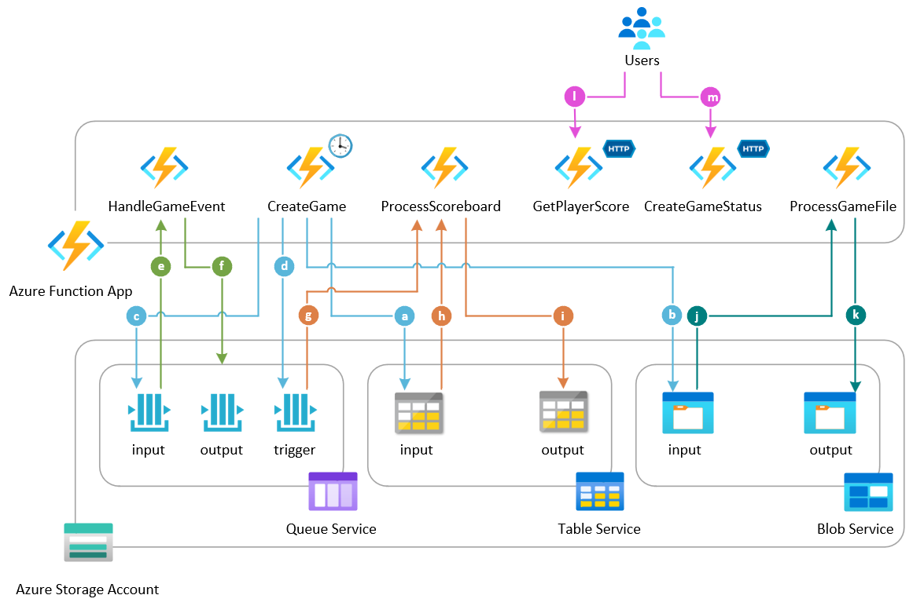
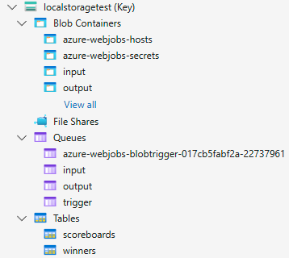
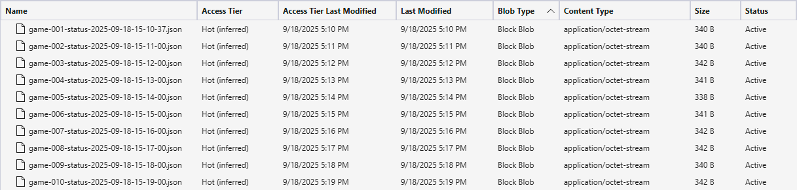
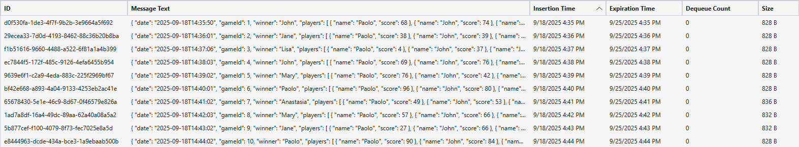
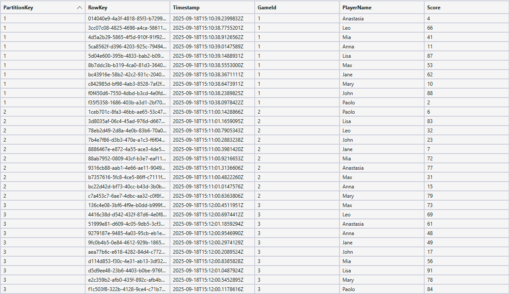
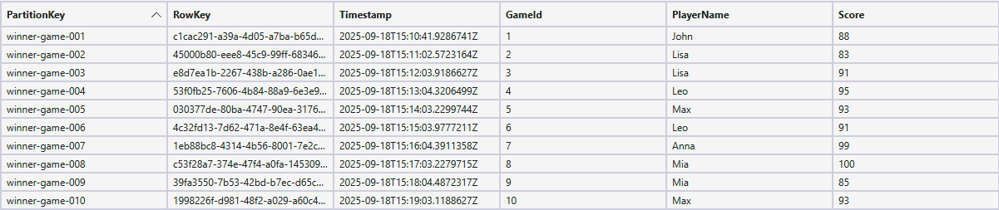

# Azure Functions Sample with LocalStack for Azure

This sample demonstrates a comprehensive gaming scoreboard system built with [Azure Functions](https://learn.microsoft.com/en-us/azure/azure-functions/functions-overview) running against [LocalStack for Azure](https://azure.localstack.cloud/). The application showcases how Azure Functions can seamlessly interact with Azure Storage services (Queues, Blobs, and Tables) when both the Azure Function App and storage services are running in emulated fashion locally on your machine using LocalStack for Azure.

## Overview

The sample implements a complete gaming workflow that:

- **Manages game sessions** with player scoring and winner determination
- **Processes game events** through multiple Azure Storage services
- **Demonstrates hybrid storage architecture** using both Azure Storage services and in-memory data structures
- **Runs entirely locally** using LocalStack for Azure emulation
- **Showcases real-world Azure Functions patterns** with triggers, bindings, and best practices

## Architecture

The following diagram illustrates the architecture of the sample application, showing how Azure Functions interact with various Azure Storage services through LocalStack for Azure emulation:



The system uses a **hybrid storage approach** combining:

- **Azure Blob Storage**: for game file processing and data exchange
- **Azure Queue Storage**: for asynchronous event processing and workflow coordination  
- **Azure Table Storage**: for persistent winner records
- **In-memory Dictionary**: for fast access to active game data with thread-safe operations

## Azure Functions Triggers and Bindings

### Triggers Used

| Trigger Type | Function | Description |
|-------------|----------|-------------|
| [HttpTrigger](https://learn.microsoft.com/en-us/azure/azure-functions/functions-bindings-http-webhook-trigger) | `GetPlayerScore` | GET endpoint to retrieve player scores: `/api/player/{gameId}/{name}/status` |
| [HttpTrigger](https://learn.microsoft.com/en-us/azure/azure-functions/functions-bindings-http-webhook-trigger) | `CreateGameStatus` | POST/PUT endpoint for game status requests: `/api/game/session` |
| [BlobTrigger](https://learn.microsoft.com/en-us/azure/azure-functions/functions-bindings-storage-blob-trigger) | `ProcessGameFile` | Processes uploaded game files from input container |
| [QueueTrigger](https://learn.microsoft.com/en-us/azure/azure-functions/functions-bindings-storage-queue-trigger) | `HandleGameEvent` | Processes game events from input queue |
| [QueueTrigger](https://learn.microsoft.com/en-us/azure/azure-functions/functions-bindings-storage-queue-trigger) | `ProcessScoreboard` | Processes scoreboard data from trigger queue |
| [TimerTrigger](https://learn.microsoft.com/en-us/azure/azure-functions/functions-bindings-timer) | `CreateGame` | Runs every minute to generate new game rounds |

### Bindings Used

| Binding Type | Usage | Description |
|-------------|-------|-------------|
| [BlobOutput](https://learn.microsoft.com/en-us/azure/azure-functions/functions-bindings-storage-blob-output) | `ProcessGameFile` | Outputs processed game status to output container |
| [QueueOutput](https://learn.microsoft.com/en-us/azure/azure-functions/functions-bindings-storage-queue-output) | `HandleGameEvent` | Sends processed events to output queue |
| [TableInput](https://learn.microsoft.com/en-us/azure/azure-functions/functions-bindings-storage-table-input) | `ProcessScoreboard` | Reads scoreboard entities by game ID |
| [TableOutput](https://learn.microsoft.com/en-us/azure/azure-functions/functions-bindings-storage-table-output) | `ProcessScoreboard` | Writes winner records to winners table |

## Function Details

This section describes individual functions used in the sample. For more information, see [Azure Functions Methods Documentation](./METHODS.md).

### 1. GetPlayerScore
- **Route**: `GET /api/player/{gameId}/{name}/status`
- **Purpose**: Retrieves individual player scores for a specific game
- **Input**: `gameId` and `name` parameters in the query string
- **Response**: `PlayerScoreResponse` with player name, score, and timestamp

### 2. CreateGameStatus  
- **Route**: `POST|PUT /api/game/session`
- **Purpose**: Processes game status requests and returns comprehensive game information
- **Input**: `GameStatusRequest` with game ID
- **Response**: `GameStatusResponse` with winner, all players, and game details

### 3. ProcessGameFile
- **Trigger**: New blobs in the `input` container
- **Purpose**: Processes uploaded game status files
- **Workflow**: Receives blob from `input` container → Deserializes `GameStatusRequest` → Creates `GameStatusResponse` from in-memory data -> Outputs `GameStatusResponse` to `output` container


### 4. HandleGameEvent
- **Trigger**: Messages in the `input` queue
- **Purpose**: Processes game events asynchronously
- **Workflow**: Reads messages from the `input` queue → Processes `GameStatusRequest` → Outputs `GameStatusResponse` to the `output` queue

### 5. ProcessScoreboard
- **Trigger**: Messages in trigger queue
- **Purpose**: Determines game winners and records them permanently
- **Workflow**: Reads entities from the `scoreboards` table → Finds highest score → Creates winner record in `winners` table

### 6. CreateGame (Timer Function)
- **Schedule**: Every minute (`0 */1 * * * *`) + runs on startup
- **Purpose**: Generates new game rounds with random player data
- **Workflow**: 
  1. Creates `GameStatusRequest` with new game ID
  2. Uploads game file to `input` container (triggers `ProcessGameFile` function)
  3. Sends message to `input` queue (triggers `HandleGameEvent` function)
  4. Sends trigger message to `trigger` queue (triggers `ProcessScoreboard` function)
  5. Creates in-memory game data with random player scores
  6. Increments game ID for next round

## Game Data Model

The sample uses the following classes to represent and manage game data throughout the workflow:

- `PlayerScore`: Represents a player's name and score
- `PlayerScoreRequest`: HTTP request for player operations  
- `PlayerScoreResponse`: HTTP response with player information
- `GameStatusRequest`: Request for game status operations
- `GameStatusResponse`: Response with complete game status, winner, and all players
- `ScoreboardEntity`: Azure Table entity for persistent scoreboard storage

### Configuration

The sample uses the following configurable settings in `local.settings.json`:

```json
{
  "STORAGE_ACCOUNT_CONNECTION_STRING": "Storage account connection string",
  "INPUT_STORAGE_CONTAINER_NAME": "input", 
  "OUTPUT_STORAGE_CONTAINER_NAME": "output",
  "INPUT_QUEUE_NAME": "input",
  "OUTPUT_QUEUE_NAME": "output", 
  "TRIGGER_QUEUE_NAME": "trigger",
  "INPUT_TABLE_NAME": "scoreboards",
  "OUTPUT_TABLE_NAME": "winners",
  "PLAYER_NAMES": "Anastasia,Paolo,Leo,Mia,Bob"
}
```

## Prerequisites

- [LocalStack for Azure](https://azure.localstack.cloud/) for Azure services emulation.
- [Visual Studio Code](https://code.visualstudio.com/) installed on one of the [supported platforms](https://code.visualstudio.com/docs/supporting/requirements#_platforms).
- [Azure Functions Core Tools](https://learn.microsoft.com/en-us/azure/azure-functions/functions-run-local) let you develop and test your functions on your local computer.
- [Bicep extension](https://marketplace.visualstudio.com/items?itemName=ms-azuretools.vscode-bicep), if you plan to install the sample via Bicep.
- [Terraform](https://developer.hashicorp.com/terraform/downloads), if you plan to install the sample via Terraform.
- [.NET SDK](https://dotnet.microsoft.com/en-us/download) is required to build and run the Azure Functions app written in C#.
- [Docker](https://docs.docker.com/get-docker/) necessary as container runtime for LocalStack.
- [Azure CLI](https://learn.microsoft.com/en-us/cli/azure/install-azure-cli) necessary to work with LocalStack.
- [azlocal CLI](https://azure.localstack.cloud/user-guides/sdks/az/) is the LocalStack Azure CLI wrapper.
- [jq](https://jqlang.org/) is a JSON processor for scripting.
- [Azure Storage Explorer](https://learn.microsoft.com/en-us/azure/storage/storage-explorer/vs-azure-tools-storage-manage-with-storage-explorer) for viewing storage contents.

## Deployment

1. You can set up the Azure emulator by utilizing LocalStack for Azure Docker image. Before starting, ensure you have a valid `LOCALSTACK_AUTH_TOKEN` to access the Azure emulator. Refer to the [Auth Token guide](https://docs.localstack.cloud/getting-started/auth-token/?__hstc=108988063.8aad2b1a7229945859f4d9b9bb71e05d.1743148429561.1758793541854.1758810151462.32&__hssc=108988063.3.1758810151462&__hsfp=3945774529) to obtain your Auth Token and specify it in the `LOCALSTACK_AUTH_TOKEN` environment variable. The Azure Docker image is available on the [LocalStack Docker Hub](https://hub.docker.com/r/localstack/localstack-azure-alpha). To pull the Azure Docker image, execute the following command:

   ```bash
   docker pull localstack/localstack-azure-alpha
   ```

2. Start the LocalStack Azure emulator using the localstack CLI, execute the following command:

   ```bash
   export LOCALSTACK_AUTH_TOKEN=<your_auth_token>
   IMAGE_NAME=localstack/localstack-azure-alpha localstack start
   ```

3. Deploy the application to LocalStack for Azure using one of the following methods:

    - [Azure CLI Deployment](./scripts/README.md)
    - [Bicep Deployment](./bicep/README.md)
    - [Terraform Deployment](./terraform/README.md)

All deployment methods have been fully tested against Azure and the LocalStack for Azure local emulator.

> **Note**  
> The first time you run Azure Functions on LocalStack for Azure, the emulator downloads a ZIP archive of the selected version of the [Azure Functions Core Tools](https://github.com/Azure/azure-functions-core-tools/tags) to build the container image that hosts your functions. By default, version 4.2.2 is used. You can override this by setting the AZURE_FUNCTIONS_CORE_TOOLS_VERSION environment variable. The archive is large (over 500 MB), so the initial download may take several minutes. Subsequent runs will use the cached copy.

## Test

Use the [call-http-triggers.sh](./scripts/call-http-triggers.sh) script to quickly test the sample's HTTP-triggered Azure Functions and verify player status or game session details. The script below demonstrates three methods for calling HTTP-triggered functions:

1. **Through the LocalStack for Azure emulator**: Call the function app via the emulator using its default host name. The emulator acts as a proxy to the function app.
2. **Via localhost and host port mapped to the container's port**: Use `127.0.0.1` with the host port mapped to the container's port `80`.
3. **Via container IP address**: Use the app container's IP address on port `80`. This technique is only available when accessing the function app from the Docker host machine.

```bash
#!/bin/bash

get_docker_container_name_by_prefix() {
	local app_prefix="$1"
	local container_name

	# Check if Docker is running
	if ! docker info >/dev/null 2>&1; then
		echo "Error: Docker is not running" >&2
		return 1
	fi

	echo "Looking for containers with names starting with [$app_prefix]..." >&2

	# Find the container using grep
	container_name=$(docker ps --format "{{.Names}}" | grep "^${app_prefix}" | head -1)

	if [ -z "$container_name" ]; then
		echo "Error: No running container found with name starting with [$app_prefix]" >&2
		return 1
	fi

	echo "Found matching container [$container_name]" >&2
	echo "$container_name"
}

get_docker_container_ip_address_by_name() {
	local container_name="$1"
	local ip_address

	if [ -z "$container_name" ]; then
		echo "Error: Container name is required" >&2
		return 1
	fi

	# Get IP address
	ip_address=$(docker inspect -f '{{range .NetworkSettings.Networks}}{{.IPAddress}}{{end}}' "$container_name")

	if [ -z "$ip_address" ]; then
		echo "Error: Container [$container_name] has no IP address assigned" >&2
		return 1
	fi

	echo "$ip_address"
}

get_docker_container_port_mapping() {
	local container_name="$1"
	local container_port="$2"
	local host_port

	if [ -z "$container_name" ] || [ -z "$container_port" ]; then
		echo "Error: Container name and container port are required" >&2
		return 1
	fi

	# Get host port mapping
	host_port=$(docker inspect -f "{{(index (index .NetworkSettings.Ports \"${container_port}/tcp\") 0).HostPort}}" "$container_name")

	if [ -z "$host_port" ]; then
		echo "Error: No host port mapping found for container [$container_name] port [$container_port]" >&2
		return 1
	fi

	echo "$host_port"
}

call_http_trigger_functions() {
	# Get the function app name
	echo "Getting function app name..."
	function_app_name=$(azlocal functionapp list --query '[0].name' --output tsv)

	if [ -n "$function_app_name" ]; then
		echo "Function app [$function_app_name] successfully retrieved."
	else
		echo "Error: No function app found"
		exit 1
	fi

	# Get the resource group name
	echo "Getting resource group name for function app [$function_app_name]..."
	resource_group_name=$(azlocal functionapp list --query '[0].resourceGroup' --output tsv)

	if [ -n "$resource_group_name" ]; then
		echo "Resource group [$resource_group_name] successfully retrieved."
	else
		echo "Error: No resource group found for function app [$function_app_name]"
		exit 1
	fi

	# Get the the default host name of the function app
	echo "Getting the default host name of the function app [$function_app_name]..."
	function_host_name=$(azlocal functionapp show \
		--name "$function_app_name" \
		--resource-group "$resource_group_name" \
		--query 'defaultHostName' \
		--output tsv)

	if [ -n "$function_host_name" ]; then
		echo "Function app default host name [$function_host_name] successfully retrieved."
	else
		echo "Error: No function app default host name found"
		exit 1
	fi

	# Get the Docker container name
	echo "Finding container name with prefix [ls-$function_app_name]..."
	container_name=$(get_docker_container_name_by_prefix "ls-$function_app_name")

	if [ $? -eq 0 ] && [ -n "$container_name" ]; then
		echo "Container [$container_name] found successfully"
	else
		echo "Failed to get container name"
		exit 1
	fi

	# Get the container IP address
	echo "Getting IP address for container [$container_name]..."
	container_ip=$(get_docker_container_ip_address_by_name "$container_name")
	player_name='Leo'
	game_session='1'

	if [ $? -eq 0 ] && [ -n "$container_ip" ]; then
		echo "IP address [$container_ip] retrieved successfully for container [$container_name]"
	else
		echo "Failed to get container IP address"
		exit 1
	fi

	# Get the mapped host port for function app HTTP trigger (internal port 80)
	echo "Getting the host port mapped to internal port 80 in container [$container_name]..."
	host_port=$(get_docker_container_port_mapping "$container_name" "80")
	
	if [ $? -eq 0 ] && [ -n "$host_port" ]; then
		echo "Mapped host port [$host_port] retrieved successfully for container [$container_name]"
	else
		echo "Failed to get mapped host port for container [$container_name]"
		exit 1
	fi

	# Retrieve LocalStack proxy port
	proxy_port=$(curl http://localhost:4566/_localstack/proxy -s | jq '.proxy_port')

	if [ -n "$proxy_port" ]; then
		# Call the GET HTTP trigger function that returns a player status in a specified game session via emulator
		echo "Calling HTTP trigger function to retrieve player [$player_name] status in game session [$game_session] via emulator..."
		curl  --proxy "http://localhost:$proxy_port/" -s "http://$function_host_name/api/player/$game_session/$player_name/status" | jq

		# Call the POST HTTP trigger function that returns the game session details via emulator
		echo "Calling HTTP trigger function to retrieve game session [$game_session] details via emulator..."
		curl --proxy "http://localhost:$proxy_port/" -s -X POST -H "Content-Type: application/json" -d "{\"gameId\": $game_session}" "http://$function_host_name/api/game/session" | jq
	else
		echo "Failed to retrieve LocalStack proxy port"
	fi
	
	if [ -n "$container_ip" ]; then
		# Call the GET HTTP trigger function that returns a player status in a specified game session via the container IP address
		echo "Calling HTTP trigger function to retrieve player [$player_name] status in game session [$game_session] via container IP address [$container_ip]..."
		curl -s "http://$container_ip/api/player/$game_session/$player_name/status" | jq

		# Call the POST HTTP trigger function that returns the game session details via the container IP address
		echo "Calling HTTP trigger function to retrieve game session [$game_session] details via container IP address [$container_ip]..."
		curl -s -X POST -H "Content-Type: application/json" -d "{\"gameId\": $game_session}" "http://$container_ip/api/game/session" | jq
	else
		echo "Failed to retrieve container IP address"
	fi

	if [ -n "$host_port" ]; then
		# Call the GET HTTP trigger function that returns a player status in a specified game session via the host port
		echo "Calling HTTP trigger function to retrieve player [$player_name] status in game session [$game_session] via host port [$host_port]..."
		curl -s "http://localhost:$host_port/api/player/$game_session/$player_name/status" | jq

		# Call the POST HTTP trigger function that returns the game session details via the host port
		echo "Calling HTTP trigger function to retrieve game session [$game_session] details via host port [$host_port]..."
		curl -s -X POST -H "Content-Type: application/json" -d "{\"gameId\": $game_session}" "http://localhost:$host_port/api/game/session" | jq
	else
		echo "Failed to retrieve container IP address"
	fi
}

call_http_trigger_functions
```

## Storage Contents

You can use [Azure Storage Explorer](https://learn.microsoft.com/en-us/azure/storage/storage-explorer/vs-azure-tools-storage-manage-with-storage-explorer) to confirm that your Azure Function app creates the expected storage entities in the emulated storage account. To do this:

- Expand **Emulator & Attached**.
- Right-click **Storage Accounts**.
- Select **Connect to Azure Storage...**.
- In the dialog that appears, enter the name of the emulated storage account and specify the published ports, as shown in the following picture:


> **Note**  
> When sending commands to an emulated storage account, make sure to use the primary key generated by the emulator itself. For convenience, if you're connecting to the storage account directly with Azure Storage Explorer, you can use the default Azurite password. For more details, see [Connect to Azurite with SDKs and tools](https://learn.microsoft.com/en-us/azure/storage/common/storage-connect-azurite).

You can expand the storage account to view the **Blob Containers**, **Queues**, and **Tables** created and used by this sample, as illustrated below:



To verify that the sample is producing the expected data, follow these steps:

- Open the `output` container to inspect processed game status responses:

  

- Open the `output` queue to review processed game events:

  

- Open the `scoreboards` table to examine player scores:

  

- Open the `winners` table to see the recorded winning players:

  

## References

Explore the following resources to deepen your understanding of Azure Functions, LocalStack for Azure, and the related storage services featured in this sample:

### Azure Documentation

- [Azure Functions Documentation](https://docs.microsoft.com/en-us/azure/azure-functions/)
- [Azure Functions .NET Isolated Worker](https://docs.microsoft.com/en-us/azure/azure-functions/dotnet-isolated-process-guide)
- [Azure Functions Triggers and Bindings](https://docs.microsoft.com/en-us/azure/azure-functions/functions-triggers-bindings)
- [Azure Blob Storage](https://docs.microsoft.com/en-us/azure/storage/blobs/)
- [Azure Queue Storage](https://docs.microsoft.com/en-us/azure/storage/queues/)
- [Azure Table Storage](https://docs.microsoft.com/en-us/azure/storage/tables/)

### LocalStack for Azure

- [LocalStack for Azure - Introduction](https://azure.localstack.cloud/introduction/)
- [LocalStack for Azure - Getting Started](https://azure.localstack.cloud/getting-started/)
- [LocalStack for Azure - Azure Functions](https://azure.localstack.cloud/user-guide/azure-functions/)
- [LocalStack for Azure - Storage Services](https://azure.localstack.cloud/user-guide/storage/)