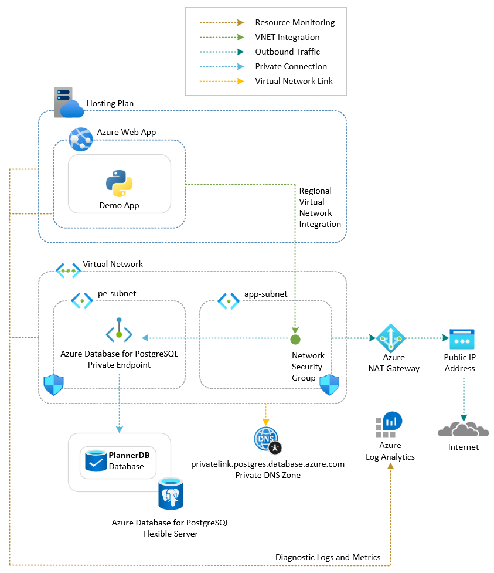
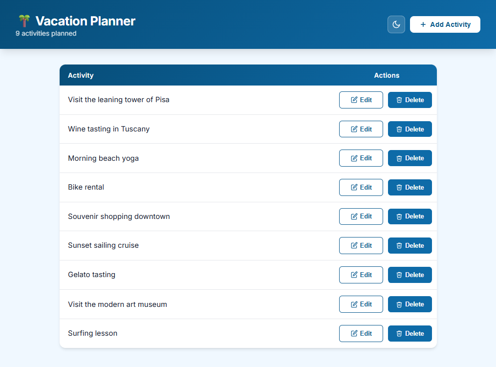

# Azure Web App with Azure App Configuration and Azure Key Vault

This sample demonstrates a Python Flask single-page web application called *Vacation Planner* hosted on an [Azure Web App](https://learn.microsoft.com/en-us/azure/app-service/overview). The app runs on an Azure App Service Plan and stores activity data in the `activities` table of the `PlannerDB` database on an [Azure Database for PostgreSQL flexible server](https://learn.microsoft.com/en-us/azure/postgresql/flexible-server/overview), reached through a [Private Endpoint](https://learn.microsoft.com/azure/private-link/private-endpoint-overview). What sets this permutation apart from the [PostgreSQL sample](../../web-app-postgresql-flexible-server/python/README.md) it derives from is where the app reads its connection settings from: the host, port and database name live in an [Azure App Configuration](https://learn.microsoft.com/en-us/azure/azure-app-configuration/overview) store, the application role name and password live in [Azure Key Vault](https://learn.microsoft.com/en-us/azure/key-vault/general/overview) and reach the app through App Configuration [Key Vault references](https://learn.microsoft.com/en-us/azure/azure-app-configuration/use-key-vault-references-python-provider), and the app authenticates to both stores with a [user-assigned managed identity](https://learn.microsoft.com/en-us/entra/identity/managed-identities-azure-resources/overview) authorized through Azure RBAC. No connection string, access key or database credential is stored in the Web App's app settings.

## Architecture



The web app enables users to plan and manage vacation activities; all data is persisted in PostgreSQL. The solution is composed of the following Azure resources:

1. [Azure Resource Group](https://learn.microsoft.com/en-us/azure/azure-resource-manager/management/manage-resource-groups-cli): A logical container scoping all resources in this sample.
2. [Azure Virtual Network](https://learn.microsoft.com/azure/virtual-network/virtual-networks-overview): Hosts two subnets:
   - *app-subnet*: Delegated to `Microsoft.Web/serverFarms` for regional VNet integration of the Web App.
   - *pe-subnet*: Hosts the three Private Endpoints to the PostgreSQL flexible server, the App Configuration store and the Key Vault.
3. [Azure Private DNS Zones](https://learn.microsoft.com/azure/dns/private-dns-privatednszone) `privatelink.postgres.database.azure.com`, `privatelink.azconfig.io` and `privatelink.vaultcore.azure.net`, each linked to the VNet with a `link-to-vnet` virtual network link. The DNS zone group (`default`) of each Private Endpoint registers the `A` record of its target, so the Web App resolves the three services to private IP addresses.
4. [Azure Private Endpoints](https://learn.microsoft.com/azure/private-link/private-endpoint-overview): `<prefix>-postgres-pe-<suffix>` (group `postgresqlServer`), `<prefix>-appconfig-pe-<suffix>` (group `configurationStores`) and `<prefix>-keyvault-pe-<suffix>` (group `vault`).
5. [Azure NAT Gateway](https://learn.microsoft.com/azure/nat-gateway/nat-overview): Deterministic outbound connectivity for the Web App subnet.
6. [Azure Network Security Group](https://learn.microsoft.com/en-us/azure/virtual-network/network-security-groups-overview): One NSG per subnet.
7. [Azure Log Analytics Workspace](https://learn.microsoft.com/azure/azure-monitor/logs/log-analytics-overview): Centralizes the diagnostic logs and metrics of every resource, the store and the vault included.
8. [Azure Database for PostgreSQL flexible server](https://learn.microsoft.com/en-us/azure/postgresql/flexible-server/overview): Public-access server hosting the `PlannerDB` database. Burstable `Standard_B1ms`, version 16, 32 GiB storage, 7-day backup retention, HA disabled. A permissive firewall rule (`0.0.0.0` to `255.255.255.255`) lets the deploy machine run the post-create psql bootstrap; the Web App itself reaches the server through the Private Endpoint.
9. [PostgreSQL database](https://learn.microsoft.com/en-us/azure/postgresql/flexible-server/concepts-servers) `PlannerDB`: Created at provisioning time; the post-deploy psql step creates the `activities` table and seeds the demo rows.
10. [Azure App Configuration store](https://learn.microsoft.com/en-us/azure/azure-app-configuration/overview) `<prefix>-appconfig-<suffix>` (Standard tier): Holds the five connection settings as key-values, see [Configuration design](#configuration-design). Access keys stay enabled (the default) because the deployment scripts and templates write the key-values with them; the Web App never uses them.
11. [Azure Key Vault](https://learn.microsoft.com/en-us/azure/key-vault/general/overview) `<prefix>-keyvault-<suffix>` with the [Azure RBAC permission model](https://learn.microsoft.com/en-us/azure/key-vault/general/rbac-guide): Holds the secrets `pg-user` and `pg-password` with the credentials of the PostgreSQL application role.
12. [User-assigned managed identity](https://learn.microsoft.com/en-us/entra/identity/managed-identities-azure-resources/overview) `<prefix>-identity-<suffix>`, assigned to the Web App, with two [role assignments](https://learn.microsoft.com/en-us/azure/role-based-access-control/built-in-roles): [App Configuration Data Reader](https://learn.microsoft.com/en-us/azure/role-based-access-control/built-in-roles/integration#app-configuration-data-reader) on the store and [Key Vault Secrets User](https://learn.microsoft.com/en-us/azure/role-based-access-control/built-in-roles/security#key-vault-secrets-user) on the vault.
13. [Azure App Service Plan](https://learn.microsoft.com/en-us/azure/app-service/overview-hosting-plans): The underlying compute tier that hosts the web application.
14. [Azure Web App](https://learn.microsoft.com/en-us/azure/app-service/overview): Runs the Python Flask *Vacation Planner* app with regional VNet integration into *app-subnet* and the user-assigned managed identity. Its app settings hold the store endpoint (`Endpoints__AppConfiguration`), the identity client id (`AZURE_CLIENT_ID`), `LOGIN_NAME`, `WEBSITES_PORT` and the Oryx build flags. No `PG_*` app setting exists: the app connects to PostgreSQL with the dedicated application role (`testuser`) it reads from the store, and the server-admin login is never used at runtime.
15. [App Service Source Control](https://learn.microsoft.com/en-us/rest/api/appservice/web-apps/create-or-update-source-control?view=rest-appservice-2024-11-01): *(Optional)* Configures continuous deployment from a public GitHub repository.

The deploy scripts and templates follow the same pattern as the sibling [`web-app-postgresql-flexible-server`](../../web-app-postgresql-flexible-server/python/) sample: after provisioning, they (i) connect as the server admin via the public endpoint and the firewall rule, (ii) create the application role `testuser` with its own password, (iii) grant minimum schema privileges on `PlannerDB`, (iv) create the `activities` table and (v) seed the sample rows. The difference is step (vi): the role name and password are not written onto the Web App's app settings; they are stored in Key Vault and referenced from the App Configuration store at provisioning time, and the app loads them from there.

### Configuration design

The original sample hands the five PostgreSQL settings to the Web App as app settings. This sample partitions them by sensitivity:

| Setting       | Lives in                                   | Key or secret name          | Content type                                                         |
| ------------- | ------------------------------------------ | --------------------------- | -------------------------------------------------------------------- |
| `PG_HOST`     | App Configuration key-value                | `PG_HOST`                   | none                                                                 |
| `PG_PORT`     | App Configuration key-value                | `PG_PORT`                   | none                                                                 |
| `PG_DATABASE` | App Configuration key-value                | `PG_DATABASE`               | none                                                                 |
| `PG_USER`     | Key Vault secret, referenced from the store | `PG_USER` referencing `pg-user`         | `application/vnd.microsoft.appconfig.keyvaultref+json;charset=utf-8` |
| `PG_PASSWORD` | Key Vault secret, referenced from the store | `PG_PASSWORD` referencing `pg-password` | `application/vnd.microsoft.appconfig.keyvaultref+json;charset=utf-8` |

The keys keep the names of the former environment variables, carry no label, and the two Key Vault references hold the versionless identifier of their secret (`{"uri":"https://<vault>.vault.azure.net/secrets/pg-user"}`), so they always follow the latest version. Key Vault secret names allow only alphanumerics and hyphens, which is why the secrets are called `pg-user` and `pg-password`. The App Configuration store is the app's single configuration source: a reader of the store sees where every setting comes from, and the secrets never leave Key Vault except when the authorized identity resolves them.

There are two ways for an App Service app to consume such a store:

1. **In-process App Configuration provider** (the path this sample uses, on Azure and on the emulator). The app receives only the store endpoint and the identity client id, loads the `PG_*` keys itself with the [Azure App Configuration Python provider](https://learn.microsoft.com/en-us/azure/azure-app-configuration/reference-python-provider) and lets the provider resolve the Key Vault references with the same credential. One `DefaultAzureCredential` serves both stores: on App Service it resolves to the user-assigned managed identity selected by `AZURE_CLIENT_ID`, on a developer machine to the signed-in Azure CLI user. See `src/settings.py`:

   ```python
   credential = DefaultAzureCredential()
   settings = load(
       endpoint=os.environ["Endpoints__AppConfiguration"],
       credential=credential,
       keyvault_credential=credential,
       selects=[SettingSelector(key_filter="PG_*")],
       startup_timeout=60,
   )
   ```

   The load is retried for a few minutes, so a role assignment that has not propagated yet produces log lines rather than a crash loop, and the app logs which keys it loaded and how many Key Vault references it resolved, never the values. The app setting is called `Endpoints__AppConfiguration` in both language variants because that is the app-setting spelling of the `Endpoints:AppConfiguration` key the .NET configuration system reads.

2. **App Service configuration references** (Azure only, documented here as the alternative, not used by the deployed sample). App Service can resolve app settings of the form `@Microsoft.AppConfiguration(Endpoint=https://<store>.azconfig.io; Key=<key>; Label=<label>)` at startup, without any code in the app, and a referenced key-value that is itself a Key Vault reference is resolved through the same identity. To switch this sample to that path on Azure, keep the store as it is and apply these settings to the Web App (the user-assigned identity must be selected explicitly, because the platform uses the system-assigned identity by default and the property name is misleading):

   ```bash
   STORE_ENDPOINT=$(az appconfig show --name local-appconfig-test --resource-group local-rg --query endpoint --output tsv)
   IDENTITY_ID=$(az identity show --name local-identity-test --resource-group local-rg --query id --output tsv)
   az webapp update --name local-webapp-test --resource-group local-rg --set keyVaultReferenceIdentity="$IDENTITY_ID"
   az webapp config appsettings set --name local-webapp-test --resource-group local-rg --settings \
     PG_HOST="@Microsoft.AppConfiguration(Endpoint=$STORE_ENDPOINT; Key=PG_HOST)" \
     PG_PORT="@Microsoft.AppConfiguration(Endpoint=$STORE_ENDPOINT; Key=PG_PORT)" \
     PG_DATABASE="@Microsoft.AppConfiguration(Endpoint=$STORE_ENDPOINT; Key=PG_DATABASE)" \
     PG_USER="@Microsoft.AppConfiguration(Endpoint=$STORE_ENDPOINT; Key=PG_USER)" \
     PG_PASSWORD="@Microsoft.AppConfiguration(Endpoint=$STORE_ENDPOINT; Key=PG_PASSWORD)"
   ```

   The identity needs the same two roles (App Configuration Data Reader on the store, Key Vault Secrets User on the vault). App Service resolves the references when the app starts and again on every restart; there is no automatic refresh. An unresolved reference (missing role, wrong key, syntax error) is not an error: the app sees the literal `@Microsoft.AppConfiguration(...)` string, which this app detects and reports instead of passing it to the PostgreSQL driver. See [Use App Configuration references for App Service](https://learn.microsoft.com/en-us/azure/app-service/app-service-configuration-references) and [Use Key Vault references as app settings](https://learn.microsoft.com/en-us/azure/app-service/app-service-key-vault-references). **Emulator note:** LocalStack for Azure hands app settings to the app container verbatim and does not resolve either reference syntax yet, so this path works on Azure only; the in-process path above works on both.

Emulator note on endpoints: on Azure the store endpoint is `https://<store>.azconfig.io` and the vault URI is `https://<vault>.vault.azure.net/`; on the emulator they are `https://<store>.azure.localhost.localstack.cloud:4566` and `https://<vault>.vault.azure.localhost.localstack.cloud:4566`. The scripts and templates read both values back from the service and never assemble them from a name, so the same code runs on both targets.

## Prerequisites

- [Azure Subscription](https://azure.microsoft.com/free/)
- [Azure CLI](https://learn.microsoft.com/en-us/cli/azure/install-azure-cli)
- [Python 3.11+](https://www.python.org/downloads/)
- [Flask](https://flask.palletsprojects.com/)
- [psycopg2](https://www.psycopg.org/docs/) (`psycopg2-binary` for development)
- [Azure App Configuration Python provider](https://pypi.org/project/azure-appconfiguration-provider/) and [Azure Identity](https://pypi.org/project/azure-identity/) (installed from `src/requirements.txt`)
- [PostgreSQL client tools](https://www.postgresql.org/download/) (`psql`), required by the deploy scripts to create the application role and seed data
- [Bicep extension](https://marketplace.visualstudio.com/items?itemName=ms-azuretools.vscode-bicep), if you plan to install the sample via Bicep
- [Terraform](https://developer.hashicorp.com/terraform/downloads), if you plan to install the sample via Terraform

When you deploy to a real Azure subscription, also take care of the following:

- **Roles of the deploying principal.** Contributor on the subscription or resource group creates every resource, including the role assignments' target resources. Writing the role assignments themselves needs `Microsoft.Authorization/roleAssignments/write` (Owner, User Access Administrator or Role Based Access Control Administrator). The Azure CLI and Terraform variants write the two secrets through the Key Vault data plane, so the deploying principal also needs [Key Vault Secrets Officer](https://learn.microsoft.com/en-us/azure/role-based-access-control/built-in-roles/security#key-vault-secrets-officer) on the vault: the scripts assign it to the signed-in user or service principal when they can resolve its object id, and retry the secret writes while the assignment propagates. The `az appconfig kv` commands authenticate with the store's access keys (the default `--auth-mode key`); if you disable access keys, pass `--auth-mode login` and grant the deploying principal App Configuration Data Owner on the store, and switch the store's Azure Resource Manager authentication mode to `Pass-through` so the Bicep and Terraform key-value writes keep working.
- **Globally unique names.** The App Configuration store (5 to 50 alphanumerics and hyphens) and the Key Vault (3 to 24 alphanumerics and hyphens) have globally unique names, and the defaults `local-appconfig-test` and `local-keyvault-test` will collide with other people's resources. Export your own `SUFFIX` (or `PREFIX`) before running any of the three variants.
- **Role assignment propagation.** A new role assignment can take up to 10 minutes to take effect ([Troubleshoot Azure RBAC](https://learn.microsoft.com/en-us/azure/role-based-access-control/troubleshooting)). The app retries its configuration load and App Service restarts it if needed, so it comes up on its own once the assignment is effective.
- **Soft delete.** Deleting the store or the vault only soft-deletes it and keeps its name reserved for the retention period (7 days here). The scripts recover a soft-deleted store or vault of the same name before creating it; to free the name instead run `az appconfig purge` and `az keyvault purge`.
- **Costs and cleanup.** The App Service plan (S1), the PostgreSQL flexible server, the NAT gateway, the Standard App Configuration store and the Key Vault are billed for as long as they exist. Delete the resource group when you are done (`az group delete --name local-rg --yes`) and purge the soft-deleted store and vault.

## Deployment

Set up the Azure emulator using the LocalStack for Azure Docker image. Before starting, ensure you have a valid `LOCALSTACK_AUTH_TOKEN`. Refer to the [Auth Token guide](https://docs.localstack.cloud/getting-started/auth-token/) to obtain yours. Pull and start the emulator:

```bash
docker pull localstack/localstack-azure

export LOCALSTACK_AUTH_TOKEN=<your_auth_token>
IMAGE_NAME=localstack/localstack-azure localstack start -d
localstack wait -t 60

# Route all Azure CLI calls to the LocalStack Azure emulator
lstk az start-interception
```

Deploy the application using one of these methods:

- [Azure CLI Deployment](./scripts/README.md)
- [Bicep Deployment](./bicep/README.md)
- [Terraform Deployment](./terraform/README.md)

All three variants provision the same topology: a VNet whose *pe-subnet* hosts three Private Endpoints, to a public-access PostgreSQL flexible server, to the App Configuration store and to the Key Vault, each with its Private DNS Zone linked to the VNet; the store seeded with the three plain key-values and the two Key Vault references; the vault seeded with the two secrets; the user-assigned managed identity with its two role assignments; and the Web App configured with the store endpoint and the identity client id only.

> **Note**
> When you deploy the application to LocalStack for Azure for the first time, the initialization process pulls and builds Docker images (LocalStack itself plus the `postgres:18` backing container for the flexible-server emulator). This is a one-time operation; subsequent deployments are much faster.

## Test

1. Retrieve the port published and mapped to port 80 by the Docker container hosting the emulated Web App.
2. Open a web browser and navigate to `http://localhost:<published-port>`.
3. If the deployment was successful, you will see the *Vacation Planner* UI with the seeded activities and can add, edit, and remove activities.



You can use the `scripts/call-web-app.sh` Bash script to call the web app from outside the emulator. The script demonstrates four call paths:

1. **Through the LocalStack for Azure emulator** via the default hostname.
2. **Via localhost and host port** mapped to the container's port `80`.
3. **Via container IP address** on port `80`.
4. **Via the default hostname** `<web-app-name>.azurewebsites.azure.localhost.localstack.cloud:4566`.

To inspect the configuration the app runs with, list the key-values of the store with their content types (the two Key Vault references stand out), the secret names in the vault (never the values), and the app settings of the Web App, which must contain no `PG_*` entry:

```bash
az appconfig kv list --name local-appconfig-test \
  --query "[].{Key:key,ContentType:contentType,Label:label}" --output table
az keyvault secret list --vault-name local-keyvault-test --query "[].name" --output tsv
az webapp config appsettings list --name local-webapp-test --resource-group local-rg \
  --query "[?starts_with(name, 'PG_')].name" --output tsv
```

The projection uses `--query` rather than `--fields`: `--fields` makes the CLI request only those fields from the service, and the CLI then fails to build a Key Vault reference whose value was not returned. `scripts/validate.sh` runs these checks, and fails if a `PG_*` app setting exists. The app itself reports its configuration source at startup; on the emulator read it with `docker logs` on the container whose name starts with `ls-local-webapp-test`:

```text
Loaded 5 settings from App Configuration https://local-appconfig-test.azure.localhost.localstack.cloud:4566 (PG_DATABASE, PG_HOST, PG_PASSWORD, PG_PORT, PG_USER); 2 Key Vault references resolved (PG_PASSWORD, PG_USER)
PostgreSQL schema initialized
```

## Troubleshooting

- **The app logs `App Configuration load failed ... 403` or `Forbidden` and restarts.** The identity's role assignments have not propagated yet (up to 10 minutes on Azure), or one of them is missing. Check `az role assignment list --assignee <principalId> --all` for App Configuration Data Reader on the store and Key Vault Secrets User on the vault; the app keeps retrying and App Service restarts it until the load succeeds.
- **`az keyvault create` or `az appconfig create` fails because the name exists in a deleted state.** A previous run soft-deleted the resource. The scripts recover it automatically; to start from scratch, purge it: `az keyvault purge --name <vault> --location <location>` and `az appconfig purge --name <store> --location <location> --yes`.
- **`KeyVaultReferenceException` or `No key vault credential or secret resolver callback configured`.** The provider found a Key Vault reference but has no credential for Key Vault. The sample passes the same credential with `keyvault_credential=credential` (Python) or `ConfigureKeyVault(kv => kv.SetCredential(credential))` (.NET); keep that call.
- **`The setting Endpoints__AppConfiguration was not found.`** The Web App has no store endpoint app setting. Set it to the value of `az appconfig show --name <store> --query endpoint --output tsv`.
- **A literal `@Microsoft.AppConfiguration(...)` value reaches the app.** You configured App Service references (the Azure-only alternative) and they were not resolved: the identity lacks a role, the key does not exist, `keyVaultReferenceIdentity` does not point at the user-assigned identity, or you are running on the emulator, which does not resolve them yet. The app fails fast with a message naming the setting.
- **`az keyvault secret set` keeps failing with `Forbidden` on Azure.** The deploying principal has no Key Vault Secrets Officer assignment on the vault (the script could not resolve its object id) or the assignment is still propagating. Assign the role and re-run; the scripts are idempotent.

## PostgreSQL Tooling

You can use [pgAdmin](https://www.pgadmin.org/) to explore and manage the deployed database. Connect using:

| Field    | Value                                                                       |
| -------- | --------------------------------------------------------------------------- |
| Host     | `localhost`                                                                 |
| Port     | (see `docker ps` for the host-mapped port of the backing `postgres:18` container) |
| Database | `PlannerDB`                                                                 |
| Username | `testuser` *(or `pgadmin` for admin operations)*                            |
| Password | `TestP@ssw0rd123` *(or `P@ssw0rd1234!` for the admin)*                      |

The application role credentials are the values of the `pg-user` and `pg-password` secrets; read them with `az keyvault secret show --vault-name local-keyvault-test --name pg-password --query value --output tsv` when you override the defaults. Or use [psql](https://www.postgresql.org/docs/current/app-psql.html):

```bash
PGPASSWORD='TestP@ssw0rd123' psql -h localhost -p <port> -U testuser -d PlannerDB
PlannerDB=> SELECT id, username, activity, created_at FROM activities;
```

## References

- [Azure Web Apps Documentation](https://learn.microsoft.com/en-us/azure/app-service/)
- [Azure Database for PostgreSQL flexible server](https://learn.microsoft.com/en-us/azure/postgresql/flexible-server/)
- [Quickstart: Python Flask on Azure](https://learn.microsoft.com/en-us/azure/app-service/quickstart-python?tabs=flask%2Cbrowser)
- [psycopg2 documentation](https://www.psycopg.org/docs/)
- [Quickstart: Create a Python app with Azure App Configuration](https://learn.microsoft.com/en-us/azure/azure-app-configuration/quickstart-python-provider?tabs=entra-id%2Cflask)
- [Azure App Configuration Python provider](https://learn.microsoft.com/en-us/azure/azure-app-configuration/reference-python-provider?tabs=entra-id)
- [Tutorial: Use Key Vault references in a Python app](https://learn.microsoft.com/en-us/azure/azure-app-configuration/use-key-vault-references-python-provider)
- [Access Azure App Configuration using Microsoft Entra ID](https://learn.microsoft.com/en-us/azure/azure-app-configuration/concept-enable-rbac)
- [Use managed identities to access App Configuration](https://learn.microsoft.com/en-us/azure/azure-app-configuration/howto-integrate-azure-managed-service-identity)
- [Use App Configuration references for App Service and Azure Functions](https://learn.microsoft.com/en-us/azure/app-service/app-service-configuration-references)
- [Use Key Vault references as app settings in Azure App Service](https://learn.microsoft.com/en-us/azure/app-service/app-service-key-vault-references)
- [Use private endpoints for Azure App Configuration](https://learn.microsoft.com/en-us/azure/azure-app-configuration/concept-private-endpoint)
- [Integrate Key Vault with Azure Private Link](https://learn.microsoft.com/en-us/azure/key-vault/general/private-link-service)
- [Provide access to Key Vault keys, certificates, and secrets with Azure RBAC](https://learn.microsoft.com/en-us/azure/key-vault/general/rbac-guide)
- [Azure App Configuration best practices](https://learn.microsoft.com/en-us/azure/azure-app-configuration/howto-best-practices)
- [Naming rules and restrictions for Azure resources](https://learn.microsoft.com/en-us/azure/azure-resource-manager/management/resource-name-rules)
- [LocalStack for Azure](https://docs.localstack.cloud/azure/)
- [lstk CLI](https://docs.localstack.cloud/aws/developer-tools/running-localstack/lstk/)
- [lstk GitHub repository](https://github.com/localstack/lstk)
