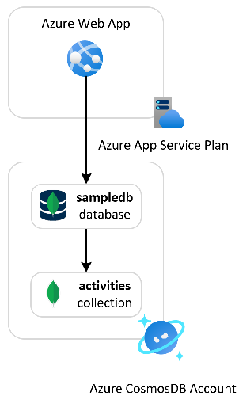
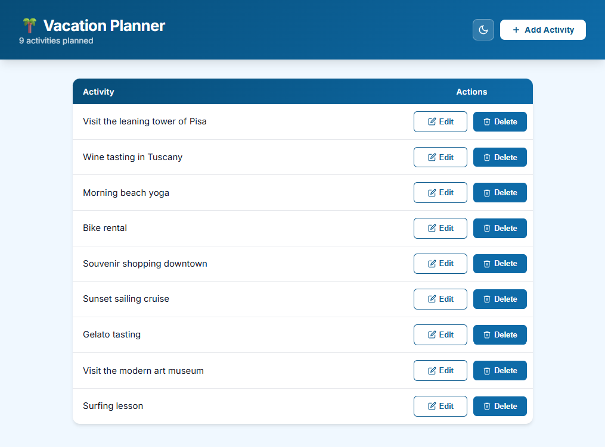
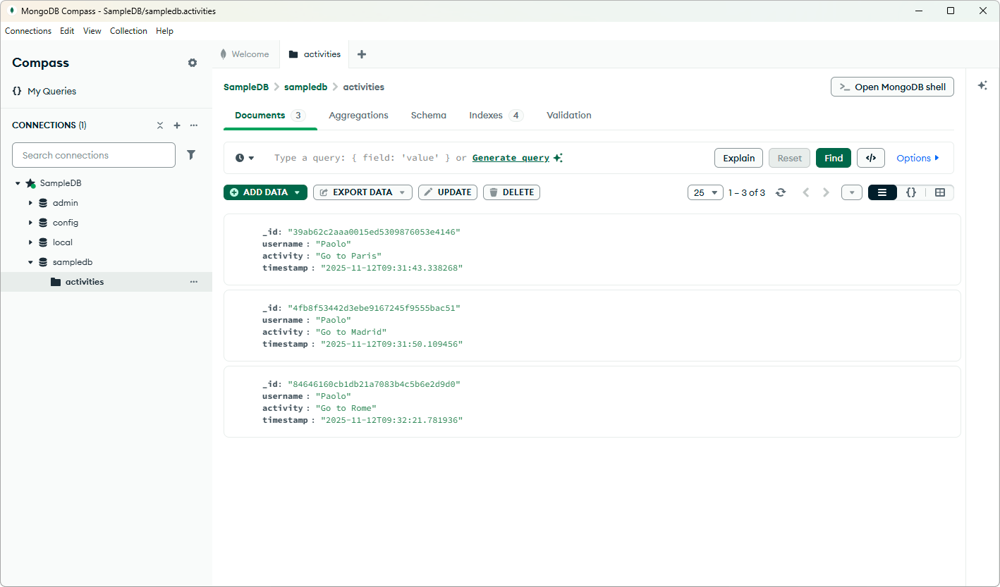

# Azure Web App with Azure CosmosDB for MongoDB

This sample demonstrates a Python Flask single-page web application called *Vacation Planner* hosted on an [Azure Web App](https://learn.microsoft.com/en-us/azure/app-service/overview). The app runs on an Azure App Service Plan and stores activity data in the `activities` collection of the `sampledb` MongoDB database on an [Azure CosmosDB for MongoDB](https://learn.microsoft.com/en-us/azure/cosmos-db/mongodb/introduction) account.

## Architecture

The following diagram illustrates the architecture of the solution:



The web app enables users to plan and manage vacation activities, with all data persisted in a CosmosDB-backed MongoDB collection. The solution is composed of the following Azure resources:

1. [Azure Resource Group](https://learn.microsoft.com/en-us/azure/azure-resource-manager/management/manage-resource-groups-cli): A logical container scoping all resources in this sample.
2. [Azure Virtual Network](https://learn.microsoft.com/azure/virtual-network/virtual-networks-overview): Hosts two subnets:
	- *app-subnet*: Dedicated to [regional VNet integration](https://learn.microsoft.com/azure/azure-functions/functions-networking-options?tabs=azure-portal#outbound-networking-features) with the Function App.
	- *pe-subnet*: Used for hosting Azure Private Endpoints.
3. [Azure Private DNS Zone](https://learn.microsoft.com/azure/dns/private-dns-privatednszone): Handles DNS resolution for the CosmosDB for MongoDB Private Endpoint within the virtual network.
4. [Azure Private Endpoint](https://learn.microsoft.com/azure/private-link/private-endpoint-overview): Secures network access to the CosmosDB for MongoDB account via a private IP within the VNet.
5. [Azure NAT Gateway](https://learn.microsoft.com/azure/nat-gateway/nat-overview): Provides deterministic outbound connectivity for the Web App. Included for completeness; the sample app does not call any external services.
6. [Azure Network Security Group](https://learn.microsoft.com/en-us/azure/virtual-network/network-security-groups-overview): Enforces inbound and outbound traffic rules across the virtual network's subnets.
7. [Azure Log Analytics Workspace](https://learn.microsoft.com/azure/azure-monitor/logs/log-analytics-overview): Centralizes diagnostic logs and metrics from all resources in the solution.
8. [Azure Cosmos DB for MongoDB](https://learn.microsoft.com/en-us/azure/cosmos-db/mongodb/introduction): A globally distributed database account optimized for MongoDB workloads, with multi-region failover enabled.
9. [MongoDB Database](https://learn.microsoft.com/en-us/azure/cosmos-db/mongodb/overview): The `sampledb` database that holds all application data.
10. [MongoDB Collection](https://learn.microsoft.com/en-us/azure/cosmos-db/mongodb/overview): The `activities` collection within `sampledb`, used to store vacation activity records.
11. [Azure App Service Plan](https://learn.microsoft.com/en-us/azure/app-service/overview-hosting-plans): The underlying compute tier that hosts the web application.
12. [Azure Web App](https://learn.microsoft.com/en-us/azure/app-service/overview): Runs the Python Flask single-page application (*Vacation Planner*), connected to CosmosDB for MongoDB via VNet integration.
13. [App Service Source Control](https://learn.microsoft.com/en-us/rest/api/appservice/web-apps/create-or-update-source-control?view=rest-appservice-2024-11-01): *(Optional)* Configures continuous deployment from a public GitHub repository.

## Prerequisites

- [Azure Subscription](https://azure.microsoft.com/free/)
- [Azure CLI](https://learn.microsoft.com/en-us/cli/azure/install-azure-cli)
- [Python 3.11+](https://www.python.org/downloads/)
- [Flask](https://flask.palletsprojects.com/)
- [pymongo](https://pymongo.readthedocs.io/en/stable/)
- [Bicep extension](https://marketplace.visualstudio.com/items?itemName=ms-azuretools.vscode-bicep), if you plan to install the sample via Bicep.
- [Terraform](https://developer.hashicorp.com/terraform/downloads), if you plan to install the sample via Terraform.

## Deployment

Set up the Azure emulator using the LocalStack for Azure Docker image. Before starting, ensure you have a valid `LOCALSTACK_AUTH_TOKEN` to access the Azure emulator. Refer to the [Auth Token guide](https://docs.localstack.cloud/getting-started/auth-token/?__hstc=108988063.8aad2b1a7229945859f4d9b9bb71e05d.1743148429561.1758793541854.1758810151462.32&__hssc=108988063.3.1758810151462&__hsfp=3945774529) to obtain your Auth Token and set it in the `LOCALSTACK_AUTH_TOKEN` environment variable. The Azure Docker image is available on the [LocalStack Docker Hub](https://hub.docker.com/r/localstack/localstack-azure-alpha). To pull the image, execute:

```bash
docker pull localstack/localstack-azure-alpha
```

Start the LocalStack Azure emulator by running:

```bash
# Set the authentication token
export LOCALSTACK_AUTH_TOKEN=<your_auth_token>

# Start the LocalStack Azure emulator
IMAGE_NAME=localstack/localstack-azure-alpha localstack start -d
localstack wait -t 60

# Route all Azure CLI calls to the LocalStack Azure emulator
azlocal start-interception
```

Deploy the application to LocalStack for Azure using one of these methods:

- [Azure CLI Deployment](./scripts/README.md)
- [Bicep Deployment](./bicep/README.md)
- [Terraform Deployment](./terraform/README.md)

All deployment methods have been fully tested against Azure and the LocalStack for Azure local emulator.

> **Note**  
> When you deploy the application to LocalStack for Azure for the first time, the initialization process involves downloading and building Docker images. This is a one-time operation—subsequent deployments will be significantly faster. Depending on your internet connection and system resources, this initial setup may take several minutes.

## Test

1. Retrieve the port published and mapped to port 80 by the Docker container hosting the emulated Web App.
2. Open a web browser and navigate to `http://localhost:<published-port>`.
3. If the deployment was successful, you will see the following user interface for adding and removing activities:



You can use the `call-web-app.sh` Bash script below to call the web app. The script demonstrates three methods for calling web apps:

1. **Through the LocalStack for Azure emulator**: Call the web app via the emulator using its default host name. The emulator acts as a proxy to the web app.
2. **Via localhost and host port mapped to the container's port**: Use `127.0.0.1` with the host port mapped to the container's port `80`.
3. **Via container IP address**: Use the app container's IP address on port `80`. This technique is only available when accessing the web app from the Docker host machine.
4. **Via the default hostname**: Call the web app via the default hostname `<web-app-name>.azurewebsites.azure.localhost.localstack.cloud:4566`.

## MongoDB Tooling

You can utilize [MongoDB Compass](https://www.mongodb.com/try/download/compass) to explore and manage your MongoDB databases and collections. Ensure you connect using `mongodb://localhost:port` connection string, where `port` corresponds to the port published by the MongoDB container on the host and mapped to the internal MongoDB port `27017`.



Alternatively, you can use the [MongoDB Shell](https://www.mongodb.com/docs/mongodb-shell/) to interact with and administer your MongoDB instance, as shown in the following table:

```bash
~$ mongosh mongodb://localhost:32770
Current Mongosh Log ID: 6914588406320f60899dc29c
Connecting to:          mongodb://localhost:32770/?directConnection=true&serverSelectionTimeoutMS=2000&appName=mongosh+2.5.9
Using MongoDB:          8.0.15
Using Mongosh:          2.5.9

For mongosh info see: https://www.mongodb.com/docs/mongodb-shell/

------
   The server generated these startup warnings when booting
   2025-11-12T09:28:07.726+00:00: Using the XFS filesystem is strongly recommended with the WiredTiger storage engine. See http://dochub.mongodb.org/core/prodnotes-filesystem
   2025-11-12T09:28:07.892+00:00: Access control is not enabled for the database. Read and write access to data and configuration is unrestricted
   2025-11-12T09:28:07.892+00:00: For customers running the current memory allocator, we suggest changing the contents of the following sysfsFile
   2025-11-12T09:28:07.892+00:00: We suggest setting the contents of sysfsFile to 0.
   2025-11-12T09:28:07.892+00:00: vm.max_map_count is too low
   2025-11-12T09:28:07.892+00:00: We suggest setting swappiness to 0 or 1, as swapping can cause performance problems.
------

test> show dbs
admin     100.00 KiB
config    108.00 KiB
local      40.00 KiB
sampledb  180.00 KiB
test> use sampledb
switched to db sampledb
sampledb> show collections
activities
sampledb> db.activities.find().pretty()
[
  {
    _id: '39ab62c2aaa0015ed5309876053e4146',
    username: 'Paolo',
    activity: 'Go to Paris',
    timestamp: '2025-11-12T09:31:43.338268'
  },
  {
    _id: '4fb8f53442d3ebe9167245f9555bac51',
    username: 'Paolo',
    activity: 'Go to Madrid',
    timestamp: '2025-11-12T09:31:50.109456'
  },
  {
    _id: '84646160cb1db21a7083b4c5b6e2d9d0',
    username: 'Paolo',
    activity: 'Go to Rome',
    timestamp: '2025-11-12T09:32:21.781936'
  }
]
```

## References

- [Azure Web Apps Documentation](https://learn.microsoft.com/en-us/azure/app-service/)
- [Azure CosmosDB for MongoDB API](https://learn.microsoft.com/en-us/azure/cosmos-db/mongodb/introduction)
- [Quickstart: Python Flask on Azure](https://learn.microsoft.com/en-us/azure/app-service/quickstart-python?tabs=flask%2Cbrowser)
- [Quickstart: CosmosDB for MongoDB](https://learn.microsoft.com/en-us/azure/cosmos-db/mongodb/quickstart?tabs=azure-portal)
- [Azure Identity Client Library for Python](https://learn.microsoft.com/en-us/python/api/overview/azure/identity-readme?view=azure-python)
- [LocalStack for Azure](https://azure.localstack.cloud/)