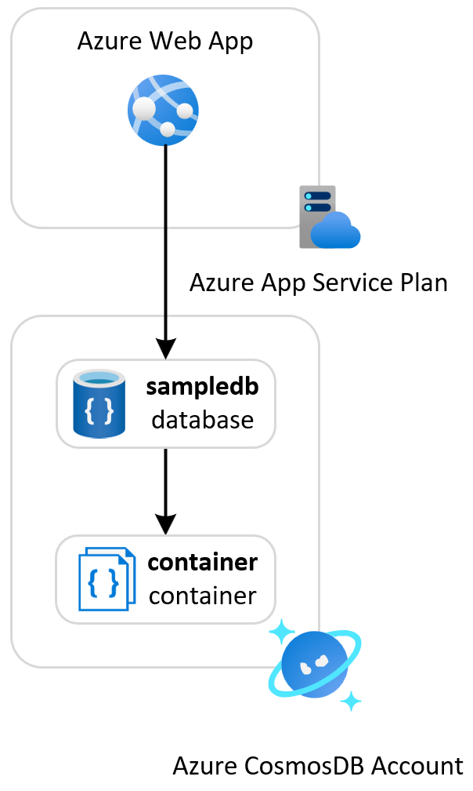
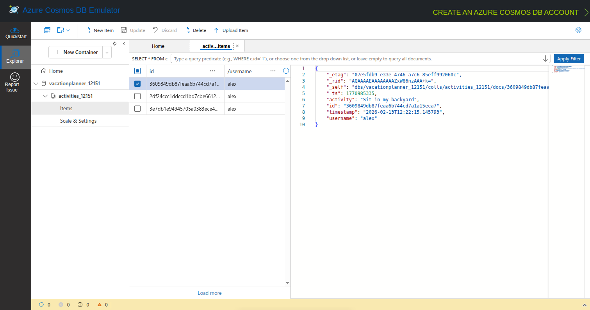

# Azure Web App with Azure CosmosDB for NoSQL API

This sample demonstrates a Python Flask single-page web application called *Vacation Planner* hosted on an [Azure Web App](https://learn.microsoft.com/en-us/azure/app-service/overview). The app runs on an Azure App Service Plan and stores activity data in the `activities` container of the `sampledb` NoSQL database on an [Azure CosmosDB for NoSQL](https://learn.microsoft.com/en-us/azure/cosmos-db/distributed-nosql) account.

## Architecture

The following diagram illustrates the architecture of the solution:



- **Azure Web App**: Hosts the Python Flask application
- **Azure App Service Plan**: Provides compute resources for the web app
- **Azure CosmosDB for NoSQL API**: Stores activity data in a CosmosDB container

## Prerequisites

- [Azure Subscription](https://azure.microsoft.com/free/)
- [Azure CLI](https://learn.microsoft.com/en-us/cli/azure/install-azure-cli)
- [Python 3.11+](https://www.python.org/downloads/)
- [Flask](https://flask.palletsprojects.com/)
- [pymongo](https://pymongo.readthedocs.io/en/stable/)

## Deployment

Set up the Azure emulator using the LocalStack for Azure Docker image. Before starting, ensure you have a valid `LOCALSTACK_AUTH_TOKEN` to access the Azure emulator. Refer to the [Auth Token guide](https://docs.localstack.cloud/getting-started/auth-token/?__hstc=108988063.8aad2b1a7229945859f4d9b9bb71e05d.1743148429561.1758793541854.1758810151462.32&__hssc=108988063.3.1758810151462&__hsfp=3945774529) to obtain your Auth Token and set it in the `LOCALSTACK_AUTH_TOKEN` environment variable. The Azure Docker image is available on the [LocalStack Docker Hub](https://hub.docker.com/r/localstack/localstack-azure-alpha). To pull the image, execute:

```bash
docker pull localstack/localstack-azure-alpha
```

Start the LocalStack Azure emulator by running:

```bash
export LOCALSTACK_AUTH_TOKEN=<your_auth_token>
IMAGE_NAME=localstack/localstack-azure-alpha localstack start
   ```

Deploy the application to LocalStack for Azure using:

- [Azure CLI Deployment](./scripts/README.md)

> **Note**  
> When you deploy the application to LocalStack for Azure for the first time, the initialization process involves downloading and building Docker images. This is a one-time operation—subsequent deployments will be significantly faster. Depending on your internet connection and system resources, this initial setup may take several minutes.

## Test

1. Retrieve the port published and mapped to port 80 by the Docker container hosting the emulated Web App.
2. Open a web browser and navigate to `http://localhost:<published-port>`.
3. If the deployment was successful, you will see the following user interface for adding and removing activities:


You can use the `call-web-app.sh` Bash script below to call the web app. The script demonstrates three methods for calling web apps:

1. **Through the LocalStack for Azure emulator**: Call the web app via the emulator using its default host name. The emulator acts as a proxy to the web app.
2. **Via localhost and host port mapped to the container's port**: Use `127.0.0.1` with the host port mapped to the container's port `80`.
3. **Via container IP address**: Use the app container's IP address on port `80`. This technique is only available when accessing the web app from the Docker host machine.
4. **Via Runtime Gateway**: Use the `{web_app_name}website.localhost.localstack.cloud:4566` URL to call the web app via the LocalStack runtime gateway.

```bash
#!/bin/bash

get_docker_container_name_by_prefix() {
	local app_prefix="$1"
	local container_name

	# Check if Docker is running
	if ! docker info >/dev/null 2>&1; then
		echo "Error: Docker is not running" >&2
		return 1
	fi

	echo "Looking for containers with names starting with [$app_prefix]..." >&2

	# Find the container using grep
	container_name=$(docker ps --format "{{.Names}}" | grep "^${app_prefix}" | head -1)

	if [ -z "$container_name" ]; then
		echo "Error: No running container found with name starting with [$app_prefix]" >&2
		return 1
	fi

	echo "Found matching container [$container_name]" >&2
	echo "$container_name"
}

get_docker_container_ip_address_by_name() {
	local container_name="$1"
	local ip_address

	if [ -z "$container_name" ]; then
		echo "Error: Container name is required" >&2
		return 1
	fi

	# Get IP address
	ip_address=$(docker inspect -f '{{range .NetworkSettings.Networks}}{{.IPAddress}}{{end}}' "$container_name")

	if [ -z "$ip_address" ]; then
		echo "Error: Container [$container_name] has no IP address assigned" >&2
		return 1
	fi

	echo "$ip_address"
}

get_docker_container_port_mapping() {
	local container_name="$1"
	local container_port="$2"
	local host_port

	if [ -z "$container_name" ] || [ -z "$container_port" ]; then
		echo "Error: Container name and container port are required" >&2
		return 1
	fi

	# Get host port mapping
	host_port=$(docker inspect -f "{{(index (index .NetworkSettings.Ports \"${container_port}/tcp\") 0).HostPort}}" "$container_name")

	if [ -z "$host_port" ]; then
		echo "Error: No host port mapping found for container [$container_name] port [$container_port]" >&2
		return 1
	fi

	echo "$host_port"
}

call_web_app() {
	# Get the web app name
	echo "Getting web app name..."
	web_app_name=$(azlocal webapp list --query '[0].name' --output tsv)

	if [ -n "$web_app_name" ]; then
		echo "Web app [$web_app_name] successfully retrieved."
	else
		echo "Error: No web app found"
		exit 1
	fi

	# Get the resource group name
	echo "Getting resource group name for web app [$web_app_name]..."
	resource_group_name=$(azlocal webapp list --query '[0].resourceGroup' --output tsv)

	if [ -n "$resource_group_name" ]; then
		echo "Resource group [$resource_group_name] successfully retrieved."
	else
		echo "Error: No resource group found for web app [$web_app_name]"
		exit 1
	fi

	# Get the the default host name of the web app
	echo "Getting the default host name of the web app [$web_app_name]..."
	app_host_name=$(azlocal webapp show \
		--name "$web_app_name" \
		--resource-group "$resource_group_name" \
		--query 'defaultHostName' \
		--output tsv)

	if [ -n "$app_host_name" ]; then
		echo "Web app default host name [$app_host_name] successfully retrieved."
	else
		echo "Error: No web app default host name found"
		exit 1
	fi

	# Get the Docker container name
	echo "Finding container name with prefix [ls-$web_app_name]..."
	container_name=$(get_docker_container_name_by_prefix "ls-$web_app_name")

	if [ $? -eq 0 ] && [ -n "$container_name" ]; then
		echo "Container [$container_name] found successfully"
	else
		echo "Failed to get container name"
		exit 1
	fi

	# Get the container IP address
	echo "Getting IP address for container [$container_name]..."
	container_ip=$(get_docker_container_ip_address_by_name "$container_name")

	if [ $? -eq 0 ] && [ -n "$container_ip" ]; then
		echo "IP address [$container_ip] retrieved successfully for container [$container_name]"
	else
		echo "Failed to get container IP address"
		exit 1
	fi

	# Get the mapped host port for web app HTTP trigger (internal port 80)
	echo "Getting the host port mapped to internal port 80 in container [$container_name]..."
	host_port=$(get_docker_container_port_mapping "$container_name" "80")
	
	if [ $? -eq 0 ] && [ -n "$host_port" ]; then
		echo "Mapped host port [$host_port] retrieved successfully for container [$container_name]"
	else
		echo "Failed to get mapped host port for container [$container_name]"
		exit 1
	fi

	# Retrieve LocalStack proxy port
	proxy_port=$(curl http://localhost:4566/_localstack/proxy -s | jq '.proxy_port')

	if [ -n "$proxy_port" ]; then
		# Call the web app via emulator proxy
		echo "Calling web app [$web_app_name] via emulator..."
		curl --proxy "http://localhost:$proxy_port/" -s "http://$app_host_name/" 1> /dev/null
		
		if [ $? == 0 ]; then
			echo "Web app call via emulator proxy port [$proxy_port] succeeded."
		else
			echo "Web app call via emulator proxy port [$proxy_port] failed."
		fi
	else
		echo "Failed to retrieve LocalStack proxy port"
	fi
	
	if [ -n "$container_ip" ]; then
		# Call the web app via the container IP address
		echo "Calling web app [$web_app_name] via container IP address [$container_ip]..."
		curl -s "http://$container_ip/" 1> /dev/null

		if [ $? == 0 ]; then
			echo "Web app call via container IP address [$container_ip] succeeded."
		else
			echo "Web app call via container IP address [$container_ip] failed."
		fi
	else
		echo "Failed to retrieve container IP address"
	fi

	if [ -n "$host_port" ]; then
		# Call the web app via the host port
		echo "Calling web app [$web_app_name] via host port [$host_port]..."
		curl -s "http://127.0.0.1:$host_port/" 1> /dev/null

		if [ $? == 0 ]; then
			echo "Web app call via host port [$host_port] succeeded."
		else
			echo "Web app call via host port [$host_port] failed."
		fi
	else
		echo "Failed to retrieve host port"
	fi

	gateway_port=4566

	if [ -n "$gateway_port" ]; then
		# Call the web app via the runtime gateway
		echo "Calling web app [$web_app_name] via runtime gateway on port [$gateway_port]..."
		curl -s "http://${web_app_name}website.localhost.localstack.cloud:$gateway_port/" 1> /dev/null

		if [ $? == 0 ]; then
			echo "Web app call via runtime gateway on port [$gateway_port] succeeded."
		else
			echo "Web app call via runtime gateway on port [$gateway_port] failed."
		fi
	else
		echo "Failed to retrieve runtime gateway port"
	fi
}

call_web_app
```

## CosmosDB Tooling

You can utilize [CosmosDB Data Explorer] to explore and manage your CosmosDB databases and collections. Ensure you connect using `http://localhost:port` connection string, where `port` corresponds to the port published by the CosmosDB container on the host and mapped to the internal CosmosDB port `1234`.



## References

- [Azure Web Apps Documentation](https://learn.microsoft.com/en-us/azure/app-service/)
- [Azure CosmosDB for MongoDB API](https://learn.microsoft.com/en-us/azure/cosmos-db/)
- [Quickstart: Python Flask on Azure](https://learn.microsoft.com/en-us/azure/app-service/quickstart-python?tabs=flask%2Cbrowser)
- [Azure Identity Client Library for Python](https://learn.microsoft.com/en-us/python/api/overview/azure/identity-readme?view=azure-python)
- [LocalStack for Azure](https://azure.localstack.cloud/)