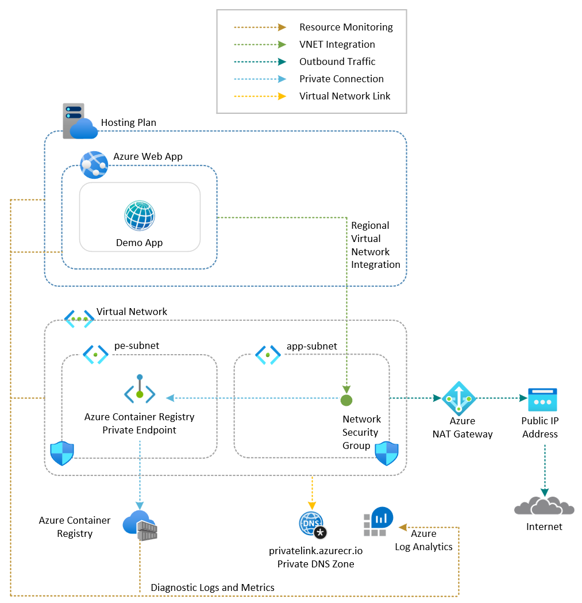

# Azure Web App with Custom Docker Image

This sample demonstrates a Python Flask web application hosted on an [Azure Web App](https://learn.microsoft.com/en-us/azure/app-service/overview) using a custom Docker image. The app runs on an Azure App Service Plan and uses a container image stored in an [Azure Container Registry](https://learn.microsoft.com/azure/container-registry/container-registry-intro). For more information on configuring a web app to use a custom container, see [Configure a custom container for Azure App Service](https://learn.microsoft.com/azure/app-service/configure-custom-container?tabs=debian&pivots=container-linux).

## Architecture

The following diagram illustrates the architecture of the solution:



The solution is composed of the following Azure resources:

1. [Azure Resource Group](https://learn.microsoft.com/en-us/azure/azure-resource-manager/management/manage-resource-groups-cli): A logical container scoping all resources in this sample.
2. [Azure Virtual Network](https://learn.microsoft.com/azure/virtual-network/virtual-networks-overview): Hosts two subnets:
	- *app-subnet*: Dedicated to [regional VNet integration](https://learn.microsoft.com/azure/azure-functions/functions-networking-options?tabs=azure-portal#outbound-networking-features) with the Web App.
	- *pe-subnet*: Used for hosting Azure Private Endpoints.
3. [Azure Private DNS Zone](https://learn.microsoft.com/azure/dns/private-dns-privatednszone): Handles DNS resolution for the Azure Container Registry Private Endpoint within the virtual network.
4. [Azure Private Endpoint](https://learn.microsoft.com/azure/private-link/private-endpoint-overview): Secures network access to the Azure Container Registry via a private IP within the VNet.
5. [Azure NAT Gateway](https://learn.microsoft.com/azure/nat-gateway/nat-overview): Provides deterministic outbound connectivity for the Web App. Included for completeness; the sample app does not call any external services.
6. [Azure Network Security Group](https://learn.microsoft.com/en-us/azure/virtual-network/network-security-groups-overview): Enforces inbound and outbound traffic rules across the virtual network's subnets.
7. [Azure Log Analytics Workspace](https://learn.microsoft.com/azure/azure-monitor/logs/log-analytics-overview): Centralizes diagnostic logs and metrics from all resources in the solution.
8. [Azure Container Registry](https://learn.microsoft.com/azure/container-registry/container-registry-intro): A fully-managed container registry service based on the open-source [Docker platform](https://docs.docker.com/get-started/docker-overview/) used to hold the container image used by the web app.
9. [User-Assigned Managed Identity](https://learn.microsoft.com/en-us/azure/active-directory/managed-identities-azure-resources/overview): Assigned the [AcrPull](https://learn.microsoft.com/en-us/azure/role-based-access-control/built-in-roles/containers#acrpull) role on the Azure Container Registry, enabling the Web App to pull the container image without storing credentials.
10. [Azure App Service Plan](https://learn.microsoft.com/en-us/azure/app-service/overview-hosting-plans): The underlying compute tier that hosts the web application.
11. [Azure Web App](https://learn.microsoft.com/en-us/azure/app-service/overview): Runs the Python Flask application from the custom container image stored in the Azure Container Registry.

## Prerequisites

- [Azure Subscription](https://azure.microsoft.com/free/)
- [Azure CLI](https://learn.microsoft.com/en-us/cli/azure/install-azure-cli)
- [Docker](https://docs.docker.com/get-docker/)
- [Bicep](https://marketplace.visualstudio.com/items?itemName=ms-azuretools.vscode-bicep), if you plan to install the sample via Bicep.
- [Terraform](https://developer.hashicorp.com/terraform/downloads), if you plan to install the sample via Terraform.
- [Azlocal CLI](https://azure.localstack.cloud/user-guides/sdks/az/): LocalStack Azure CLI wrapper
- [jq](https://jqlang.org/): JSON processor for scripting and parsing command outputs

## Deployment

Set up the Azure emulator using the LocalStack for Azure Docker image. Before starting, ensure you have a valid `LOCALSTACK_AUTH_TOKEN` to access the Azure emulator. Refer to the [Auth Token guide](https://docs.localstack.cloud/getting-started/auth-token/?__hstc=108988063.8aad2b1a7229945859f4d9b9bb71e05d.1743148429561.1758793541854.1758810151462.32&__hssc=108988063.3.1758810151462&__hsfp=3945774529) to obtain your Auth Token and set it in the `LOCALSTACK_AUTH_TOKEN` environment variable. The Azure Docker image is available on the [LocalStack Docker Hub](https://hub.docker.com/r/localstack/localstack-azure-alpha). To pull the image, execute:

```bash
docker pull localstack/localstack-azure-alpha
```

Start the LocalStack Azure emulator by running:

```bash
# Set the authentication token
export LOCALSTACK_AUTH_TOKEN=<your_auth_token>

# Start the LocalStack Azure emulator
IMAGE_NAME=localstack/localstack-azure-alpha localstack start -d
localstack wait -t 60

# Route all Azure CLI calls to the LocalStack Azure emulator
azlocal start-interception
```

Deploy the application to LocalStack for Azure using one of these methods:

- [Azure CLI Deployment](./scripts/README.md)
- [Bicep Deployment](./bicep/README.md)
- [Terraform Deployment](./terraform/README.md)

All deployment methods have been fully tested against Azure and the LocalStack for Azure local emulator.

> **Note**  
> When you deploy the application to LocalStack for Azure for the first time, the initialization process involves downloading and building Docker images. This is a one-time operation—subsequent deployments will be significantly faster. Depending on your internet connection and system resources, this initial setup may take several minutes.

## Test

You can use the `call-web-app.sh` Bash script below to call the web app. The script calls the web app via the default hostname `<web-app-name>.azurewebsites.azure.localhost.localstack.cloud:4566`.

## References

- [Azure Web Apps Documentation](https://learn.microsoft.com/en-us/azure/app-service/)
- [Azure Container Registry Documentation](https://learn.microsoft.com/azure/container-registry/container-registry-intro)
- [Configure a custom container for Azure App Service](https://learn.microsoft.com/azure/app-service/configure-custom-container?tabs=debian&pivots=container-linux)
- [Azure Identity Client Library for Python](https://learn.microsoft.com/en-us/python/api/overview/azure/identity-readme?view=azure-python)
- [LocalStack for Azure](https://docs.localstack.cloud/azure/)
