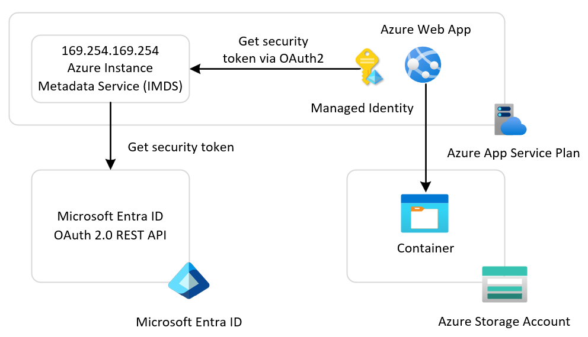
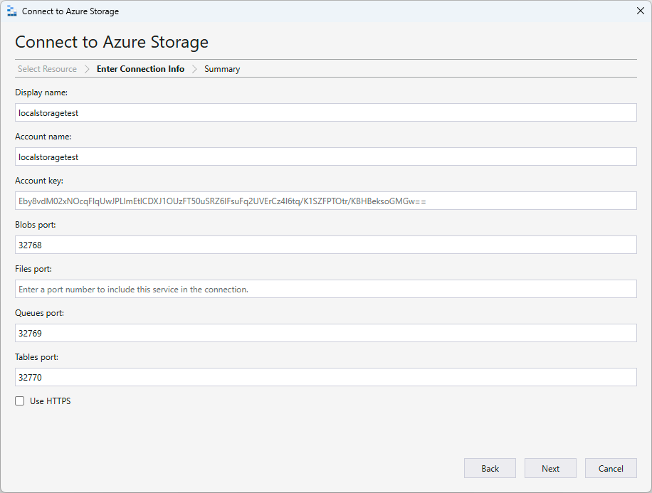

# Azure Web App with Managed Identity

This sample demonstrates a Python Flask single-page web application called *Vacation Planner* hosted on an [Azure Web App](https://learn.microsoft.com/en-us/azure/app-service/overview). The app runs on an Azure App Service Plan and stores activity data in an `activities` container within [Azure Blob Storage](https://learn.microsoft.com/en-us/azure/storage/blobs/storage-blobs-introduction). The web app uses a user-assigned or system-assigned managed identity to access storage.

A managed identity from Microsoft Entra ID allows your app to easily access other Microsoft Entra-protected resources, such as Azure Key Vault. The Azure platform manages the identity, so you don't need to provision or rotate any secrets. For more information about managed identities in Microsoft Entra ID, see [Managed identities for Azure resources](https://learn.microsoft.com/en-us/azure/active-directory/managed-identities-azure-resources/overview).

You can configure the Azure Web App to use two types of managed identities:

- A **system-assigned identity** is tied to the application and is deleted when the application is deleted. An application can have only one system-assigned identity.
- A **user-assigned identity** is a standalone Azure resource that can be assigned to your application. An application can have multiple user-assigned identities. A single user-assigned identity can be assigned to multiple Azure resources, such as multiple App Service applications.

For more information on how to create a managed identity for Azure App Service and Azure Functions applications, and how to use it to access other resources, see [Use managed identities for App Service and Azure Functions](https://learn.microsoft.com/en-us/azure/app-service/overview-managed-identity).

## Architecture

The following diagram illustrates the architecture of the solution:



- **Azure Web App**: Hosts the Python Flask application
- **Azure App Service Plan**: Provides compute resources for the web app
- **Azure Blob Storage**: Stores activity data as blobs in a container
- **Azure Entra Tenant**: Issues security tokens via OAuth 2.0

## Security

This sample demonstrates how to configure an [Azure App Service](https://learn.microsoft.com/en-us/azure/app-service/configure-authentication-provider-aad?tabs=workforce-configuration), specifically a Web App, to use either a user-assigned identity or a system-assigned identity to acquire a security token from [Microsoft Entra ID](https://learn.microsoft.com/en-us/entra/fundamentals/what-is-entra) for accessing downstream services such as Azure Blob Storage. You must configure the target resource to allow access from your app. For most Azure services, configure the target resource by [creating a role assignment](https://learn.microsoft.com/en-us/azure/role-based-access-control/role-assignments-steps) for the user-assigned or system-assigned managed identity used by the application via Azure role-based access control (Azure RBAC). For more information, see [What is Azure RBAC?](https://learn.microsoft.com/en-us/azure/role-based-access-control/overview)

Some services use mechanisms other than Azure role-based access control. To understand how to configure access using an identity, refer to the Azure documentation for each target resource. To learn more about which resources support Microsoft Entra tokens, see [Azure services that support Microsoft Entra authentication](https://learn.microsoft.com/en-us/azure/active-directory/managed-identities-azure-resources/services-support-managed-identities#azure-services-that-support-azure-ad-authentication).

For example, if you [request a token](https://learn.microsoft.com/en-us/azure/app-service/overview-managed-identity?tabs=portal%2Chttp#connect-to-azure-services-in-app-code) to access a secret in Azure Key Vault, you must also create a role assignment that allows the managed identity to work with secrets in the target vault. Otherwise, Key Vault will reject your calls even if you use a valid token. The same is true for Azure SQL Database and other Azure services.

In this sample, the provisioning process assigns the [Storage Blob Data Contributor](https://learn.microsoft.com/en-us/azure/role-based-access-control/built-in-roles/storage#storage-blob-data-contributor) built-in role to the managed identity used by the web app, with the demo storage account as the scope. This ensures the managed identity has the proper permissions to allow the application code to read and write blobs in the target container.

The LocalStack emulator emulates the following services, which are necessary at provisioning time and runtime:

- **Microsoft Entra Tenant**: This REST API is responsible for issuing a security token to the application to access the target service. For more information, see [Microsoft identity platform and OAuth 2.0 authorization code flow](https://learn.microsoft.com/en-us/entra/identity-platform/v2-oauth2-auth-code-flow).
- **Microsoft Graph REST API**: Microsoft Graph is the gateway to Microsoft cloud services like Microsoft Entra and Microsoft 365. In particular, it provides access to [service principals](https://learn.microsoft.com/en-us/graph/api/resources/serviceprincipal?view=graph-rest-1.0) used by applications via [workload identities](https://learn.microsoft.com/en-us/entra/workload-id/workload-identities-overview). In Microsoft Entra, workload identities are applications, service principals, and managed identities.
- **Azure Role-Based Access Control (RBAC)**: Azure role-based access control (Azure RBAC) helps you manage who has access to Azure resources, what they can do with those resources, and what areas they have access to. LocalStack for Azure fully supports and mocks built-in [role definitions](https://learn.microsoft.com/en-us/azure/role-based-access-control/role-definitions), custom role definitions, and [role assignments](https://learn.microsoft.com/en-us/azure/role-based-access-control/role-assignments), but does not enforce or check permissions.

## Prerequisites

- [Azure Subscription](https://azure.microsoft.com/free/)
- [Azure CLI](https://learn.microsoft.com/en-us/cli/azure/install-azure-cli)
- [Python](https://www.python.org/downloads/)
- [Flask](https://flask.palletsprojects.com/)
- [Bicep extension](https://marketplace.visualstudio.com/items?itemName=ms-azuretools.vscode-bicep), if you plan to install the sample via Bicep.
- [Terraform](https://developer.hashicorp.com/terraform/downloads), if you plan to install the sample via Terraform.

## Deployment

Set up the Azure emulator using the LocalStack for Azure Docker image. Before starting, ensure you have a valid `LOCALSTACK_AUTH_TOKEN` to access the Azure emulator. Refer to the [Auth Token guide](https://docs.localstack.cloud/getting-started/auth-token/?__hstc=108988063.8aad2b1a7229945859f4d9b9bb71e05d.1743148429561.1758793541854.1758810151462.32&__hssc=108988063.3.1758810151462&__hsfp=3945774529) to obtain your Auth Token and set it in the `LOCALSTACK_AUTH_TOKEN` environment variable. The Azure Docker image is available on the [LocalStack Docker Hub](https://hub.docker.com/r/localstack/localstack-azure-alpha). To pull the image, execute:

```bash
docker pull localstack/localstack-azure-alpha
```

Start the LocalStack Azure emulator by running:

```bash
# Set the authentication token
export LOCALSTACK_AUTH_TOKEN=<your_auth_token>

# Start the LocalStack Azure emulator
IMAGE_NAME=localstack/localstack-azure-alpha localstack start -d
localstack wait -t 60

# Route all Azure CLI calls to the LocalStack Azure emulator
azlocal start-interception
```

Deploy the application to LocalStack for Azure using one of these methods:

- [Azure CLI Deployment](./scripts/README.md)
- [Bicep Deployment](./bicep/README.md)
- [Terraform Deployment](./terraform/README.md)

All deployment methods have been fully tested with both user-assigned and system-assigned managed identities against Azure and the LocalStack for Azure local emulator.

> **Note**  
> When you deploy the application to LocalStack for Azure for the first time, the initialization process involves downloading and building Docker images. This is a one-time operation—subsequent deployments will be significantly faster. Depending on your internet connection and system resources, this initial setup may take several minutes.

## Test

1. Retrieve the port published and mapped to port 80 by the Docker container hosting the emulated Web App.
2. Open a web browser and navigate to `http://localhost:<published-port>`.
3. If the deployment was successful, you will see the following user interface for adding and removing activities:


You can use the `call-web-app.sh` Bash script below to call the web app. The script demonstrates three methods for calling web apps:

1. **Through the LocalStack for Azure emulator**: Call the web app via the emulator using its default host name. The emulator acts as a proxy to the web app.
2. **Via localhost and host port mapped to the container's port**: Use `127.0.0.1` with the host port mapped to the container's port `80`.
3. **Via container IP address**: Use the app container's IP address on port `80`. This technique is only available when accessing the web app from the Docker host machine.
4. **Via Runtime Gateway**: Use the `{web_app_name}website.localhost.localstack.cloud:4566` URL to call the web app via the LocalStack runtime gateway.

```bash
#!/bin/bash

get_docker_container_name_by_prefix() {
  local app_prefix="$1"
  local container_name

  # Check if Docker is running
  if ! docker info >/dev/null 2>&1; then
    echo "Error: Docker is not running" >&2
    return 1
  fi

  echo "Looking for containers with names starting with [$app_prefix]..." >&2

  # Find the container using grep
  container_name=$(docker ps --format "{{.Names}}" | grep "^${app_prefix}" | head -1)

  if [ -z "$container_name" ]; then
    echo "Error: No running container found with name starting with [$app_prefix]" >&2
    return 1
  fi

  echo "Found matching container [$container_name]" >&2
  echo "$container_name"
}

get_docker_container_ip_address_by_name() {
  local container_name="$1"
  local ip_address

  if [ -z "$container_name" ]; then
    echo "Error: Container name is required" >&2
    return 1
  fi

  # Get IP address
  ip_address=$(docker inspect -f '{{range .NetworkSettings.Networks}}{{.IPAddress}}{{end}}' "$container_name")

  if [ -z "$ip_address" ]; then
    echo "Error: Container [$container_name] has no IP address assigned" >&2
    return 1
  fi

  echo "$ip_address"
}

get_docker_container_port_mapping() {
  local container_name="$1"
  local container_port="$2"
  local host_port

  if [ -z "$container_name" ] || [ -z "$container_port" ]; then
    echo "Error: Container name and container port are required" >&2
    return 1
  fi

  # Get host port mapping
  host_port=$(docker inspect -f "{{(index (index .NetworkSettings.Ports \"${container_port}/tcp\") 0).HostPort}}" "$container_name")

  if [ -z "$host_port" ]; then
    echo "Error: No host port mapping found for container [$container_name] port [$container_port]" >&2
    return 1
  fi

  echo "$host_port"
}

call_web_app() {
  # Get the web app name
  echo "Getting web app name..."
  web_app_name=$(azlocal webapp list --query '[0].name' --output tsv)

  if [ -n "$web_app_name" ]; then
    echo "Web app [$web_app_name] successfully retrieved."
  else
    echo "Error: No web app found"
    exit 1
  fi

  # Get the resource group name
  echo "Getting resource group name for web app [$web_app_name]..."
  resource_group_name=$(azlocal webapp list --query '[0].resourceGroup' --output tsv)

  if [ -n "$resource_group_name" ]; then
    echo "Resource group [$resource_group_name] successfully retrieved."
  else
    echo "Error: No resource group found for web app [$web_app_name]"
    exit 1
  fi

  # Get the the default host name of the web app
  echo "Getting the default host name of the web app [$web_app_name]..."
  app_host_name=$(azlocal webapp show \
    --name "$web_app_name" \
    --resource-group "$resource_group_name" \
    --query 'defaultHostName' \
    --output tsv)

  if [ -n "$app_host_name" ]; then
    echo "Web app default host name [$app_host_name] successfully retrieved."
  else
    echo "Error: No web app default host name found"
    exit 1
  fi

  # Get the Docker container name
  echo "Finding container name with prefix [ls-$web_app_name]..."
  container_name=$(get_docker_container_name_by_prefix "ls-$web_app_name")

  if [ $? -eq 0 ] && [ -n "$container_name" ]; then
    echo "Container [$container_name] found successfully"
  else
    echo "Failed to get container name"
    exit 1
  fi

  # Get the container IP address
  echo "Getting IP address for container [$container_name]..."
  container_ip=$(get_docker_container_ip_address_by_name "$container_name")

  if [ $? -eq 0 ] && [ -n "$container_ip" ]; then
    echo "IP address [$container_ip] retrieved successfully for container [$container_name]"
  else
    echo "Failed to get container IP address"
    exit 1
  fi

  # Get the mapped host port for web app HTTP trigger (internal port 80)
  echo "Getting the host port mapped to internal port 80 in container [$container_name]..."
  host_port=$(get_docker_container_port_mapping "$container_name" "80")
  
  if [ $? -eq 0 ] && [ -n "$host_port" ]; then
    echo "Mapped host port [$host_port] retrieved successfully for container [$container_name]"
  else
    echo "Failed to get mapped host port for container [$container_name]"
    exit 1
  fi

  # Retrieve LocalStack proxy port
  proxy_port=$(curl http://localhost:4566/_localstack/proxy -s | jq '.proxy_port')

  if [ -n "$proxy_port" ]; then
    # Call the web app via emulator proxy
    echo "Calling web app [$web_app_name] via emulator..."
    curl --proxy "http://localhost:$proxy_port/" -s "http://$app_host_name/" 1> /dev/null
    
    if [ $? == 0 ]; then
      echo "Web app call via emulator proxy port [$proxy_port] succeeded."
    else
      echo "Web app call via emulator proxy port [$proxy_port] failed."
    fi
  else
    echo "Failed to retrieve LocalStack proxy port"
  fi
  
  if [ -n "$container_ip" ]; then
    # Call the web app via the container IP address
    echo "Calling web app [$web_app_name] via container IP address [$container_ip]..."
    curl -s "http://$container_ip/" 1> /dev/null

    if [ $? == 0 ]; then
      echo "Web app call via container IP address [$container_ip] succeeded."
    else
      echo "Web app call via container IP address [$container_ip] failed."
    fi
  else
    echo "Failed to retrieve container IP address"
  fi

  if [ -n "$host_port" ]; then
    # Call the web app via the host port
    echo "Calling web app [$web_app_name] via host port [$host_port]..."
    curl -s "http://127.0.0.1:$host_port/" 1> /dev/null

    if [ $? == 0 ]; then
      echo "Web app call via host port [$host_port] succeeded."
    else
      echo "Web app call via host port [$host_port] failed."
    fi
  else
    echo "Failed to retrieve host port"
  fi

  gateway_port=4566

  if [ -n "$gateway_port" ]; then
    # Call the web app via the runtime gateway
    echo "Calling web app [$web_app_name] via runtime gateway on port [$gateway_port]..."
    curl -s "http://${web_app_name}website.localhost.localstack.cloud:$gateway_port/" 1> /dev/null

    if [ $? == 0 ]; then
      echo "Web app call via runtime gateway on port [$gateway_port] succeeded."
    else
      echo "Web app call via runtime gateway on port [$gateway_port] failed."
    fi
  else
    echo "Failed to retrieve runtime gateway port"
  fi
}

call_web_app
```

## Storage Contents

You can use [Azure Storage Explorer](https://learn.microsoft.com/en-us/azure/storage/storage-explorer/vs-azure-tools-storage-manage-with-storage-explorer) to confirm that your Azure Web App creates the blobs in the `activities` container in the emulated storage account. To do this:

- Expand **Emulator & Attached**.
- Right-click **Storage Accounts**.
- Select **Connect to Azure Storage...**.
- In the dialog that appears, enter the name of the emulated storage account and specify the published ports, as shown in the following picture:



> **Note**  
> When sending commands to an emulated storage account, make sure to use the primary key generated by the emulator itself. For convenience, if you're connecting to the storage account directly with Azure Storage Explorer, you can use the default Azurite password. For more details, see [Connect to Azurite with SDKs and tools](https://learn.microsoft.com/en-us/azure/storage/common/storage-connect-azurite).

## References

- [Azure Web Apps Documentation](https://learn.microsoft.com/en-us/azure/app-service/)
- [What is Azure Blob storage?](https://learn.microsoft.com/en-us/azure/storage/blobs/storage-blobs-overview)
- [What is managed identities for Azure resources?](https://learn.microsoft.com/en-us/entra/identity/managed-identities-azure-resources/overview)
- [How managed identities for Azure resources work with Azure virtual machines](https://learn.microsoft.com/en-us/entra/identity/managed-identities-azure-resources/how-managed-identities-work-vm)
- [LocalStack for Azure](https://azure.localstack.cloud/)
