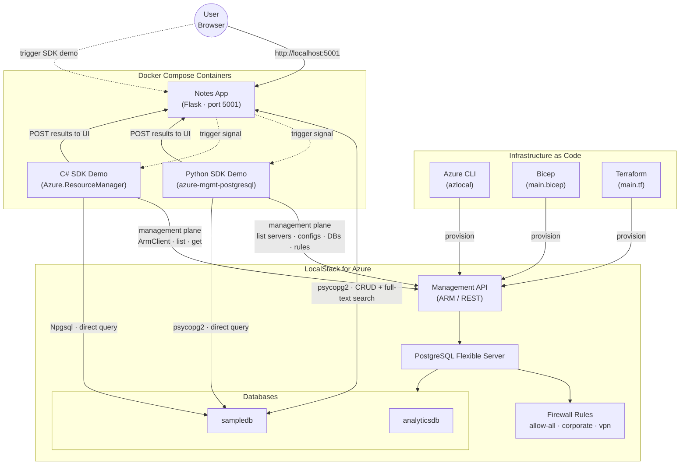

# Azure Database for PostgreSQL Flexible Server

This sample demonstrates a Notes web application with full-text search, powered by [Azure Database for PostgreSQL Flexible Server](https://learn.microsoft.com/en-us/azure/postgresql/flexible-server/overview). The app is a Python Flask single-page application that creates, searches, and deletes notes stored in the `notes` table within the `sampledb` database on a PostgreSQL Flexible Server instance. The sample also includes Python and C# Azure SDK management demos that exercise server, database, configuration, and firewall rule operations.

## Architecture

The following diagram illustrates the architecture of the solution:



- **Azure Database for PostgreSQL Flexible Server**: Managed PostgreSQL database server hosting the `sampledb` and `analyticsdb` databases
- **Notes App (Flask)**: Python Flask web application with full-text search using PostgreSQL `tsvector`
- **Python SDK Demo**: Demonstrates `azure-mgmt-postgresqlflexibleservers` management operations (list servers, get/update configurations, list databases, manage firewall rules, check name availability)
- **C# SDK Demo**: Demonstrates `Azure.ResourceManager.PostgreSql` management operations from .NET

## Prerequisites

- [Azure Subscription](https://azure.microsoft.com/free/)
- [Azure CLI](https://learn.microsoft.com/en-us/cli/azure/install-azure-cli)
- [Python 3.12+](https://www.python.org/downloads/)
- [Docker](https://docs.docker.com/get-docker/)
- [Bicep extension](https://marketplace.visualstudio.com/items?itemName=ms-azuretools.vscode-bicep), if you plan to install the sample via Bicep.
- [Terraform](https://developer.hashicorp.com/terraform/downloads), if you plan to install the sample via Terraform.

## Deployment

Set up the Azure emulator using the LocalStack for Azure Docker image. Before starting, ensure you have a valid `LOCALSTACK_AUTH_TOKEN` to access the Azure emulator. Refer to the [Auth Token guide](https://docs.localstack.cloud/getting-started/auth-token/) to obtain your Auth Token and set it in the `LOCALSTACK_AUTH_TOKEN` environment variable. The Azure Docker image is available on the [LocalStack Docker Hub](https://hub.docker.com/r/localstack/localstack-azure-alpha). To pull the image, execute:

```bash
docker pull localstack/localstack-azure-alpha
```

Start the LocalStack Azure emulator by running:

```bash
export LOCALSTACK_AUTH_TOKEN=<your_auth_token>
IMAGE_NAME=localstack/localstack-azure-alpha localstack start
```

Deploy the application to LocalStack for Azure using one of these methods:

- [Azure CLI Deployment](./scripts/README.md)
- [Bicep Deployment](./bicep/README.md)
- [Terraform Deployment](./terraform/README.md)

All deployment methods have been fully tested against Azure and the LocalStack for Azure local emulator.

> **Note**
> When you deploy the application to LocalStack for Azure for the first time, the initialization process involves downloading and building Docker images. This is a one-time operation—subsequent deployments will be significantly faster. Depending on your internet connection and system resources, this initial setup may take several minutes.

## Test

After provisioning the PostgreSQL Flexible Server infrastructure using any of the deployment methods above, launch the application containers using Docker Compose:

```bash
cd samples/postgresql-flexible-server/python

# Set environment variables (adjust values based on your deployment outputs)
export RESOURCE_GROUP="rg-pgflex"
export SERVER_NAME="pgflex-sample"
export PG_HOST="host.docker.internal"
export PG_PORT="5432"
export PG_USER="pgadmin"
export PG_PASSWORD="P@ssw0rd12345!"
export PG_DATABASE="sampledb"
export FLASK_PORT="5001"

docker compose up --build
```

Open a web browser and navigate to `http://localhost:5001`. If the deployment was successful, you will see the Notes application with full-text search and Azure SDK demo panels.

You can use the `validate.sh` Bash script below to verify that all Azure resources were created and configured correctly:

```bash
#!/bin/bash

# Variables
RESOURCE_GROUP='rg-pgflex'
SERVER_NAME='pgflex-sample'
PRIMARY_DB='sampledb'
SECONDARY_DB='analyticsdb'
ENVIRONMENT=$(az account show --query environmentName --output tsv)

# Choose the appropriate CLI based on the environment
if [[ $ENVIRONMENT == "LocalStack" ]]; then
	echo "Using azlocal for LocalStack emulator environment."
	AZ="azlocal"
else
	echo "Using standard az for AzureCloud environment."
	AZ="az"
fi

# Check resource group
echo "=== Resource Group ==="
$AZ group show \
	--name "$RESOURCE_GROUP" \
	--output table

# List resources in the resource group
echo ""
echo "=== Resources ==="
$AZ resource list \
	--resource-group "$RESOURCE_GROUP" \
	--output table

# Check PostgreSQL Flexible Server
echo ""
echo "=== PostgreSQL Flexible Server ==="
$AZ postgres flexible-server show \
	--name "$SERVER_NAME" \
	--resource-group "$RESOURCE_GROUP" \
	--output table

# List databases
echo ""
echo "=== Databases ==="
$AZ postgres flexible-server db list \
	--server-name "$SERVER_NAME" \
	--resource-group "$RESOURCE_GROUP" \
	--output table

# List firewall rules
echo ""
echo "=== Firewall Rules ==="
$AZ postgres flexible-server firewall-rule list \
	--server-name "$SERVER_NAME" \
	--resource-group "$RESOURCE_GROUP" \
	--output table
```

## PostgreSQL Tooling

You can use [pgAdmin](https://www.pgadmin.org/) to explore and manage your PostgreSQL databases. When connecting, specify `localhost` as the host and use the port published by the PostgreSQL container on the host, mapped to the internal PostgreSQL port `5432`.

Alternatively, you can use the [psql](https://www.postgresql.org/docs/current/app-psql.html) command-line tool to interact with and administer your PostgreSQL instance, as shown below:

```bash
~$ psql -h localhost -p 49114 -U pgadmin -d sampledb
Password for user pgadmin:
psql (16.0)
Type "help" for help.

sampledb=# SELECT id, title, SUBSTRING(content, 1, 30) FROM notes;
 id |     title      |           substring
----+----------------+--------------------------------
  1 | Meeting Notes  | Discussed Q4 planning and bud
  2 | Shopping List  | Eggs, milk, bread, butter, ch
  3 | Project Ideas  | Build a notes app with full-te
(3 rows)
```

## References

- [Azure Database for PostgreSQL Flexible Server](https://learn.microsoft.com/en-us/azure/postgresql/flexible-server/overview)
- [Azure CLI — PostgreSQL Flexible Server](https://learn.microsoft.com/en-us/cli/azure/postgres/flexible-server)
- [Terraform — azurerm_postgresql_flexible_server](https://registry.terraform.io/providers/hashicorp/azurerm/latest/docs/resources/postgresql_flexible_server)
- [Azure Identity Client Library for Python](https://learn.microsoft.com/en-us/python/api/overview/azure/identity-readme?view=azure-python)
- [LocalStack for Azure](https://azure.localstack.cloud/)
