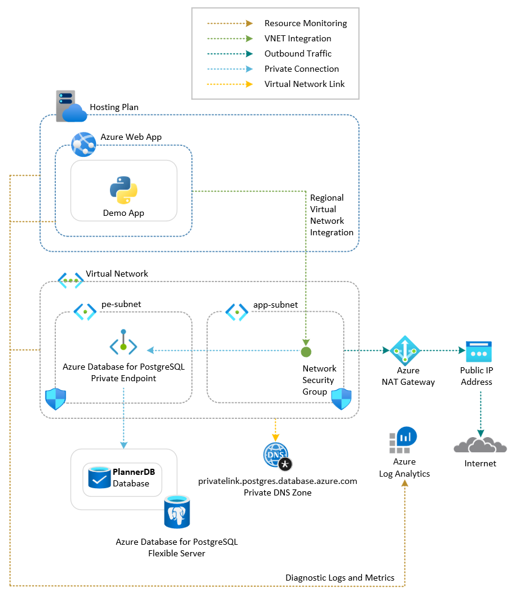

# Azure Web App with Azure Database for PostgreSQL flexible server

This sample demonstrates a Python Flask single-page web application called *Vacation Planner* hosted on an [Azure Web App](https://learn.microsoft.com/en-us/azure/app-service/overview). The app runs on an Azure App Service Plan and stores activity data in the `activities` table of the `PlannerDB` database on an [Azure Database for PostgreSQL flexible server](https://learn.microsoft.com/en-us/azure/postgresql/flexible-server/overview). The server is reached through a [Private Endpoint](https://learn.microsoft.com/azure/private-link/private-endpoint-overview) (group `postgresqlServer`) with the `privatelink.postgres.database.azure.com` Private DNS Zone, while a permissive server-level firewall rule lets the deploy machine run the post-create psql bootstrap that creates the application role and seeds the schema.

## Architecture



The web app enables users to plan and manage vacation activities; all data is persisted in PostgreSQL. The solution is composed of the following Azure resources:

1. [Azure Resource Group](https://learn.microsoft.com/en-us/azure/azure-resource-manager/management/manage-resource-groups-cli): A logical container scoping all resources in this sample.
2. [Azure Virtual Network](https://learn.microsoft.com/azure/virtual-network/virtual-networks-overview): Hosts two subnets:
   - *app-subnet*: Delegated to `Microsoft.Web/serverFarms` for regional VNet integration of the Web App.
   - *pe-subnet*: Hosts the Private Endpoint to the PostgreSQL flexible server.
3. [Azure Private DNS Zone](https://learn.microsoft.com/azure/dns/private-dns-privatednszone) `privatelink.postgres.database.azure.com`, linked to the VNet. The Private Endpoint's DNS-zone group auto-registers the `A` record for the server, so the Web App resolves the server's private IP through the VNet.
4. [Azure Private Endpoint](https://learn.microsoft.com/azure/private-link/private-endpoint-overview) (group `postgresqlServer`): Secures access to the PostgreSQL flexible server from the VNet.
5. [Azure NAT Gateway](https://learn.microsoft.com/azure/nat-gateway/nat-overview): Deterministic outbound connectivity for both subnets.
6. [Azure Network Security Group](https://learn.microsoft.com/en-us/azure/virtual-network/network-security-groups-overview): One NSG per subnet.
7. [Azure Log Analytics Workspace](https://learn.microsoft.com/azure/azure-monitor/logs/log-analytics-overview): Centralizes diagnostic logs and metrics.
8. [Azure Database for PostgreSQL flexible server](https://learn.microsoft.com/en-us/azure/postgresql/flexible-server/overview): Public-access server hosting the `PlannerDB` database. Burstable `Standard_B1ms`, version 16, 32 GiB storage, 7-day backup retention, HA disabled. A permissive firewall rule (`0.0.0.0–255.255.255.255`) is created so the deploy machine can run the post-create psql bootstrap; the Web App itself reaches the server through the Private Endpoint.
9. [PostgreSQL database](https://learn.microsoft.com/en-us/azure/postgresql/flexible-server/concepts-server-and-database) `PlannerDB`: Created at provisioning time; the post-deploy psql step creates the `activities` table and seeds three demo rows.
10. [Azure App Service Plan](https://learn.microsoft.com/en-us/azure/app-service/overview-hosting-plans): The underlying compute tier that hosts the web application.
11. [Azure Web App](https://learn.microsoft.com/en-us/azure/app-service/overview): Runs the Python Flask *Vacation Planner* app with regional VNet integration into *app-subnet*. The Web App connects to PostgreSQL using a dedicated application role (`testuser`) — the server-admin login is never used at runtime.
12. [App Service Source Control](https://learn.microsoft.com/en-us/rest/api/appservice/web-apps/create-or-update-source-control?view=rest-appservice-2024-11-01): *(Optional)* Configures continuous deployment from a public GitHub repository.

The deploy scripts follow the same pattern as the sibling [`web-app-sql-database`](../../web-app-sql-database/python/) sample: after provisioning, they (i) connect as the server admin via the public endpoint + firewall rule, (ii) create the application role `testuser` with its own password, (iii) grant minimum schema privileges on `PlannerDB`, (iv) create the `activities` table, (v) seed three sample rows, and (vi) write `PG_USER=testuser` + `PG_PASSWORD` onto the Web App's app settings. The server-admin login is never written into the Web App's runtime configuration.

## Prerequisites

- [Azure Subscription](https://azure.microsoft.com/free/)
- [Azure CLI](https://learn.microsoft.com/en-us/cli/azure/install-azure-cli)
- [Python 3.11+](https://www.python.org/downloads/)
- [Flask](https://flask.palletsprojects.com/)
- [psycopg2](https://www.psycopg.org/docs/) (`psycopg2-binary` for development)
- [PostgreSQL client tools](https://www.postgresql.org/download/) (`psql`) — required by the deploy scripts to create the application role and seed data
- [Bicep extension](https://marketplace.visualstudio.com/items?itemName=ms-azuretools.vscode-bicep), if you plan to install the sample via Bicep
- [Terraform](https://developer.hashicorp.com/terraform/downloads), if you plan to install the sample via Terraform

## Deployment

Set up the Azure emulator using the LocalStack for Azure Docker image. Before starting, ensure you have a valid `LOCALSTACK_AUTH_TOKEN`. Refer to the [Auth Token guide](https://docs.localstack.cloud/getting-started/auth-token/) to obtain yours. Pull and start the emulator:

```bash
docker pull localstack/localstack-azure

export LOCALSTACK_AUTH_TOKEN=<your_auth_token>
IMAGE_NAME=localstack/localstack-azure localstack start -d
localstack wait -t 60

# Route all Azure CLI calls to the LocalStack Azure emulator
azlocal start-interception
```

Deploy the application using one of these methods:

- [Azure CLI Deployment](./scripts/README.md)
- [Bicep Deployment](./bicep/README.md)
- [Terraform Deployment](./terraform/README.md)

All three variants provision the same topology: VNet + pe-subnet hosting a Private Endpoint targeting a public-access PostgreSQL flexible server, with a Private DNS Zone linked to the VNet.

> **Note**
> When you deploy the application to LocalStack for Azure for the first time, the initialization process pulls and builds Docker images (LocalStack itself plus the `postgres:18` backing container for the flexible-server emulator). This is a one-time operation — subsequent deployments are much faster.

## Test

1. Retrieve the port published and mapped to port 80 by the Docker container hosting the emulated Web App.
2. Open a web browser and navigate to `http://localhost:<published-port>`.
3. If the deployment was successful, you will see the *Vacation Planner* UI with the three seeded activities (*Go to Paris*, *Go to London*, *Go to Mexico*) and can add, edit, and remove activities.


You can use the `scripts/call-web-app.sh` Bash script to call the web app from outside the emulator. The script demonstrates four call paths:

1. **Through the LocalStack for Azure emulator** via the default hostname.
2. **Via localhost and host port** mapped to the container's port `80`.
3. **Via container IP address** on port `80`.
4. **Via the default hostname** `<web-app-name>.azurewebsites.azure.localhost.localstack.cloud:4566`.

## PostgreSQL Tooling

You can use [pgAdmin](https://www.pgadmin.org/) to explore and manage the deployed database. Connect using:

| Field    | Value                                                                       |
| -------- | --------------------------------------------------------------------------- |
| Host     | `localhost`                                                                 |
| Port     | (see `docker ps` for the host-mapped port of the backing `postgres:18` container) |
| Database | `PlannerDB`                                                                 |
| Username | `testuser` *(or `pgadmin` for admin operations)*                            |
| Password | `TestP@ssw0rd123` *(or `P@ssw0rd1234!` for the admin)*                      |

Or use [psql](https://www.postgresql.org/docs/current/app-psql.html):

```bash
PGPASSWORD='TestP@ssw0rd123' psql -h localhost -p <port> -U testuser -d PlannerDB
PlannerDB=> SELECT id, username, activity, created_at FROM activities;
```

## References

- [Azure Web Apps Documentation](https://learn.microsoft.com/en-us/azure/app-service/)
- [Azure Database for PostgreSQL — flexible server](https://learn.microsoft.com/en-us/azure/postgresql/flexible-server/)
- [Quickstart: Python Flask on Azure](https://learn.microsoft.com/en-us/azure/app-service/quickstart-python?tabs=flask%2Cbrowser)
- [psycopg2 documentation](https://www.psycopg.org/docs/)
- [LocalStack for Azure](https://docs.localstack.cloud/azure/)
